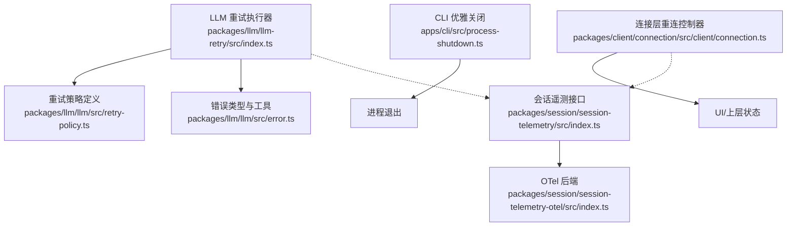
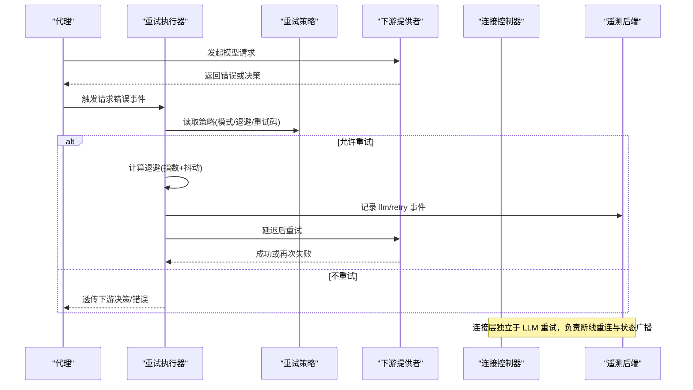
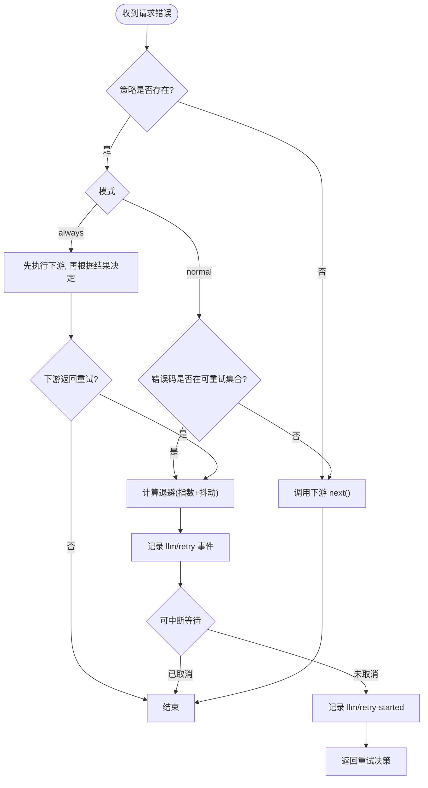
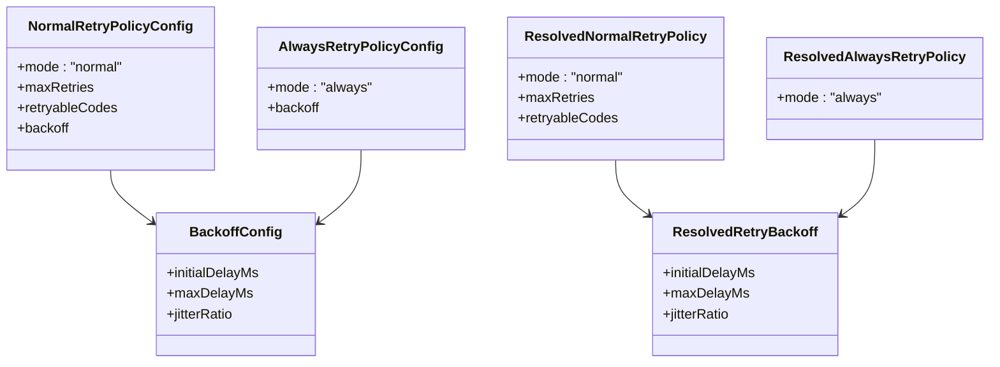
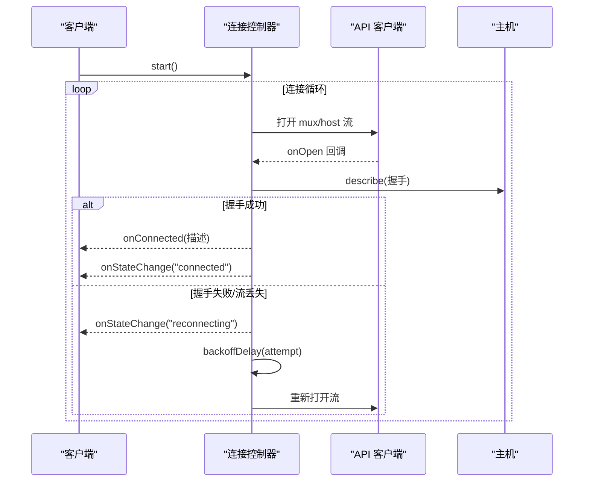
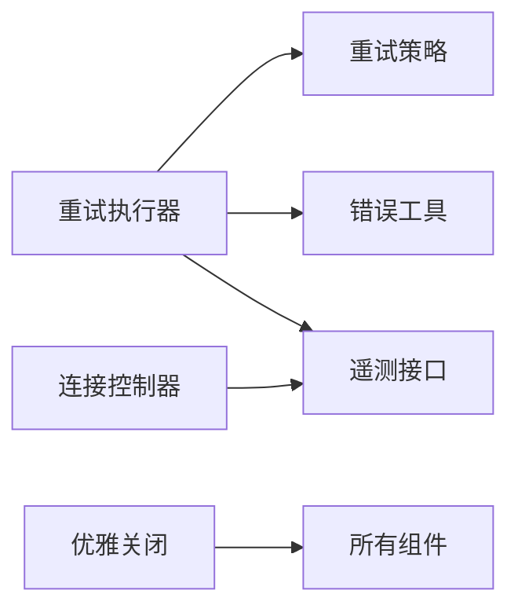

# 错误处理与重试

<cite>
**本文引用的文件**
- [packages/llm/llm-retry/src/index.ts](file://packages/llm/llm-retry/src/index.ts)
- [packages/llm/llm/src/retry-policy.ts](file://packages/llm/llm/src/retry-policy.ts)
- [packages/llm/llm/src/error.ts](file://packages/llm/llm/src/error.ts)
- [packages/client/connection/src/client/connection.ts](file://packages/client/connection/src/client/connection.ts)
- [apps/cli/src/process-shutdown.ts](file://apps/cli/src/process-shutdown.ts)
- [packages/session/session-telemetry/src/index.ts](file://packages/session/session-telemetry/src/index.ts)
- [packages/session/session-telemetry-otel/src/index.ts](file://packages/session/session-telemetry-otel/src/index.ts)
</cite>

## 目录
1. [简介](#简介)
2. [项目结构](#项目结构)
3. [核心组件](#核心组件)
4. [架构总览](#架构总览)
5. [详细组件分析](#详细组件分析)
6. [依赖关系分析](#依赖关系分析)
7. [性能考量](#性能考量)
8. [故障诊断指南](#故障诊断指南)
9. [结论](#结论)
10. [附录](#附录)

## 简介
本文件聚焦第三方集成中的错误处理与重试机制，覆盖异常分类、错误传播与恢复策略；深入解析重试算法（指数退避、抖动、熔断/断路器模式）；说明超时控制、降级策略与优雅关闭；并提供监控告警、指标收集、日志记录与性能分析的集成方案，以及故障诊断工具与调试技巧，帮助快速定位和解决问题。

## 项目结构
围绕错误处理与重试的关键代码分布在以下模块：
- LLM 重试执行器：在代理循环的请求错误扩展点安装重试策略，支持“普通”与“始终”两种模式，内置指数退避与抖动，并持久化重试事件。
- 重试策略定义：提供可配置的重试策略解析与校验，包括默认重试码、退避参数与模式选择。
- 连接层重连：客户端连接控制器实现基于指数的重连退避，带状态切换与超时保护。
- CLI 优雅关闭：进程级优雅关闭控制器，保证插件树可被安全释放，并在超时后强制退出。
- 遥测与告警：会话遥测后端暴露共享策略，OTel 后端负责上报与关闭超时隔离。

**图表来源**
- [packages/llm/llm-retry/src/index.ts:99-226](file://packages/llm/llm-retry/src/index.ts#L99-L226)
- [packages/llm/llm/src/retry-policy.ts:145-191](file://packages/llm/llm/src/retry-policy.ts#L145-L191)
- [packages/llm/llm/src/error.ts:13-22](file://packages/llm/llm/src/error.ts#L13-L22)
- [packages/client/connection/src/client/connection.ts:61-169](file://packages/client/connection/src/client/connection.ts#L61-L169)
- [apps/cli/src/process-shutdown.ts:22-76](file://apps/cli/src/process-shutdown.ts#L22-L76)
- [packages/session/session-telemetry/src/index.ts:148-160](file://packages/session/session-telemetry/src/index.ts#L148-L160)
- [packages/session/session-telemetry-otel/src/index.ts:147-168](file://packages/session/session-telemetry-otel/src/index.ts#L147-L168)

**章节来源**
- [packages/llm/llm-retry/src/index.ts:99-226](file://packages/llm/llm-retry/src/index.ts#L99-L226)
- [packages/llm/llm/src/retry-policy.ts:145-191](file://packages/llm/llm/src/retry-policy.ts#L145-L191)
- [packages/client/connection/src/client/connection.ts:61-169](file://packages/client/connection/src/client/connection.ts#L61-L169)
- [apps/cli/src/process-shutdown.ts:22-76](file://apps/cli/src/process-shutdown.ts#L22-L76)
- [packages/session/session-telemetry/src/index.ts:148-160](file://packages/session/session-telemetry/src/index.ts#L148-L160)
- [packages/session/session-telemetry-otel/src/index.ts:147-168](file://packages/session/session-telemetry-otel/src/index.ts#L147-L168)

## 核心组件
- 重试执行器：拦截请求错误，依据策略决定是否重试、如何退避、是否持久化事件，并在生命周期结束时中止所有进行中的等待。
- 重试策略：定义“normal”（有限次重试+可重试错误码集合）与“always”（无限重试直到成功或取消），统一退避参数与校验。
- 连接重连：客户端连接丢失时进入重连循环，使用指数退避与抖动，带握手超时与状态广播。
- 优雅关闭：为 CLI 提供统一的优雅关闭入口，确保插件树释放，并在超时后强制退出。
- 遥测与告警：会话遥测抽象与 OTel 后端，支持不同共享模式与关闭超时，便于错误指标采集与告警。

**章节来源**
- [packages/llm/llm-retry/src/index.ts:99-226](file://packages/llm/llm-retry/src/index.ts#L99-L226)
- [packages/llm/llm/src/retry-policy.ts:145-191](file://packages/llm/llm/src/retry-policy.ts#L145-L191)
- [packages/client/connection/src/client/connection.ts:91-169](file://packages/client/connection/src/client/connection.ts#L91-L169)
- [apps/cli/src/process-shutdown.ts:22-76](file://apps/cli/src/process-shutdown.ts#L22-L76)
- [packages/session/session-telemetry/src/index.ts:148-160](file://packages/session/session-telemetry/src/index.ts#L148-L160)
- [packages/session/session-telemetry-otel/src/index.ts:147-168](file://packages/session/session-telemetry-otel/src/index.ts#L147-L168)

## 架构总览
下图展示了从请求失败到重试决策、退避等待、下游执行与结果回收的完整流程，以及与连接层重连、遥测上报的关系。

**图表来源**
- [packages/llm/llm-retry/src/index.ts:156-208](file://packages/llm/llm-retry/src/index.ts#L156-L208)
- [packages/llm/llm/src/retry-policy.ts:145-191](file://packages/llm/llm/src/retry-policy.ts#L145-L191)
- [packages/client/connection/src/client/connection.ts:107-169](file://packages/client/connection/src/client/connection.ts#L107-L169)
- [packages/session/session-telemetry/src/index.ts:148-160](file://packages/session/session-telemetry/src/index.ts#L148-L160)

## 详细组件分析

### 重试执行器（llm-retry）
- 职责：在代理循环的“请求错误”扩展点安装拦截器，按策略决定是否重试、如何退避、是否记录事件，并在插件销毁时中止所有进行中的等待。
- 关键行为：
  - 策略模式：“normal”限制最大重试次数与可重试错误码；“always”对每次失败都尝试重试，直到成功、取消或插件销毁。
  - 退避算法：指数退避 + 对称抖动，上限受 maxDelayMs 约束；若上游提供 Retry-After 且不超过上限则优先采用。
  - 事件持久化：每次退避前写入“llm/retry”，重试开始时写入“llm/retry-started”，便于回放与审计。
  - 生命周期安全：通过 AbortSignal 组合当前信号与插件生命周期信号，避免在销毁后继续执行。

**图表来源**
- [packages/llm/llm-retry/src/index.ts:156-208](file://packages/llm/llm-retry/src/index.ts#L156-L208)
- [packages/llm/llm-retry/src/index.ts:111-154](file://packages/llm/llm-retry/src/index.ts#L111-L154)

**章节来源**
- [packages/llm/llm-retry/src/index.ts:99-226](file://packages/llm/llm-retry/src/index.ts#L99-L226)

### 重试策略（retry-policy）
- 职责：定义并解析重试策略，包含模式、最大重试次数、可重试错误码集合、退避参数，并进行严格校验。
- 关键点：
  - 默认策略：normal 模式，最大重试次数 2，可重试错误码包含空响应、限流、服务端错误、超时、传输错误等。
  - 退避参数：初始延迟、最大延迟、抖动比例，均受定时器上限约束，防止过大值导致系统阻塞。
  - 不可变对象：解析后的策略冻结，避免运行时被篡改。

**图表来源**
- [packages/llm/llm/src/retry-policy.ts:26-79](file://packages/llm/llm/src/retry-policy.ts#L26-L79)
- [packages/llm/llm/src/retry-policy.ts:117-137](file://packages/llm/llm/src/retry-policy.ts#L117-L137)
- [packages/llm/llm/src/retry-policy.ts:145-191](file://packages/llm/llm/src/retry-policy.ts#L145-L191)

**章节来源**
- [packages/llm/llm/src/retry-policy.ts:145-191](file://packages/llm/llm/src/retry-policy.ts#L145-L191)

### 错误类型与工具（error）
- 职责：提供统一的错误基类与工具函数，用于错误分类、链式原因渲染与类型判断。
- 关键点：
  - HarnessError：携带稳定机器可读的错误码，支持 cause 链。
  - 错误码常量：如 EMPTY_RESPONSE、CONTEXT_WINDOW_EXCEEDED、QUOTA、INVALID_CREDENTIAL 等，便于路由与重试判定。
  - 错误链渲染：将 Error 链与 AggregateError 成员合并为可读文本，便于日志与告警展示。

**章节来源**
- [packages/llm/llm/src/error.ts:13-22](file://packages/llm/llm/src/error.ts#L13-L22)
- [packages/llm/llm/src/error.ts:24-49](file://packages/llm/llm/src/error.ts#L24-L49)
- [packages/llm/llm/src/error.ts:102-164](file://packages/llm/llm/src/error.ts#L102-L164)

### 连接层重连（connection）
- 职责：维护双向流的连接，断开后以指数退避重连，并在握手阶段设置超时，避免卡死。
- 关键点：
  - 指数退避：base * factor^(attempt-1)，上限 capped by backoffMaxMs，实际延迟在 cap/2..cap 间随机抖动。
  - 状态广播：connected / reconnecting 状态变化通知 UI。
  - 超时保护：streamOpenTimeoutMs 防止 onOpen 永不触发导致的永久等待。

**图表来源**
- [packages/client/connection/src/client/connection.ts:61-169](file://packages/client/connection/src/client/connection.ts#L61-L169)

**章节来源**
- [packages/client/connection/src/client/connection.ts:91-169](file://packages/client/connection/src/client/connection.ts#L91-L169)

### 优雅关闭（process-shutdown）
- 职责：为 CLI 提供统一的优雅关闭入口，协调应用树释放，并在超时后强制退出。
- 关键点：
  - 首次优雅关闭：调用 dispose 并等待完成，完成后正常退出。
  - 强制退出：若在关闭过程中再次收到中断，立即强制退出，避免长时间挂起。
  - 超时保护：超过阈值后强制退出，确保进程边界可控。

**章节来源**
- [apps/cli/src/process-shutdown.ts:22-76](file://apps/cli/src/process-shutdown.ts#L22-L76)

### 遥测与告警（session-telemetry & otel）
- 职责：抽象会话遥测后端接口，OTel 后端实现上报与关闭超时隔离，支持不同共享模式。
- 关键点：
  - 共享策略：full / feedback-only / disabled，供 UI 披露当前策略。
  - 关闭超时：OTel 后端在关闭 SDK 时增加超时，避免阻塞整个插件树释放。
  - 本地警告：禁用模式下仍会记录本地反馈并给出警告，便于排查。

**章节来源**
- [packages/session/session-telemetry/src/index.ts:148-160](file://packages/session/session-telemetry/src/index.ts#L148-L160)
- [packages/session/session-telemetry-otel/src/index.ts:147-168](file://packages/session/session-telemetry-otel/src/index.ts#L147-L168)

## 依赖关系分析
- 重试执行器依赖重试策略与错误类型，并通过事件通道与遥测后端交互。
- 连接层重连独立于 LLM 重试，但同样遵循指数退避与抖动原则。
- 优雅关闭作为进程边界，确保所有组件（包括重试等待与遥测上报）能够被安全终止。

**图表来源**
- [packages/llm/llm-retry/src/index.ts:99-226](file://packages/llm/llm-retry/src/index.ts#L99-L226)
- [packages/llm/llm/src/retry-policy.ts:145-191](file://packages/llm/llm/src/retry-policy.ts#L145-L191)
- [packages/llm/llm/src/error.ts:13-22](file://packages/llm/llm/src/error.ts#L13-L22)
- [packages/client/connection/src/client/connection.ts:61-169](file://packages/client/connection/src/client/connection.ts#L61-L169)
- [apps/cli/src/process-shutdown.ts:22-76](file://apps/cli/src/process-shutdown.ts#L22-L76)
- [packages/session/session-telemetry/src/index.ts:148-160](file://packages/session/session-telemetry/src/index.ts#L148-L160)

**章节来源**
- [packages/llm/llm-retry/src/index.ts:99-226](file://packages/llm/llm-retry/src/index.ts#L99-L226)
- [packages/client/connection/src/client/connection.ts:61-169](file://packages/client/connection/src/client/connection.ts#L61-L169)
- [apps/cli/src/process-shutdown.ts:22-76](file://apps/cli/src/process-shutdown.ts#L22-L76)
- [packages/session/session-telemetry/src/index.ts:148-160](file://packages/session/session-telemetry/src/index.ts#L148-L160)

## 性能考量
- 指数退避与抖动：有效降低突发流量与雪崩风险，避免重试风暴。
- 最大延迟上限：防止退避时间过长影响用户体验。
- 可中断等待：结合 AbortSignal，确保在取消或销毁时及时释放资源。
- 事件持久化：仅记录必要元数据，避免过度开销。
- 连接握手超时：避免在异常网络环境下长期阻塞。

[本节为通用指导，无需特定文件引用]

## 故障诊断指南
- 查看重试事件：通过“llm/retry”与“llm/retry-started”事件确认重试是否发生、退避时长与重试次数。
- 检查错误码：利用 HarnessError.code 与错误码常量（如 EMPTY_RESPONSE、RATE_LIMIT、SERVER、TIMEOUT、TRANSPORT）判断是否应重试。
- 连接状态：观察“connected”与“reconnecting”状态切换，定位断线与重连频率。
- 优雅关闭：若进程长时间无法退出，检查是否有未完成的等待或未释放的资源；必要时使用强制退出路径。
- 遥测模式：确认当前共享模式（full/feedback-only/disabled），在禁用模式下关注本地警告信息。

**章节来源**
- [packages/llm/llm-retry/src/index.ts:111-154](file://packages/llm/llm-retry/src/index.ts#L111-L154)
- [packages/llm/llm/src/error.ts:24-49](file://packages/llm/llm/src/error.ts#L24-L49)
- [packages/client/connection/src/client/connection.ts:38-52](file://packages/client/connection/src/client/connection.ts#L38-L52)
- [apps/cli/src/process-shutdown.ts:22-76](file://apps/cli/src/process-shutdown.ts#L22-L76)
- [packages/session/session-telemetry-otel/src/index.ts:147-168](file://packages/session/session-telemetry-otel/src/index.ts#L147-L168)

## 结论
该仓库实现了分层、可配置且健壮的错误处理与重试体系：LLM 层提供策略化的重试与退避，连接层保障网络连接的稳定性，CLI 层确保优雅关闭，遥测层提供可观测性与告警能力。通过明确的错误码、事件持久化与超时保护，开发者可以快速定位问题并采取合适的恢复策略。

[本节为总结性内容，无需特定文件引用]

## 附录
- 建议实践：
  - 为每个第三方提供者配置合理的 retryableCodes 与 backoff 参数。
  - 在生产环境启用遥测并合理设置共享模式，以便收集错误指标。
  - 对关键路径设置超时与降级策略，避免单点故障扩散。
  - 在测试中注入确定性随机源与定时器，验证重试与退避逻辑。

[本节为补充建议，无需特定文件引用]