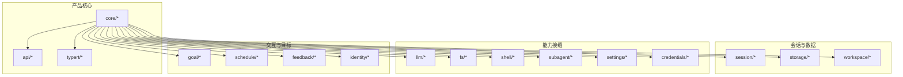
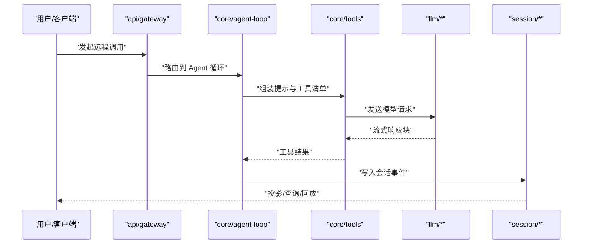
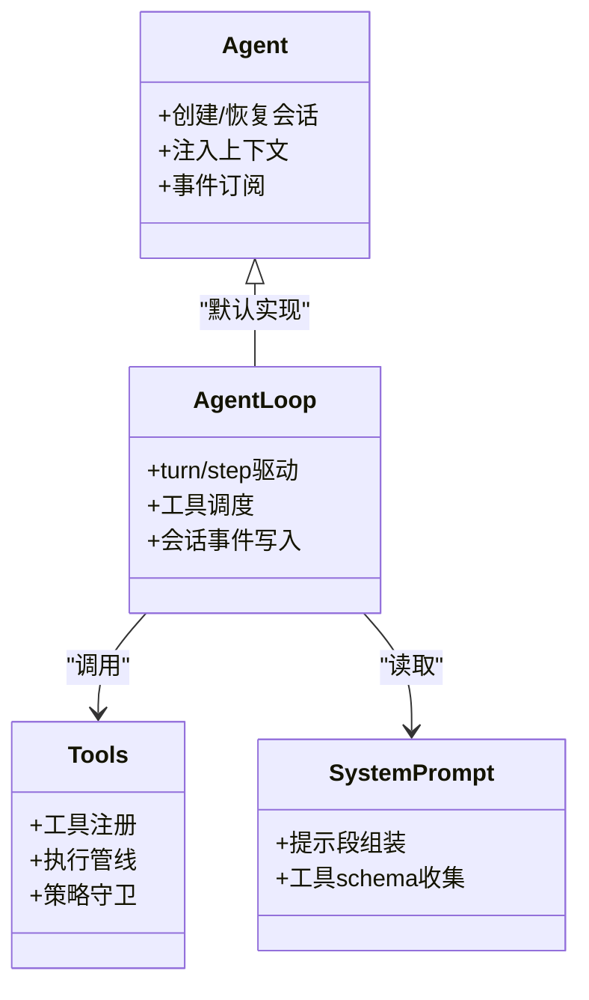
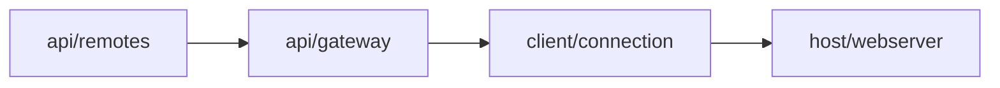
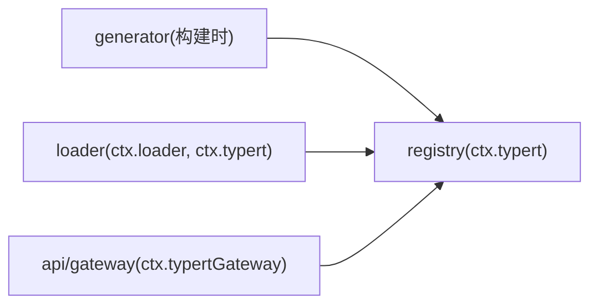
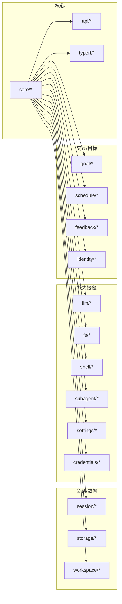

# 核心包结构

<cite>
**本文引用的文件**
- [packages/README.md](file://packages/README.md)
- [docs/capability-seams.md](file://docs/capability-seams.md)
- [docs/architecture.md](file://docs/architecture.md)
- [packages/core/README.md](file://packages/core/README.md)
- [packages/api/README.md](file://packages/api/README.md)
- [packages/typert/README.md](file://packages/typert/README.md)
- [packages/goal/README.md](file://packages/goal/README.md)
- [packages/schedule/README.md](file://packages/schedule/README.md)
- [packages/feedback/README.md](file://packages/feedback/README.md)
- [packages/identity/README.md](file://packages/identity/README.md)
- [packages/llm/README.md](file://packages/llm/README.md)
- [packages/session/README.md](file://packages/session/README.md)
- [packages/storage/README.md](file://packages/storage/README.md)
- [packages/workspace/README.md](file://packages/workspace/README.md)
- [packages/settings/README.md](file://packages/settings/README.md)
- [packages/credentials/README.md](file://packages/credentials/README.md)
- [packages/subagent/README.md](file://packages/subagent/README.md)
- [packages/fs/README.md](file://packages/fs/README.md)
- [packages/shell/README.md](file://packages/shell/README.md)
</cite>

## 目录
1. [简介](#简介)
2. [项目结构](#项目结构)
3. [核心组件](#核心组件)
4. [架构总览](#架构总览)
5. [详细组件分析](#详细组件分析)
6. [依赖关系分析](#依赖关系分析)
7. [性能考量](#性能考量)
8. [故障排查指南](#故障排查指南)
9. [结论](#结论)
10. [附录](#附录)

## 简介
本文件系统性梳理 DeepSeek Harness（简称 dsh）核心包的分组、职责与依赖，重点说明 capability seams（能力接缝）设计原则，以及 core、api、typert、goal、schedule、feedback、identity、llm 等关键包的作用。文档同时给出包间依赖图、通信机制、新包开发规范与版本兼容性策略，帮助读者在不深入源码的情况下理解并扩展系统。

## 项目结构
dsh 采用“按能力域分组的 monorepo”组织方式，所有功能以 Cordis 插件形式贡献到共享上下文 ctx。每个能力通常由三部分构成：Service Definition（接口）、Service Provider（实现）、Consumer（消费者，常为模型可见工具）。通过这种“能力接缝”，同一能力可被不同后端替换而不影响上层调用。



图表来源
- [docs/architecture.md:39-52](file://docs/architecture.md#L39-L52)
- [packages/README.md:7-59](file://packages/README.md#L7-L59)

章节来源
- [packages/README.md:7-59](file://packages/README.md#L7-L59)
- [docs/architecture.md:39-52](file://docs/architecture.md#L39-L52)

## 核心组件
- core：产品 API 脊柱，包含会话日志、系统提示组装、工具注册与执行管线、Agent 接口与默认循环驱动等稳定面。
- api：面向应用的 Remote 层，BFF 策略与 Typert RPC 网关，连接 Host/Client 的远程调用。
- typert：类型图生成、运行时注册表与 Loader 发现，支撑跨进程的类型安全 RPC。
- goal：同会话目标的持久化与生命周期管理，独立于模型工具与延续策略。
- schedule：会话内定时提醒，状态随 Session 日志持久化，冷启动恢复过期任务。
- feedback：人类反馈，分为不可变日志备注与会话消息侧边栏评分两类。
- identity：跨域共享匿名标识，用于遥测、反馈与请求关联。
- llm：LLM 能力族，抽象服务、流式协议与适配器注册，统一消费端调用。

章节来源
- [packages/core/README.md:1-22](file://packages/core/README.md#L1-L22)
- [packages/api/README.md:1-18](file://packages/api/README.md#L1-L18)
- [packages/typert/README.md:1-12](file://packages/typert/README.md#L1-L12)
- [packages/goal/README.md:1-15](file://packages/goal/README.md#L1-L15)
- [packages/schedule/README.md:1-14](file://packages/schedule/README.md#L1-L14)
- [packages/feedback/README.md:1-15](file://packages/feedback/README.md#L1-L15)
- [packages/identity/README.md:1-10](file://packages/identity/README.md#L1-L10)
- [packages/llm/README.md:1-18](file://packages/llm/README.md#L1-L18)

## 架构总览
dsh 基于 Cordis 构建：插件向共享上下文贡献服务、类型事件与可逆效果；没有特权核心，任何部分均可通过配置替换。运行期由“profile + bundle”分层装配，每层声明自身在 package.json 的 dsh 字段，按序叠加 patch。



图表来源
- [docs/architecture.md:63-90](file://docs/architecture.md#L63-L90)
- [packages/api/README.md:1-18](file://packages/api/README.md#L1-L18)
- [packages/core/README.md:1-22](file://packages/core/README.md#L1-L22)
- [packages/llm/README.md:1-18](file://packages/llm/README.md#L1-L18)
- [packages/session/README.md:1-53](file://packages/session/README.md#L1-L53)

章节来源
- [docs/architecture.md:9-37](file://docs/architecture.md#L9-L37)
- [docs/architecture.md:63-90](file://docs/architecture.md#L63-L90)

## 详细组件分析

### core（产品 API 脊柱）
- 职责：会话日志、系统提示组装、工具注册与执行管线、Agent 接口与默认循环驱动、部署默认模型选择。
- 关键 ctx 键：ctx.sessions、ctx.systemPrompt、ctx.tools、ctx.agents、ctx.agentLoop、ctx.agentDefaultModel。
- 设计要点：extension plugins 依赖 seam 而非具体驱动；默认循环可替换；prompt 与工具 schema 在每步组装。



图表来源
- [packages/core/README.md:1-22](file://packages/core/README.md#L1-L22)
- [docs/architecture.md:39-52](file://docs/architecture.md#L39-L52)

章节来源
- [packages/core/README.md:1-22](file://packages/core/README.md#L1-L22)
- [docs/architecture.md:39-52](file://docs/architecture.md#L39-L52)

### api（Remote 层）
- 职责：Host BFF 策略与 Client Remote 装配；Typert 单向 RPC 网关暴露给 Host/Client。
- 关键 ctx 键：ctx.typertGateway、ctx.remote。
- 依赖方向：remotes → gateway → connection → webserver，保持顺序不引入具体 Gateway。



图表来源
- [packages/api/README.md:1-18](file://packages/api/README.md#L1-L18)

章节来源
- [packages/api/README.md:1-18](file://packages/api/README.md#L1-L18)

### typert（类型图与运行时注册）
- 职责：源分析、运行时存储、Loader 发现；提供类型安全的远程调用契约。
- 关键 ctx 键：ctx.typert、ctx.loader、ctx.typertGateway。
- 作用：将生成的描述符与运行时服务绑定，供 API 网关与 Loader 使用。



图表来源
- [packages/typert/README.md:1-12](file://packages/typert/README.md#L1-L12)
- [packages/api/README.md:1-18](file://packages/api/README.md#L1-L18)

章节来源
- [packages/typert/README.md:1-12](file://packages/typert/README.md#L1-L12)
- [packages/api/README.md:1-18](file://packages/api/README.md#L1-L18)

### goal（同会话目标）
- 职责：目标状态与生命周期，独立于模型工具与延续策略；状态属于会话日志的一部分。
- 关键 ctx 键：ctx.goals。
- 消费方：工具与命令通过标准 Agent 事件参与延续。

章节来源
- [packages/goal/README.md:1-15](file://packages/goal/README.md#L1-L15)

### schedule（会话内提醒）
- 职责：版本化的 Schedule 事件与折叠；模型可见工具创建/列表/删除；根 Agent 存活期间本地计时器持有。
- 特点：无外部通知通道；冷启动恢复过期任务；通过 Agent 跟进队列投递。

章节来源
- [packages/schedule/README.md:1-14](file://packages/schedule/README.md#L1-L14)

### feedback（人类反馈）
- 职责：两种合同——不可变日志备注与会话消息侧边栏评分；均不进入模型对话。
- 关键 ctx 键：messageFeedback。
- 集成：遥测可选观察反馈事件；Host Remote 提供 list/put/delete。

章节来源
- [packages/feedback/README.md:1-15](file://packages/feedback/README.md#L1-L15)

### identity（共享匿名标识）
- 职责：跨域共享匿名 Harness-home 相关 ID，用于遥测、反馈与请求关联。
- 范围：非认证账户标识。

章节来源
- [packages/identity/README.md:1-10](file://packages/identity/README.md#L1-L10)

### llm（LLM 能力族）
- 职责：抽象服务、内容块词汇、流式块组装；适配器注册到 ctx.llm；token 测量与重试作为独立消费者。
- 关键 ctx 键：ctx.llm、ctx.tokenMeter。
- 消费方：agent-loop、compaction-basic 等。

```mermaid
sequenceDiagram
participant Loop as "core/agent-loop"
participant LLM as "llm/*"
participant Adapter as "适配器(DeepSeek/pi-ai/replay)"
participant Meter as "token-meter"
Loop->>LLM : "发送模型请求"
LLM->>Adapter : "路由到具体提供商"
Adapter-->>LLM : "流式块"
LLM-->>Loop : "组装助手消息"
LLM->>Meter : "记录 token 用量"
```

图表来源
- [packages/llm/README.md:1-18](file://packages/llm/README.md#L1-L18)
- [docs/capability-seams.md:414-418](file://docs/capability-seams.md#L414-L418)

章节来源
- [packages/llm/README.md:1-18](file://packages/llm/README.md#L1-L18)
- [docs/capability-seams.md:414-418](file://docs/capability-seams.md#L414-L418)

### session（会话数据面）
- 职责：持久化接缝、检查点策略、投影、标题生成、遥测输出。
- 关键 ctx 键：ctx.sessionPersistence、ctx.sessionProjections、ctx.sessionProjectionCache、ctx.sessionTitle、ctx.sessionTelemetry。
- 特性：仅一个标题提供者；演示组合默认挂载回退服务。

章节来源
- [packages/session/README.md:1-53](file://packages/session/README.md#L1-L53)

### storage（非会话存储）
- 职责：命名后端与类型化数据表单；领域存储服务。
- 关键 ctx 键：ctx.storage、ctx.storageDomain。
- 设计：消费者通过数据表单访问，而非直连后端。

章节来源
- [packages/storage/README.md:1-17](file://packages/storage/README.md#L1-L17)

### workspace（工作区实体）
- 职责：持久化工作区（用户目录），维护标题与有序会话成员关系。
- 关键 ctx 键：ctx.workspaceRegistry。

章节来源
- [packages/workspace/README.md:1-14](file://packages/workspace/README.md#L1-L14)

### settings（用户设置）
- 职责：命名空间注册、分层解析与提交；文件后端监听外部编辑。
- 关键 ctx 键：ctx.settings。

章节来源
- [packages/settings/README.md:1-13](file://packages/settings/README.md#L1-L13)

### credentials（凭据引用）
- 职责：凭据引用与提供者分离；配置携带引用而非密钥值；操作边界解析。
- 关键 ctx 键：ctx.credentials。

章节来源
- [packages/credentials/README.md:1-15](file://packages/credentials/README.md#L1-L15)

### subagent（子代理）
- 职责：定义提供者注册、委托与延续；多种提供者共存；工具暴露委托与控制。
- 关键 ctx 键：ctx.subagents。
- 提供者：in-process、ACP、Codex、Claude Code、TypeScript SDK 等。

章节来源
- [packages/subagent/README.md:1-24](file://packages/subagent/README.md#L1-L24)

### fs（文件系统能力族）
- 职责：Provider 契约、本地实现、沙箱围栏、策略门控、模型可见工具与搜索。
- 关键 ctx 键：ctx.fs。
- 重要约束：文件 IO 无超时；取消信号传播；策略通过事件门参与。

章节来源
- [packages/fs/README.md:1-24](file://packages/fs/README.md#L1-L24)

### shell（Shell 能力族）
- 职责：执行器契约、本地/沙箱/PowerShell 实现、共享环境、模型可见工具。
- 关键 ctx 键：ctx.shell、ctx.shellEnv。
- 组合：leaf cordis.yml 选择执行器与工具；沙箱组合需选择 ctx.sandbox 提供者。

章节来源
- [packages/shell/README.md:1-20](file://packages/shell/README.md#L1-L20)

## 依赖关系分析
下图展示能力接缝与服务注册/消费关系，体现“接口-实现-消费者”解耦。



图表来源
- [docs/capability-seams.md:8-410](file://docs/capability-seams.md#L8-L410)
- [packages/README.md:7-59](file://packages/README.md#L7-L59)

章节来源
- [docs/capability-seams.md:8-410](file://docs/capability-seams.md#L8-L410)
- [packages/README.md:7-59](file://packages/README.md#L7-L59)

## 性能考量
- 流式处理：LLM 适配器以流式块传输，减少内存峰值与首字延迟。
- 令牌计量：token-meter 提供回放感知度量，避免重复统计。
- 会话投影：缓存投影单元状态，冷读路径由缓存+持久化尾部回放组成，避免全量加载日志。
- 文件 IO：无超时设计，取消仅在系统调用边界尽力而为，避免 OS 级未完成 I/O 被中断。
- 工具执行：tools 管线包含前置策略、单调守卫、后置策略与结果观测，保障一致性与可观测性。

[本节为通用指导，无需特定文件来源]

## 故障排查指南
- 事件与投影：确认事件是否写入会话日志；投影是否命中缓存；标题提供者是否唯一且可用。
- 能力接缝：确认 Service Definition 已注册、Provider 已挂载、Consumer 正确消费；必要时通过能力图定位缺失环节。
- 凭据与设置：检查引用解析顺序、热更新生效、UI 安全视图是否只写。
- 子代理：核对提供者选择、进程树生命周期、stdio 分配与终止升级。
- 工具执行：查看 tools/pre-execute/execute/post-execute 事件链路，定位策略拒绝或超时/取消原因。

章节来源
- [docs/capability-seams.md:412-469](file://docs/capability-seams.md#L412-L469)
- [packages/feedback/README.md:1-15](file://packages/feedback/README.md#L1-L15)
- [packages/settings/README.md:1-13](file://packages/settings/README.md#L1-L13)
- [packages/credentials/README.md:1-15](file://packages/credentials/README.md#L1-L15)
- [packages/subagent/README.md:1-24](file://packages/subagent/README.md#L1-L24)

## 结论
dsh 通过 capability seams 将复杂系统拆分为可替换的能力族，配合 Cordis 插件体系与 profile/bundle 装配，实现了高内聚、低耦合、可扩展的产品架构。core/api/typert 提供稳定骨架，session/storage/workspace 承载数据面，llm/fs/shell/subagent 等能力族提供可插拔实现，goal/schedule/feedback/identity 增强交互与治理。遵循该结构与规范，可高效扩展新功能并保持兼容。

[本节为总结，无需特定文件来源]

## 附录

### 新包开发规范与最佳实践
- 明确角色：区分 Service Definition、Service Provider、Consumer；至少具备三者之一才构成能力接缝。
- 注册位置：通过 ctx.* 键提供服务；模型可见能力应注册到 ctx.tools。
- 事件优先：对模型可见输入必须新增会话事件，保证可回放与可推导。
- 组合优先：通过 leaf cordis.yml 选择实现；避免硬依赖具体后端。
- 文档要求：README 需覆盖目的、API、扩展点与模型体验；列出已知限制与延期工作。
- 测试与不变式：利用 test-support 与 invariants；确保事件与投影一致性。

章节来源
- [docs/architecture.md:98-129](file://docs/architecture.md#L98-L129)
- [packages/README.md:61-69](file://packages/README.md#L61-L69)

### 包版本管理与兼容性策略
- 稳定面：标注为“Product — stable API”的包对外承诺稳定性；扩展插件依赖 Service Definition，不依赖具体 Provider。
- 可替换性：通过能力接缝替换实现，如 llm、fs、shell、subagent 等，不影响上层消费。
- 组合隔离：per-session agent preset 可使用 isolate 作用域隔离服务集合。
- 向后兼容：变更需保持事件与投影契约稳定；新增能力以插件形式追加，避免破坏现有组合。

章节来源
- [packages/README.md:11-59](file://packages/README.md#L11-L59)
- [docs/architecture.md:104-129](file://docs/architecture.md#L104-L129)