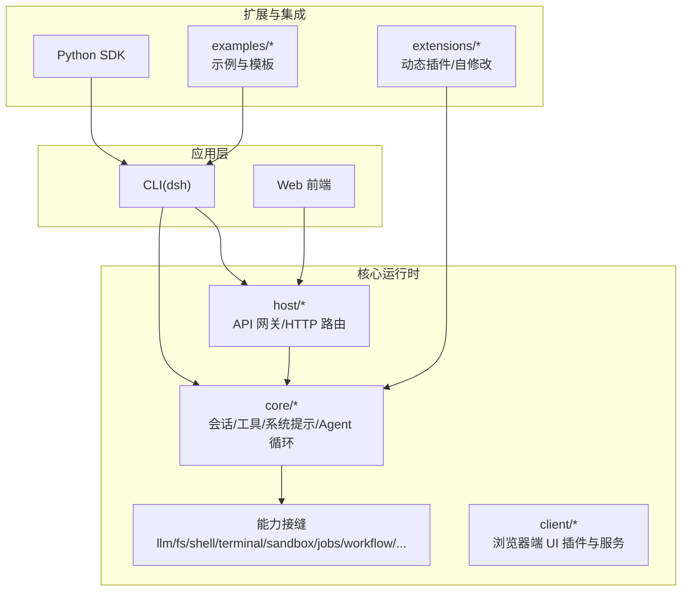
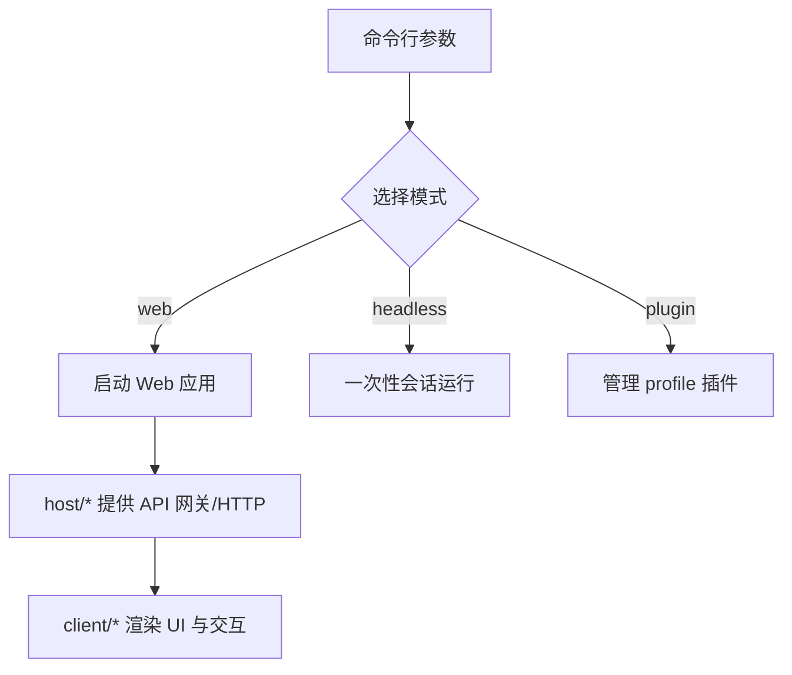
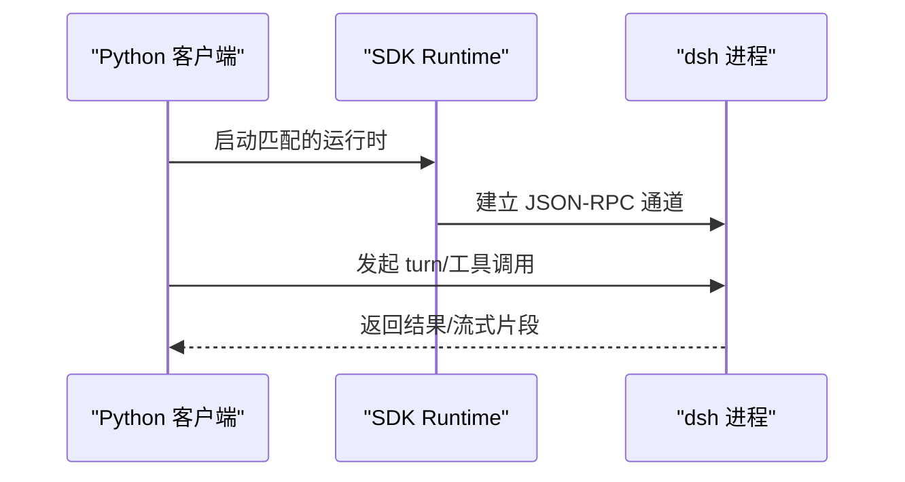
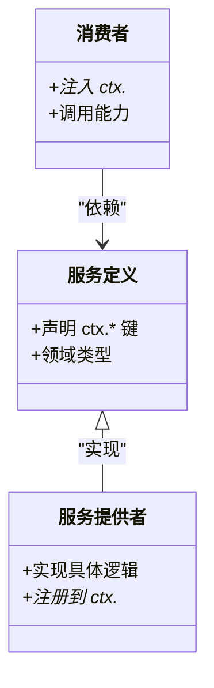
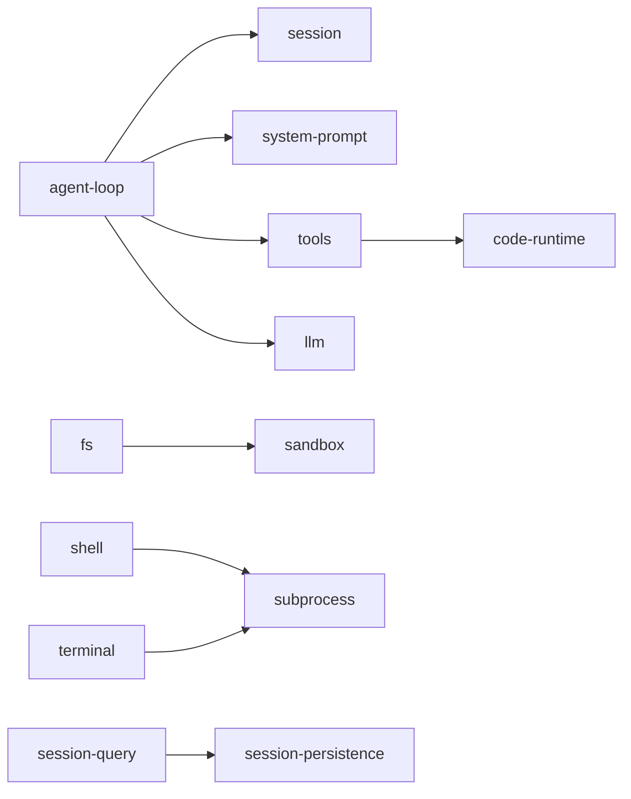

# 生态系统

<cite>
**本文引用的文件**
- [README.md](file://README.md)
- [package.json](file://package.json)
- [packages/README.md](file://packages/README.md)
- [docs/architecture.md](file://docs/architecture.md)
- [docs/subsystems/README.md](file://docs/subsystems/README.md)
- [docs/capability-seams.md](file://docs/capability-seams.md)
- [docs/module-graph.md](file://docs/module-graph.md)
- [apps/cli/README.md](file://apps/cli/README.md)
- [examples/README.md](file://examples/README.md)
- [python/README.md](file://python/README.md)
- [packages/core/README.md](file://packages/core/README.md)
- [packages/extensions/README.md](file://packages/extensions/README.md)
</cite>

## 目录
1. [简介](#简介)
2. [项目结构](#项目结构)
3. [核心组件](#核心组件)
4. [架构总览](#架构总览)
5. [详细组件分析](#详细组件分析)
6. [依赖关系分析](#依赖关系分析)
7. [性能考量](#性能考量)
8. [故障排查指南](#故障排查指南)
9. [结论](#结论)
10. [附录](#附录)

## 简介
DeepSeek Harness（简称 dsh）是一个以“一切皆插件”为核心理念的开源 Agent 运行框架，基于 Cordis 插件与上下文机制构建。它通过可组合的配置层、能力接缝（seam）、事件流和会话日志，将模型适配、工具注册、持久化、沙箱、审批、工作流等能力解耦为可替换的插件包。用户可通过 CLI、Web 界面或 Python SDK 驱动 Agent，并通过示例应用快速上手。

## 项目结构
仓库采用多包工作区组织：
- apps：产品级入口（CLI 与 Web 前端）
- packages：按能力分组的核心包、扩展包、宿主与客户端半面、示例与测试支撑
- docs：架构、子系统参考、教程与用户指南
- examples：可运行的 Agent 示例与模板
- python：Python SDK 与运行时载体
- native：原生安全隔离相关二进制与脚本
- scripts：构建、验证、文档生成与发布脚本



图表来源
- [apps/cli/README.md:1-48](file://apps/cli/README.md#L1-L48)
- [docs/architecture.md:15-37](file://docs/architecture.md#L15-L37)
- [packages/README.md:1-70](file://packages/README.md#L1-L70)

章节来源
- [README.md:1-58](file://README.md#L1-L58)
- [package.json:1-183](file://package.json#L1-L183)
- [apps/cli/README.md:1-48](file://apps/cli/README.md#L1-L48)
- [packages/README.md:1-70](file://packages/README.md#L1-L70)

## 核心组件
- 产品 API 骨架（core/*）：会话日志、系统提示组装、工具注册与执行管线、Agent 接口与默认循环实现，构成稳定对外表面。
- 能力接缝（seam）：每个能力由“服务定义 + 服务提供者 + 消费者”三角色组成，便于独立演进与替换（如 llm、fs、shell、terminal、sandbox、jobs、workflow、web 等）。
- 宿主与客户端：host/* 提供 API 网关与 HTTP 路由；client/* 提供浏览器端 UI 插件、对象服务与插槽。
- 扩展层：extensions/* 允许 Agent 在运行时检查并动态加载/卸载插件；Python SDK 提供进程外驱动方式。
- 配置与组合：通过 profile/bundle 分层叠加，支持 patch 覆盖与热插拔。

章节来源
- [packages/core/README.md:1-22](file://packages/core/README.md#L1-L22)
- [docs/capability-seams.md:1-472](file://docs/capability-seams.md#L1-L472)
- [packages/extensions/README.md:1-13](file://packages/extensions/README.md#L1-L13)
- [docs/architecture.md:15-37](file://docs/architecture.md#L15-L37)

## 架构总览
dsh 的启动过程由 CLI 选择 profile，按顺序装载 bundle 与 patch 层，形成插件树。核心控制流围绕“turn/step”展开：输入进入 Agent 循环，组装系统提示与工具模式，调用 LLM 流式响应，并在工具执行前后进行策略与审计。所有对模型可见的数据都写入会话日志，保证可回放与可观测。

```mermaid
sequenceDiagram
participant U as "用户"
participant CLI as "CLI(dsh)"
participant BOOT as "引导(Profiles/Bundles)"
participant LOOP as "Agent 循环"
participant TOOLS as "工具注册表"
participant LLM as "LLM 适配器"
participant LOG as "会话日志"
U->>CLI : 启动命令(--profile/web/headless)
CLI->>BOOT : 解析 profile 与 bundles
BOOT-->>LOOP : 挂载插件树(ctx.* 服务)
U->>LOOP : 提交任务/消息
LOOP->>LOG : turn/start, 记录意图
LOOP->>TOOLS : 组装系统提示与工具模式
LOOP->>LLM : 发送请求(流式)
LLM-->>LOOP : assistant/chunk*
LOOP->>TOOLS : tool/call* -> pre/post 策略
TOOLS-->>LOOP : tool/result*
LOOP->>LOG : 持久化 step/end, assistant/message
LOOP-->>U : 输出结果/下一步
```

图表来源
- [docs/architecture.md:63-90](file://docs/architecture.md#L63-L90)
- [docs/architecture.md:92-128](file://docs/architecture.md#L92-L128)

章节来源
- [docs/architecture.md:1-130](file://docs/architecture.md#L1-L130)

## 详细组件分析

### 应用程序层：CLI 与 Web
- CLI（dsh）：负责命令语法、profile 选择、参数转发与错误处理；支持 web、headless、plugin 管理等入口模式。
- Web：浏览器端通过 host/* 暴露 API 网关与静态资源，结合 client/* 的 UI 插件渲染对话、设置、工具面板等。



图表来源
- [apps/cli/README.md:1-48](file://apps/cli/README.md#L1-L48)
- [docs/subsystems/README.md:1-56](file://docs/subsystems/README.md#L1-L56)

章节来源
- [apps/cli/README.md:1-48](file://apps/cli/README.md#L1-L48)

### 扩展层：Python SDK 与第三方集成
- Python SDK：通过 JSON-RPC over stdio 与内置运行时通信，提供高层 turns API 与底层客户端。
- 第三方集成：通过 MCP、ACP、子代理等能力接缝接入外部系统（搜索、抓取、代码执行、远程终端等）。



图表来源
- [python/README.md:1-21](file://python/README.md#L1-L21)
- [docs/capability-seams.md:1-472](file://docs/capability-seams.md#L1-L472)

章节来源
- [python/README.md:1-21](file://python/README.md#L1-L21)

### 示例应用与模板
- headless-agent：非交互式单次任务执行，输出机器可读或人类可读结果。
- jsonrpc-agent：通过 Python SDK 驱动的无头编码 Agent。
- acp-agent：自动化 Agent Client Protocol 服务器，支持会话、权限与取消。
- web-cordis / web-schedule：Web 场景下的自引用插件树编辑与定时提醒演示。

章节来源
- [examples/README.md:1-30](file://examples/README.md#L1-L30)

### 插件生态与开放点
- 能力接缝：每个能力以“服务定义 + 提供者 + 消费者”三角色解耦，新增能力需设计三者（见 capability seams）。
- 事件与钩子：通过 agent/*、tools/*、session/event 等事件扩展行为，不侵入主循环。
- 动态插件：extensions/* 提供运行时检查与动态加载/卸载，支持模型生成的插件在受限环境中执行。



图表来源
- [docs/capability-seams.md:1-472](file://docs/capability-seams.md#L1-L472)
- [packages/extensions/README.md:1-13](file://packages/extensions/README.md#L1-L13)

章节来源
- [docs/capability-seams.md:1-472](file://docs/capability-seams.md#L1-L472)
- [packages/extensions/README.md:1-13](file://packages/extensions/README.md#L1-L13)

## 依赖关系分析
- 包层级依赖由 peerDependencies 推导，按 group 分组展示，清晰体现 core、llm、fs、shell、terminal、sandbox、jobs、workflow、web 等能力之间的耦合。
- 关键依赖方向：
  - agent-loop 依赖 session、system-prompt、tools、llm、settings、invariants。
  - tools 依赖 agent、code-runtime、llm、scope、session、system-prompt、user-approval。
  - fs/shell/terminal 等能力通过 subprocess/sandbox 共享执行环境。
  - 查询与持久化通过 session-query、session-persistence、storage-domain 协作。



图表来源
- [docs/module-graph.md:1-800](file://docs/module-graph.md#L1-L800)

章节来源
- [docs/module-graph.md:1-800](file://docs/module-graph.md#L1-L800)

## 性能考量
- 会话日志作为唯一事实源，所有模型可见数据必须可回放，避免隐式状态导致的不一致。
- 流式 LLM 响应与工具执行管道配合，减少阻塞与内存峰值。
- 压缩（compaction）与溢出存储（spill）用于控制上下文大小与 I/O 压力。
- 工作线程与子进程隔离（code-runtime、subprocess、terminal）提升并发与稳定性。
- 查询与缓存（session-projection-cache）降低冷读成本。

[本节为通用指导，不直接分析具体文件]

## 故障排查指南
- 启动失败：使用 --dump-config 查看实际组合树，确认 bundle/patch 顺序与冲突。
- 工具执行异常：检查 tools/pre-execute/tools/post-execute 策略与 approval 流程。
- 会话无法恢复：确认 session-persistence 后端可用，检查 flush 与 checkpoint 策略。
- 网络/外部能力不可用：校验 web/search/fetch 提供商与凭据（credentials）配置。
- 调试建议：启用 invariants 诊断、使用 test-support 中的 mock 与 replay 工具。

章节来源
- [docs/architecture.md:15-37](file://docs/architecture.md#L15-L37)
- [docs/subsystems/README.md:1-56](file://docs/subsystems/README.md#L1-L56)

## 结论
DeepSeek Harness 通过“一切皆插件”的架构与能力接缝，提供了高度可扩展、可替换、可观测的 Agent 平台。CLI/Web/Python SDK 覆盖多种使用场景，示例与模板加速上手，动态插件与事件机制支持社区贡献与第三方集成。开发者应优先面向服务定义与事件扩展点进行开发，保持消费者与提供者的解耦，确保生态的长期可维护性。

[本节为总结，不直接分析具体文件]

## 附录
- 快速开始：从 npm 安装并运行 web，或从源码构建后使用 pnpm dsh web。
- 深入阅读：architecture.md、capability-seams.md、module-graph.md 与各子系统参考。
- 贡献与社区：遵循 CONTRIBUTING.md，使用 @deepseek-ai/dsh-* 命名规范，通过 Cordis 服务/事件扩展。

章节来源
- [README.md:13-35](file://README.md#L13-L35)
- [docs/architecture.md:1-130](file://docs/architecture.md#L1-L130)
- [docs/capability-seams.md:1-472](file://docs/capability-seams.md#L1-L472)
- [docs/module-graph.md:1-800](file://docs/module-graph.md#L1-L800)