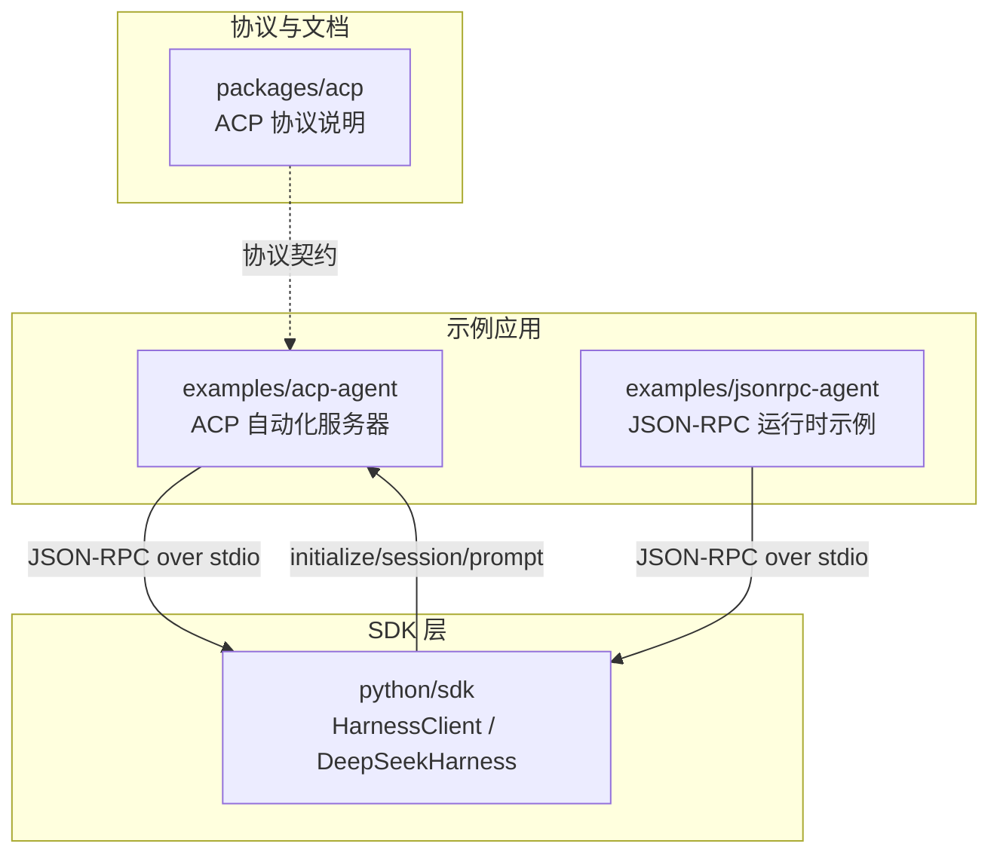
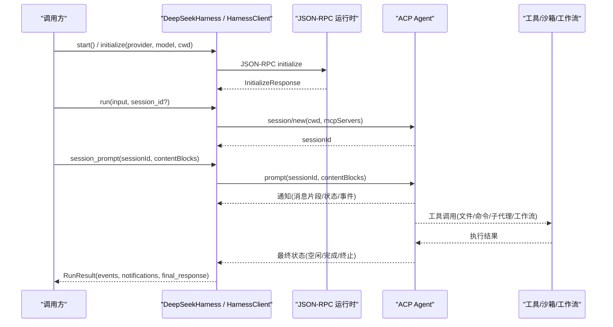
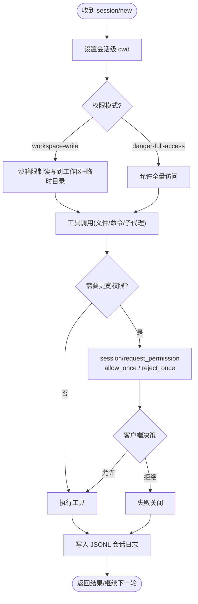
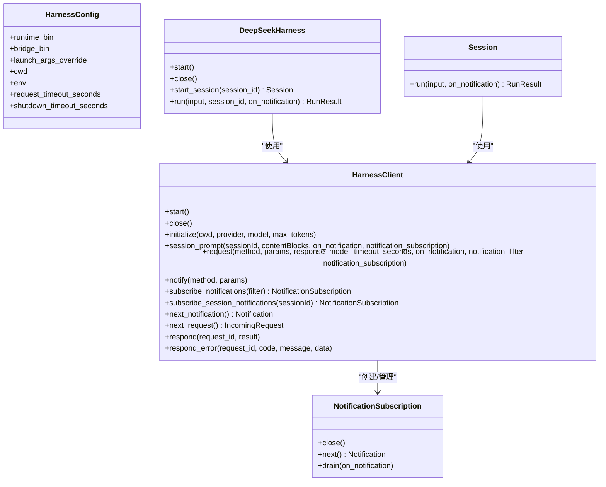
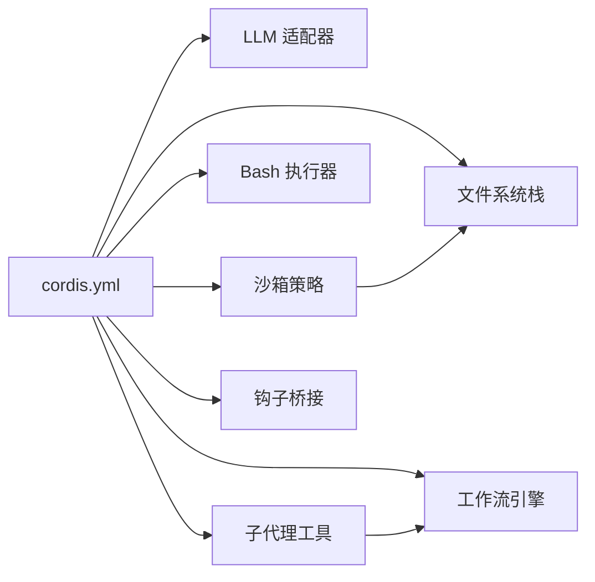

# ACP Agent 示例

<cite>
**本文引用的文件**
- [examples/acp-agent/README.md](file://examples/acp-agent/README.md)
- [examples/acp-agent/cordis.yml](file://examples/acp-agent/cordis.yml)
- [packages/acp/README.md](file://packages/acp/README.md)
- [python/sdk/src/deepseek_harness/client.py](file://python/sdk/src/deepseek_harness/client.py)
- [python/sdk/src/deepseek_harness/api.py](file://python/sdk/src/deepseek_harness/api.py)
- [python/sdk/src/deepseek_harness/models.py](file://python/sdk/src/deepseek_harness/models.py)
- [python/sdk/src/deepseek_harness/errors.py](file://python/sdk/src/deepseek_harness/errors.py)
- [examples/jsonrpc-agent/README.md](file://examples/jsonrpc-agent/README.md)
- [examples/jsonrpc-agent/minimal.py](file://examples/jsonrpc-agent/minimal.py)
- [examples/acp-agent/tests/acp.e2e.ts](file://examples/acp-agent/tests/acp.e2e.ts)
- [examples/acp-agent/tests/cleanup.ts](file://examples/acp-agent/tests/cleanup.ts)
</cite>

## 目录
1. [简介](#简介)
2. [项目结构](#项目结构)
3. [核心组件](#核心组件)
4. [架构总览](#架构总览)
5. [详细组件分析](#详细组件分析)
6. [依赖关系分析](#依赖关系分析)
7. [性能考量](#性能考量)
8. [故障排查指南](#故障排查指南)
9. [结论](#结论)
10. [附录](#附录)

## 简介
本文件系统性介绍 ACP Agent 示例应用的完整实现，涵盖 Agent Client Protocol（ACP）的概念与用途、编程式交互方式、会话管理、权限控制与取消操作、Python SDK 与 JSON-RPC 客户端连接方式，以及端到端测试设计与最佳实践。目标是帮助用户理解如何构建自己的自动化 Agent 服务，并以最小成本集成到现有系统。

## 项目结构
ACP Agent 示例位于 examples/acp-agent，提供面向自动化的 ACP 服务器，通过 JSON-RPC over stdio 暴露能力；同时配套 Python SDK 与 minimal 示例，便于快速上手。

**图示来源**
- [examples/acp-agent/README.md:1-25](file://examples/acp-agent/README.md#L1-L25)
- [examples/jsonrpc-agent/README.md:1-41](file://examples/jsonrpc-agent/README.md#L1-L41)
- [packages/acp/README.md:1-12](file://packages/acp/README.md#L1-L12)
- [python/sdk/src/deepseek_harness/client.py:37-184](file://python/sdk/src/deepseek_harness/client.py#L37-L184)

**章节来源**
- [examples/acp-agent/README.md:1-25](file://examples/acp-agent/README.md#L1-L25)
- [examples/jsonrpc-agent/README.md:1-41](file://examples/jsonrpc-agent/README.md#L1-L41)
- [packages/acp/README.md:1-12](file://packages/acp/README.md#L1-L12)

## 核心组件
- ACP 自动化服务器：基于 JSON-RPC over stdio 的无头 Agent 服务，负责会话生命周期、工具执行、子代理与工作流等。
- Python SDK：封装进程启动、初始化、会话与提示调用、通知订阅与错误处理。
- JSON-RPC 运行时示例：提供最小化配置与命令行入口，便于在容器或打包环境中运行。
- 测试套件：端到端验证 stdout 纯净性、会话创建、真实任务执行与文件系统效果。

**章节来源**
- [examples/acp-agent/cordis.yml:1-193](file://examples/acp-agent/cordis.yml#L1-L193)
- [python/sdk/src/deepseek_harness/api.py:13-183](file://python/sdk/src/deepseek_harness/api.py#L13-L183)
- [python/sdk/src/deepseek_harness/client.py:37-184](file://python/sdk/src/deepseek_harness/client.py#L37-L184)
- [examples/jsonrpc-agent/README.md:1-41](file://examples/jsonrpc-agent/README.md#L1-L41)

## 架构总览
下图展示了从 Python SDK 到 ACP Agent 的端到端调用流程，包括初始化、会话创建、提示提交、通知订阅与结果获取。

**图示来源**
- [python/sdk/src/deepseek_harness/api.py:97-183](file://python/sdk/src/deepseek_harness/api.py#L97-L183)
- [python/sdk/src/deepseek_harness/client.py:117-184](file://python/sdk/src/deepseek_harness/client.py#L117-L184)
- [examples/acp-agent/tests/acp.e2e.ts:42-126](file://examples/acp-agent/tests/acp.e2e.ts#L42-L126)

## 详细组件分析

### ACP 协议与自动化服务器
- 定位：面向程序化客户端的互操作传输层，非 UI 或人类交互层。
- 通道：stdout 仅承载换行分隔的 JSON-RPC 帧；诊断输出走 stderr。
- 会话：每个 session/new 携带绝对 cwd，作为该会话的工作空间根。
- 权限：沙箱策略按 workspace-write 或 danger-full-access 部署；模型重试请求更宽访问时触发 session/request_permission，由客户端决定 allow_once/reject_once。
- 持久化：默认 JSONL 压缩存储，快照模式可关闭压缩并隔离日志。

**图示来源**
- [examples/acp-agent/README.md:14-25](file://examples/acp-agent/README.md#L14-L25)
- [examples/acp-agent/cordis.yml:18-63](file://examples/acp-agent/cordis.yml#L18-L63)

**章节来源**
- [packages/acp/README.md:1-12](file://packages/acp/README.md#L1-L12)
- [examples/acp-agent/README.md:14-25](file://examples/acp-agent/README.md#L14-L25)
- [examples/acp-agent/cordis.yml:18-63](file://examples/acp-agent/cordis.yml#L18-L63)

### Python SDK：连接、会话与通知
- 进程管理：启动子进程、读取 stdout/stderr、线程安全写读、优雅关闭。
- 初始化：传递 provider、model、cwd、maxTokens。
- 会话与提示：创建 session/new，提交 session/prompt，订阅 session 及子会话通知。
- 通知过滤：支持按会话树过滤，自动追踪 subagent.started/finished 以识别父子关系。
- 错误处理：统一异常类型，包含 JSON-RPC 错误、传输关闭、超时等。

**图示来源**
- [python/sdk/src/deepseek_harness/client.py:24-205](file://python/sdk/src/deepseek_harness/client.py#L24-L205)
- [python/sdk/src/deepseek_harness/api.py:13-183](file://python/sdk/src/deepseek_harness/api.py#L13-L183)

**章节来源**
- [python/sdk/src/deepseek_harness/client.py:37-184](file://python/sdk/src/deepseek_harness/client.py#L37-L184)
- [python/sdk/src/deepseek_harness/api.py:97-183](file://python/sdk/src/deepseek_harness/api.py#L97-L183)
- [python/sdk/src/deepseek_harness/models.py:13-33](file://python/sdk/src/deepseek_harness/models.py#L13-L33)
- [python/sdk/src/deepseek_harness/errors.py:4-24](file://python/sdk/src/deepseek_harness/errors.py#L4-L24)

### JSON-RPC 运行时与最小示例
- 运行时：无终端、无控制台日志、无审批 UI，stdout 专用于 SDK 协议。
- 工具集：bash（前台）、read/write/edit、subagent（in-process spawn）、todo_write。
- 环境变量：DEEPSEEK_API_KEY、DEEPSEEK_BASE_URL、DSH_CWD、DSH_CONTEXT_WINDOW、DSH_MAX_TOKENS_AS_SUCCESS、DSH_MODEL、DSH_SESSION_ROOT、DSH_SYSTEM_PROMPT。
- 最小变体：独立 minimal.cordis.yml，加载 PTY、fs-local、danger-full-access、未压缩 JSONL 持久化。

**章节来源**
- [examples/jsonrpc-agent/README.md:1-41](file://examples/jsonrpc-agent/README.md#L1-L41)
- [examples/jsonrpc-agent/minimal.py:16-39](file://examples/jsonrpc-agent/minimal.py#L16-L39)

### 端到端测试与最佳实践
- 测试目标：
  - 验证 stdout 仅包含 JSON-RPC 帧（无日志泄漏）。
  - 验证 session/new 成功且返回有效 sessionId。
  - 真实提示驱动 Agent 写入文件，并通过文件系统断言结果。
- 清理策略：并行关闭进程与删除工作目录，聚合所有失败。
- 最佳实践：
  - 使用临时目录隔离每次测试。
  - 通过环境变量切换权限模式（如 danger-full-access）。
  - 对关键路径进行快照与回归保护。

**章节来源**
- [examples/acp-agent/tests/acp.e2e.ts:42-126](file://examples/acp-agent/tests/acp.e2e.ts#L42-L126)
- [examples/acp-agent/tests/cleanup.ts:11-23](file://examples/acp-agent/tests/cleanup.ts#L11-L23)

## 依赖关系分析
- 配置与插件：cordis.yml 声明 LLM、沙箱、子代理、工作流、文件系统、钩子等插件组合。
- 权限策略：通过 DSH_PERMISSION_MODE 选择 workspace-write 或 danger-full-access，影响 bash 与文件系统工具的边界。
- 会话上下文：workspaceContext.maxBytes 控制上下文窗口大小；compaction-basic 控制压缩阈值与保留比例。
- 子代理与工作流：通过 tool-subagent-* 与 tool-workflow 暴露给模型；支持 spawn/fork 两种提供者。

**图示来源**
- [examples/acp-agent/cordis.yml:18-193](file://examples/acp-agent/cordis.yml#L18-L193)

**章节来源**
- [examples/acp-agent/cordis.yml:18-193](file://examples/acp-agent/cordis.yml#L18-L193)

## 性能考量
- 上下文压缩：通过 compaction-basic 控制阈值与保留比例，避免上下文过大导致延迟与成本上升。
- 令牌计量：token-meter 监控压力，结合 provider 容量进行自适应。
- 子代理深度：tool-subagent 配置 maxDepth 防止过深递归。
- I/O 分离：stdout 仅承载协议，stderr 用于诊断，避免阻塞与污染。

[本节为通用指导，不直接分析具体文件]

## 故障排查指南
- 传输关闭：当子进程退出或 stdout 关闭时抛出 TransportClosedError，附带退出码与 stderr 尾部信息。
- JSON-RPC 错误：服务端返回 error 字段时转换为 JsonRpcError，包含 code、message、data。
- 超时处理：请求超时抛出 TimeoutError，并附加运行时诊断信息。
- 通知与请求：next_notification/next_request 若收到异常则抛出，需捕获并处理。
- 清理失败：测试 teardown 聚合所有失败，便于定位资源释放问题。

**章节来源**
- [python/sdk/src/deepseek_harness/errors.py:4-24](file://python/sdk/src/deepseek_harness/errors.py#L4-L24)
- [python/sdk/src/deepseek_harness/client.py:386-422](file://python/sdk/src/deepseek_harness/client.py#L386-L422)
- [examples/acp-agent/tests/cleanup.ts:11-23](file://examples/acp-agent/tests/cleanup.ts#L11-L23)

## 结论
ACP Agent 示例提供了稳定、可编程的自动化 Agent 服务，通过 JSON-RPC over stdio 与 Python SDK 无缝对接。其清晰的会话管理、细粒度权限控制、完善的错误处理与测试覆盖，使其成为构建自有自动化 Agent 服务的可靠基线。建议在生产中结合上下文压缩、令牌计量与子代理深度限制，以获得更好的性能与稳定性。

[本节为总结性内容，不直接分析具体文件]

## 附录

### 使用 Python SDK 连接到 ACP Agent 的步骤
- 启动并初始化：设置 provider、model、cwd，调用 start()/initialize()。
- 创建会话并提交提示：start_session()/run() 或 client.session_prompt()。
- 订阅通知：subscribe_session_notifications() 收集事件与状态变化。
- 获取结果：RunResult 包含 final_response、finish_reason、events、notifications。
- 关闭资源：使用上下文管理器或显式 close() 确保进程回收。

**章节来源**
- [python/sdk/src/deepseek_harness/api.py:97-183](file://python/sdk/src/deepseek_harness/api.py#L97-L183)
- [python/sdk/src/deepseek_harness/client.py:117-184](file://python/sdk/src/deepseek_harness/client.py#L117-L184)

### 使用 JSON-RPC 客户端的最小示例
- 通过 minimal.py 传入 prompt、workspace、session_root、provider、model、max-tokens。
- 运行时加载 minimal.cordis.yml，启用必要工具与持久化。
- 环境变量控制模型、会话目录与系统提示。

**章节来源**
- [examples/jsonrpc-agent/minimal.py:16-39](file://examples/jsonrpc-agent/minimal.py#L16-L39)
- [examples/jsonrpc-agent/README.md:16-41](file://examples/jsonrpc-agent/README.md#L16-L41)

### 端到端测试要点
- 验证 stdout 纯净性：每条 stdout 必须可解析为 JSON-RPC 帧。
- 验证会话创建：newSession 返回有效 sessionId。
- 验证真实任务：提示驱动 Agent 写入文件，断言文件系统效果。
- 清理与隔离：每次测试使用临时目录，并行关闭进程与删除目录。

**章节来源**
- [examples/acp-agent/tests/acp.e2e.ts:42-126](file://examples/acp-agent/tests/acp.e2e.ts#L42-L126)
- [examples/acp-agent/tests/cleanup.ts:11-23](file://examples/acp-agent/tests/cleanup.ts#L11-L23)