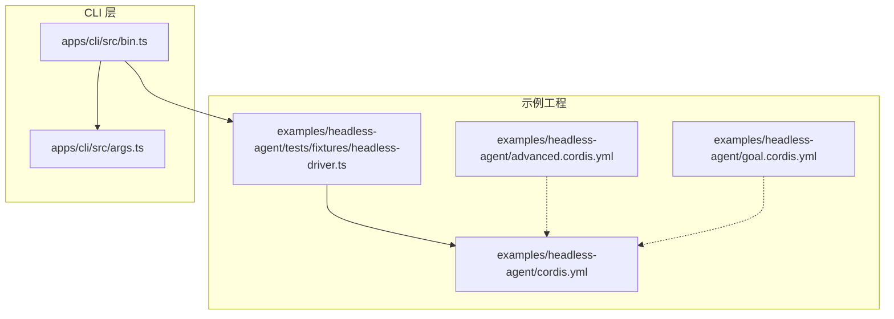
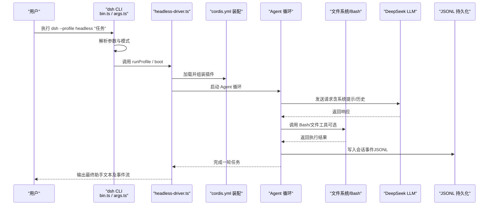
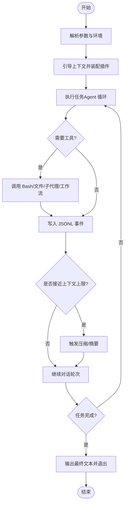
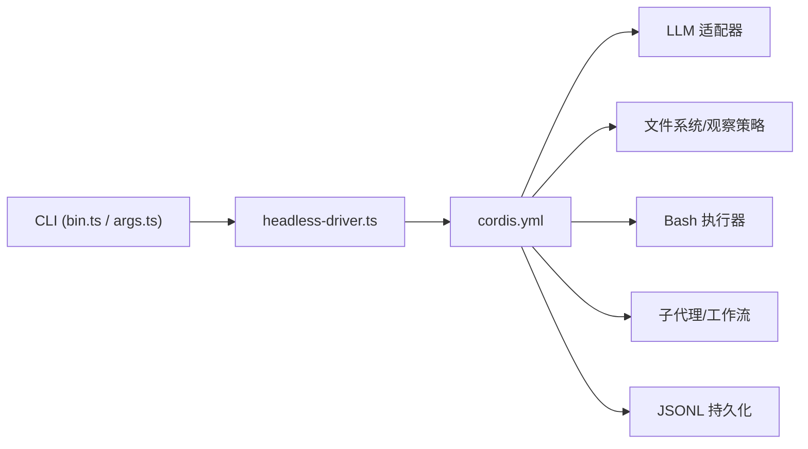

# Headless Agent 示例

<cite>
**本文引用的文件**
- [examples/headless-agent/README.md](file://examples/headless-agent/README.md)
- [examples/headless-agent/cordis.yml](file://examples/headless-agent/cordis.yml)
- [examples/headless-agent/advanced.cordis.yml](file://examples/headless-agent/advanced.cordis.yml)
- [examples/headless-agent/goal.cordis.yml](file://examples/headless-agent/goal.cordis.yml)
- [examples/headless-agent/composition.md](file://examples/headless-agent/composition.md)
- [examples/headless-agent/tests/harness.ts](file://examples/headless-agent/tests/harness.ts)
- [examples/headless-agent/tests/fixtures/headless-driver.ts](file://examples/headless-agent/tests/fixtures/headless-driver.ts)
- [apps/cli/src/bin.ts](file://apps/cli/src/bin.ts)
- [apps/cli/src/args.ts](file://apps/cli/src/args.ts)
</cite>

## 目录
1. [简介](#简介)
2. [项目结构](#项目结构)
3. [核心组件](#核心组件)
4. [架构总览](#架构总览)
5. [详细组件分析](#详细组件分析)
6. [依赖关系分析](#依赖关系分析)
7. [性能与资源管理](#性能与资源管理)
8. [故障排查与调试](#故障排查与调试)
9. [结论](#结论)
10. [附录：快速上手与生产部署](#附录快速上手与生产部署)

## 简介
Headless Agent 示例展示了如何在非交互式环境中运行一个“无头”编码 Agent。它通过 CLI 入口加载配置、组装插件栈、执行一次性任务，并将会话以 JSONL 持久化到磁盘，最终输出助手文本并退出。该示例强调：
- 无 GUI、无交互：适合 CI、批处理、后台任务等场景
- 可组合的插件体系：LLM、文件系统、Bash、子代理、工作流、压缩、检查点策略等均可按需装配
- 明确的输入/输出契约：命令行传入任务字符串；输出为最终助手消息文本（测试驱动会额外输出事件流）

适用场景包括：自动化代码修复、批量脚本生成、持续集成中的代码质量检查、后台任务编排等。

章节来源
- [examples/headless-agent/README.md:1-33](file://examples/headless-agent/README.md#L1-L33)

## 项目结构
本示例位于 examples/headless-agent，核心由以下部分组成：
- 配置文件：cordis.yml 定义完整的插件装配；advanced.cordis.yml 和 goal.cordis.yml 提供叠加覆盖能力
- 测试与驱动：tests/fixtures/headless-driver.ts 用于将一次任务转换为标准 JSONL 事件流（测试基础设施）
- CLI 入口：apps/cli/src/bin.ts 与 apps/cli/src/args.ts 负责解析参数、选择 profile、动态导入并启动对应模式

图表来源
- [examples/headless-agent/cordis.yml:1-166](file://examples/headless-agent/cordis.yml#L1-L166)
- [examples/headless-agent/advanced.cordis.yml:1-35](file://examples/headless-agent/advanced.cordis.yml#L1-L35)
- [examples/headless-agent/goal.cordis.yml:1-12](file://examples/headless-agent/goal.cordis.yml#L1-L12)
- [examples/headless-agent/tests/fixtures/headless-driver.ts:1-34](file://examples/headless-agent/tests/fixtures/headless-driver.ts#L1-L34)
- [apps/cli/src/bin.ts:1-54](file://apps/cli/src/bin.ts#L1-L54)
- [apps/cli/src/args.ts:1-192](file://apps/cli/src/args.ts#L1-L192)

章节来源
- [examples/headless-agent/composition.md:1-94](file://examples/headless-agent/composition.md#L1-L94)
- [examples/headless-agent/README.md:1-33](file://examples/headless-agent/README.md#L1-L33)

## 核心组件
- 配置与装配
  - cordis.yml：声明式装配 LLM、Bash、文件系统、子代理、工作流、持久化、压缩、检查点策略等
  - advanced.cordis.yml：在基础之上启用 Code Mode 与 Cordis 工具，并切换模型
  - goal.cordis.yml：注入目标域与工具，增强任务规划能力
- 运行时与驱动
  - headless-driver.ts：加载环境、引导上下文、执行单次任务、输出 JSONL 事件流与结果记录
  - harness.ts：测试用共享装配器，演示如何按选项挂载 Bash、Todo、Token 计量、压缩、JSONL 持久化等
- CLI 与参数
  - bin.ts：根据解析出的模式动态导入并运行（profile/plugin/dump-config）
  - args.ts：解析 --profile、--patch、--dump-config 等，并将剩余参数透传给被启动的应用

章节来源
- [examples/headless-agent/cordis.yml:1-166](file://examples/headless-agent/cordis.yml#L1-L166)
- [examples/headless-agent/advanced.cordis.yml:1-35](file://examples/headless-agent/advanced.cordis.yml#L1-L35)
- [examples/headless-agent/goal.cordis.yml:1-12](file://examples/headless-agent/goal.cordis.yml#L1-L12)
- [examples/headless-agent/tests/fixtures/headless-driver.ts:1-34](file://examples/headless-agent/tests/fixtures/headless-driver.ts#L1-L34)
- [examples/headless-agent/tests/harness.ts:1-105](file://examples/headless-agent/tests/harness.ts#L1-L105)
- [apps/cli/src/bin.ts:1-54](file://apps/cli/src/bin.ts#L1-L54)
- [apps/cli/src/args.ts:1-192](file://apps/cli/src/args.ts#L1-L192)

## 架构总览
下图展示从 CLI 到 Agent 的一次性执行流程：解析参数 → 加载环境 → 引导上下文 → 执行任务 → 输出事件与结果 → 清理资源。

图表来源
- [apps/cli/src/bin.ts:1-54](file://apps/cli/src/bin.ts#L1-L54)
- [apps/cli/src/args.ts:1-192](file://apps/cli/src/args.ts#L1-L192)
- [examples/headless-agent/tests/fixtures/headless-driver.ts:1-34](file://examples/headless-agent/tests/fixtures/headless-driver.ts#L1-L34)
- [examples/headless-agent/cordis.yml:1-166](file://examples/headless-agent/cordis.yml#L1-L166)

## 详细组件分析

### CLI 参数与环境变量
- 命令行参数
  - --profile <name>：指定要启动的配置集（如 headless）
  - --patch <path>：追加补丁层，可在 profile 之后叠加自定义配置
  - --dump-config / --dump-default-config：打印组合后的配置树而不实际运行
  - 位置参数：透传给被启动的应用（例如 headless 的任务描述）
- 环境变量
  - DEEPSEEK_API_KEY：LLM 凭据（通过本地凭据适配器读取）
  - DEEPSEEK_BASE_URL：可选，指定 API 基地址
  - DSH_SNAPSHOT：控制持久化压缩策略（快照模式下关闭压缩）
  - E2B_API_KEY：E2B 沙箱覆盖时使用（POC 场景）

章节来源
- [apps/cli/src/args.ts:1-192](file://apps/cli/src/args.ts#L1-L192)
- [examples/headless-agent/README.md:1-33](file://examples/headless-agent/README.md#L1-L33)
- [examples/headless-agent/cordis.yml:12-33](file://examples/headless-agent/cordis.yml#L12-L33)
- [examples/headless-agent/cordis.yml:63-68](file://examples/headless-agent/cordis.yml#L63-L68)

### 配置与装配（cordis.yml）
- 设置与凭据
  - settings：热重载的用户设置文件
  - credentials：从本地凭据存储读取密钥，避免硬编码
- LLM
  - deepseek 适配器，开启思考与推理强度，声明可用模型与上下文窗口
- 执行环境
  - subprocess + bash-local：受控的子进程组与 Bash 执行器（超时等）
- Agent 骨架
  - agent-spine-demo：预创建 main Agent，设定 provider/model/cwd 与工作区上下文大小、系统提示
- 持久化与检查点
  - session-persistence-jsonl：JSONL 会话日志，根目录 ./.sessions
  - session-checkpoint-policy：检查点策略
- Token 计量与压缩
  - token-meter + compaction-basic：当历史接近上下文窗口时进行摘要压缩
- 子代理与工作流
  - subagent（spawn/fork）、tool-subagent-control/report/workflow、ralph、todo_write
- 文件系统
  - fs-local + observation-policy + tool-fs：基于观察策略的安全文件操作

章节来源
- [examples/headless-agent/cordis.yml:1-166](file://examples/headless-agent/cordis.yml#L1-L166)

### 覆盖与扩展（advanced.cordis.yml / goal.cordis.yml）
- advanced.cordis.yml
  - 引入基础 cordis.yml，并覆盖 main Agent 的 model 为 deepseek-v4-pro，启用 both 模式，注入 code-runtime、cordis-host-runner、tool-cordis
- goal.cordis.yml
  - 注入 goal 域与 tool-goal，增强目标分解与工具使用

章节来源
- [examples/headless-agent/advanced.cordis.yml:1-35](file://examples/headless-agent/advanced.cordis.yml#L1-L35)
- [examples/headless-agent/goal.cordis.yml:1-12](file://examples/headless-agent/goal.cordis.yml#L1-L12)

### 执行流程与状态管理
- 启动阶段
  - 解析 CLI 参数，选择 profile 与补丁层
  - 加载环境（包含 .env），引导 Cordis 上下文
- 任务执行
  - 将任务字符串交给 Agent 循环，结合系统提示与历史进行推理
  - 根据需要调用 Bash/文件/子代理/工作流等工具
- 状态与持久化
  - 会话事件实时写入 JSONL；检查点策略保障中断恢复
  - Token 计量与压缩在历史增长时自动触发
- 结束阶段
  - 输出最终助手文本；测试驱动还会输出事件流；释放 fiber 等资源

图表来源
- [examples/headless-agent/tests/fixtures/headless-driver.ts:1-34](file://examples/headless-agent/tests/fixtures/headless-driver.ts#L1-L34)
- [examples/headless-agent/cordis.yml:63-83](file://examples/headless-agent/cordis.yml#L63-L83)

章节来源
- [examples/headless-agent/tests/fixtures/headless-driver.ts:1-34](file://examples/headless-agent/tests/fixtures/headless-driver.ts#L1-L34)
- [examples/headless-agent/cordis.yml:1-166](file://examples/headless-agent/cordis.yml#L1-L166)

### 任务输入与输出格式
- 输入
  - 通过 CLI 的位置参数传入任务描述（非空白字符串）
  - 可通过 --patch 叠加配置，或通过 advanced/goal 覆盖件调整行为
- 输出
  - 主输出：最终助手文本（由应用决定）
  - 测试驱动输出：标准 JSONL 事件流（仅测试基础设施使用）
  - 持久化：JSONL 会话日志（默认 ./.sessions）

章节来源
- [examples/headless-agent/README.md:1-33](file://examples/headless-agent/README.md#L1-L33)
- [examples/headless-agent/tests/fixtures/headless-driver.ts:1-34](file://examples/headless-agent/tests/fixtures/headless-driver.ts#L1-L34)
- [examples/headless-agent/cordis.yml:63-68](file://examples/headless-agent/cordis.yml#L63-L68)

### 子代理与工作流
- 子代理
  - spawn：可续期背景子代理，支持 report 与控制工具
  - fork：一次性子代理，避免继承历史带来的副作用
- 工作流
  - worker-thread 引擎将模型生成的脚本调度到工作线程执行，并通过 spawn 后端分发 agent() 调用
- Ralph 迭代
  - 独立的固定消费者，在不改变工作流工具或同会话目标行为的前提下，演示 fresh-agent 迭代

章节来源
- [examples/headless-agent/cordis.yml:84-153](file://examples/headless-agent/cordis.yml#L84-L153)

### 测试与复用（harness.ts）
- 提供统一的测试装配函数，可按需挂载：
  - Bash 执行器与工具
  - Todo 工具（允许多个 in_progress）
  - Token 计量与结果裁剪
  - JSONL 持久化与检查点策略
- 暴露等待空闲与提取最终文本的工具方法，便于 e2e 断言

章节来源
- [examples/headless-agent/tests/harness.ts:1-105](file://examples/headless-agent/tests/harness.ts#L1-L105)

## 依赖关系分析
- 模块耦合
  - CLI 仅负责参数解析与模式路由，业务逻辑集中在被启动的 profile
  - headless-driver 作为测试驱动，桥接 CLI 与 Cordis 上下文
  - cordis.yml 集中声明所有插件及其配置，形成松耦合、可替换的装配图
- 外部依赖
  - DeepSeek LLM 适配器、本地 Bash/文件系统、JSONL 持久化、子代理与工作流引擎

图表来源
- [apps/cli/src/bin.ts:1-54](file://apps/cli/src/bin.ts#L1-L54)
- [apps/cli/src/args.ts:1-192](file://apps/cli/src/args.ts#L1-L192)
- [examples/headless-agent/tests/fixtures/headless-driver.ts:1-34](file://examples/headless-agent/tests/fixtures/headless-driver.ts#L1-L34)
- [examples/headless-agent/cordis.yml:1-166](file://examples/headless-agent/cordis.yml#L1-L166)

章节来源
- [examples/headless-agent/composition.md:1-94](file://examples/headless-agent/composition.md#L1-L94)

## 性能与资源管理
- 上下文窗口与压缩
  - 通过 token-meter 与 compaction-basic 在历史接近阈值时触发压缩，减少后续请求成本
  - 合理设置 thresholdRatio、retainRatio、maxTokens 以平衡信息保留与开销
- 子进程与 Bash
  - 为 Bash 设置超时，避免长时间阻塞；使用受控子进程组管理生命周期
- 持久化与检查点
  - JSONL 持久化确保可回放与恢复；检查点策略降低中断损失
- 模型选择
  - 在 replay 与基准场景中优先使用 flash 模型以降低延迟与成本；必要时切换到 pro 模型提升质量
- 资源释放
  - 驱动结束时释放 fiber，避免资源泄漏

章节来源
- [examples/headless-agent/cordis.yml:63-83](file://examples/headless-agent/cordis.yml#L63-L83)
- [examples/headless-agent/cordis.yml:34-42](file://examples/headless-agent/cordis.yml#L34-L42)
- [examples/headless-agent/tests/fixtures/headless-driver.ts:30-33](file://examples/headless-agent/tests/fixtures/headless-driver.ts#L30-L33)

## 故障排查与调试
- 常见问题
  - 缺少凭据：确认 DEEPSEEK_API_KEY 已正确设置，且凭据适配器能读取
  - 模型不可用：检查 models 列表与 contextWindow 配置
  - Bash 超时：调大 timeoutMs 或优化命令
  - 压缩未生效：检查 compaction 阈值与 maxTokens 配置
- 调试技巧
  - 使用 --dump-config 查看组合后的配置树，定位覆盖顺序
  - 通过 JSONL 会话日志回放问题，定位具体轮次与工具调用
  - 在测试驱动中捕获 stderr 与 stdout，辅助定位错误
- 恢复与重试
  - 利用检查点策略与 JSONL 持久化实现中断恢复
  - 对网络波动或模型限流，可在上层增加重试逻辑

章节来源
- [apps/cli/src/args.ts:1-192](file://apps/cli/src/args.ts#L1-L192)
- [examples/headless-agent/tests/fixtures/headless-driver.ts:17-33](file://examples/headless-agent/tests/fixtures/headless-driver.ts#L17-L33)
- [examples/headless-agent/cordis.yml:63-83](file://examples/headless-agent/cordis.yml#L63-L83)

## 结论
Headless Agent 示例提供了一个完整、可组合、可持久化的无头 Agent 范式。通过 CLI 传入任务、借助插件体系装配所需能力、并以 JSONL 形式持久化会话，既适合本地开发验证，也易于在生产环境中以批处理或后台服务的方式运行。配合压缩、检查点与合理的模型选择，可以在保证效果的同时控制成本与延迟。

## 附录：快速上手与生产部署
- 快速运行
  - 准备环境变量：DEEPSEEK_API_KEY（可选 DEEPSEEK_BASE_URL）
  - 执行：pnpm dsh --profile headless "你的任务描述"
  - 结果：创建并持久化会话，输出最终助手文本后退出
- 高级配置
  - 使用 advanced.cordis.yml 启用 Code Mode 与 Cordis 工具，并切换模型
  - 使用 goal.cordis.yml 注入目标域与工具，增强任务规划
- 生产建议
  - 明确任务边界与超时策略，避免长尾任务
  - 合理设置压缩阈值与保留比例，控制上下文成本
  - 使用检查点与 JSONL 日志，确保可观测与可恢复
  - 在 CI 中通过 headless-driver 输出标准事件流，便于审计与回放

章节来源
- [examples/headless-agent/README.md:1-33](file://examples/headless-agent/README.md#L1-L33)
- [examples/headless-agent/advanced.cordis.yml:1-35](file://examples/headless-agent/advanced.cordis.yml#L1-L35)
- [examples/headless-agent/goal.cordis.yml:1-12](file://examples/headless-agent/goal.cordis.yml#L1-L12)
- [examples/headless-agent/tests/fixtures/headless-driver.ts:1-34](file://examples/headless-agent/tests/fixtures/headless-driver.ts#L1-L34)