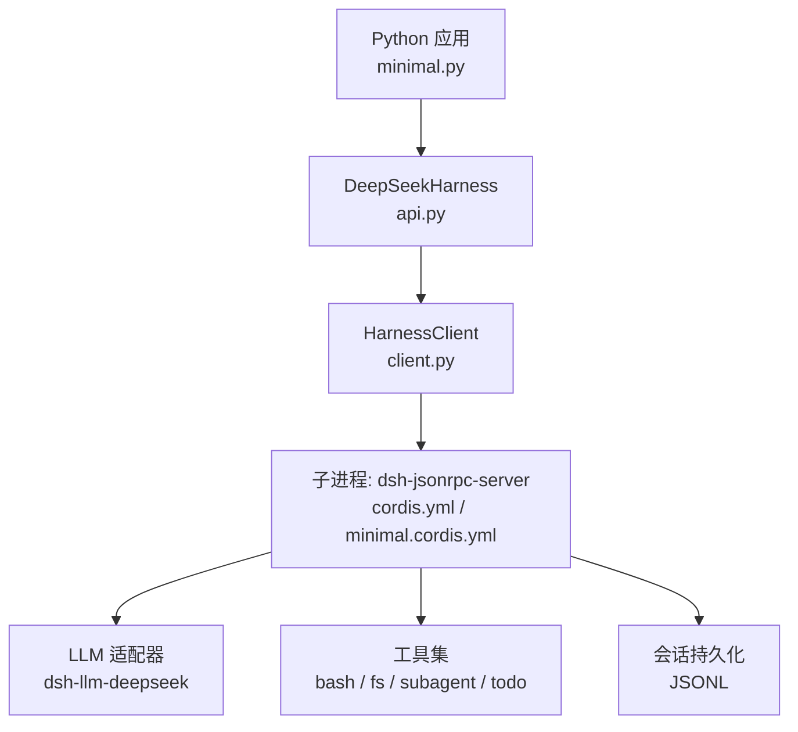
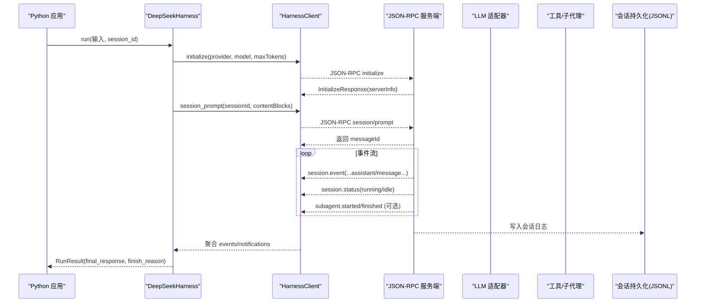
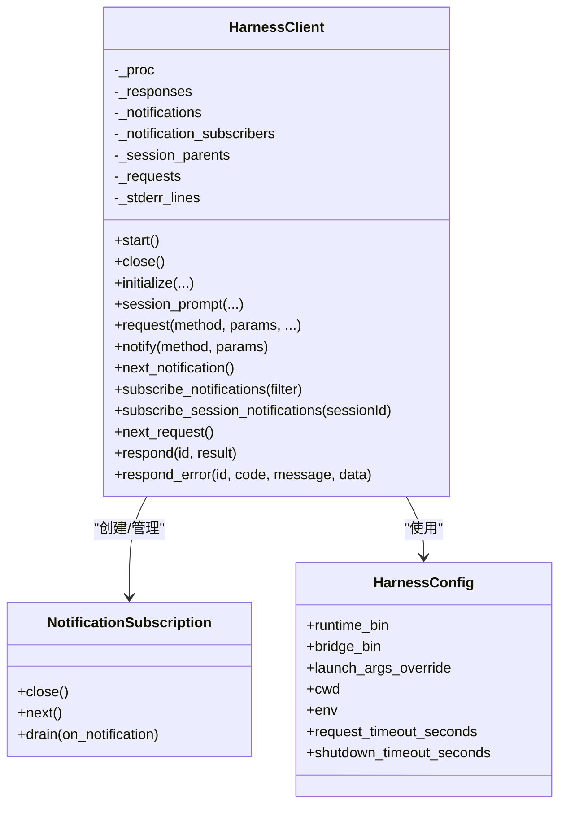
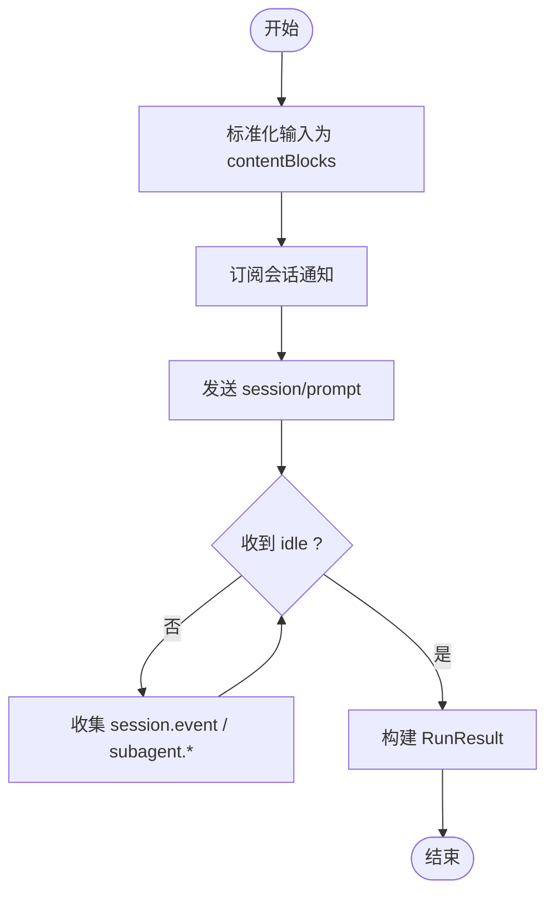
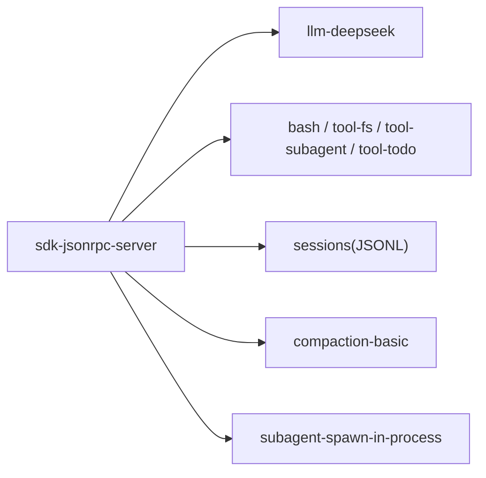
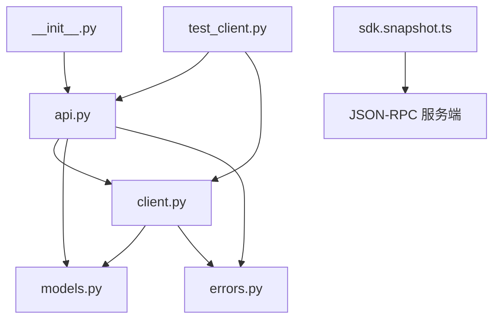

# JSON-RPC Agent 示例

<cite>
**本文引用的文件**
- [examples/jsonrpc-agent/README.md](file://examples/jsonrpc-agent/README.md)
- [examples/jsonrpc-agent/README.zh.md](file://examples/jsonrpc-agent/README.zh.md)
- [examples/jsonrpc-agent/minimal.py](file://examples/jsonrpc-agent/minimal.py)
- [examples/jsonrpc-agent/cordis.yml](file://examples/jsonrpc-agent/cordis.yml)
- [examples/jsonrpc-agent/minimal.cordis.yml](file://examples/jsonrpc-agent/minimal.cordis.yml)
- [python/sdk/src/deepseek_harness/__init__.py](file://python/sdk/src/deepseek_harness/__init__.py)
- [python/sdk/src/deepseek_harness/client.py](file://python/sdk/src/deepseek_harness/client.py)
- [python/sdk/src/deepseek_harness/api.py](file://python/sdk/src/deepseek_harness/api.py)
- [python/sdk/src/deepseek_harness/models.py](file://python/sdk/src/deepseek_harness/models.py)
- [python/sdk/src/deepseek_harness/errors.py](file://python/sdk/src/deepseek_harness/errors.py)
- [examples/jsonrpc-agent/tests/sdk.snapshot.ts](file://examples/jsonrpc-agent/tests/sdk.snapshot.ts)
- [python/sdk/tests/test_client.py](file://python/sdk/tests/test_client.py)
</cite>

## 目录
1. [简介](#简介)
2. [项目结构](#项目结构)
3. [核心组件](#核心组件)
4. [架构总览](#架构总览)
5. [详细组件分析](#详细组件分析)
6. [依赖关系分析](#依赖关系分析)
7. [性能与并发](#性能与并发)
8. [故障排查指南](#故障排查指南)
9. [结论](#结论)
10. [附录：消息格式、请求响应模式与错误处理](#附录消息格式请求响应模式与错误处理)

## 简介
本文件系统性说明 DeepSeek Harness 中“JSON-RPC Agent 示例”的架构设计与实现原理，重点解释 JSON-RPC 协议在 Harness 中的应用方式，展示如何通过 Python SDK 与 Agent 进行通信。文档覆盖消息格式、请求-响应模式、通知机制、错误处理、连接管理、任务调度、结果解析、异步与并发实践，并给出测试与集成示例路径，帮助用户构建基于 JSON-RPC 的 Agent 应用。

## 项目结构
该示例由两部分组成：
- 服务端（Agent）：通过 Cordis 配置组装运行时插件，暴露 JSON-RPC 服务，提供模型调用、工具执行、会话持久化等能力。
- 客户端（Python SDK）：以子进程方式启动并维护与服务端的 JSON-RPC 通道，封装初始化、会话轮次、通知订阅、超时与关闭等流程。

图表来源
- [examples/jsonrpc-agent/minimal.py:16-39](file://examples/jsonrpc-agent/minimal.py#L16-L39)
- [python/sdk/src/deepseek_harness/api.py:48-124](file://python/sdk/src/deepseek_harness/api.py#L48-L124)
- [python/sdk/src/deepseek_harness/client.py:37-136](file://python/sdk/src/deepseek_harness/client.py#L37-L136)
- [examples/jsonrpc-agent/cordis.yml:1-90](file://examples/jsonrpc-agent/cordis.yml#L1-L90)
- [examples/jsonrpc-agent/minimal.cordis.yml:1-83](file://examples/jsonrpc-agent/minimal.cordis.yml#L1-L83)

章节来源
- [examples/jsonrpc-agent/README.md:1-41](file://examples/jsonrpc-agent/README.md#L1-L41)
- [examples/jsonrpc-agent/README.zh.md:1-41](file://examples/jsonrpc-agent/README.zh.md#L1-L41)
- [examples/jsonrpc-agent/minimal.py:16-39](file://examples/jsonrpc-agent/minimal.py#L16-L39)
- [examples/jsonrpc-agent/cordis.yml:1-90](file://examples/jsonrpc-agent/cordis.yml#L1-L90)
- [examples/jsonrpc-agent/minimal.cordis.yml:1-83](file://examples/jsonrpc-agent/minimal.cordis.yml#L1-L83)

## 核心组件
- 高层 API（DeepSeekHarness、Session、RunResult）：封装启动、初始化、会话运行、通知收集与结果解析。
- 传输层（HarnessClient）：负责子进程生命周期、JSON-RPC 读写、请求-响应匹配、通知分发、超时控制与诊断信息。
- 数据模型（Notification、IncomingRequest、InitializeResponse、ServerInfo）：描述消息体与类型约束。
- 错误体系（HarnessError、TransportClosedError、SdkProtocolError、JsonRpcError）：统一异常语义。
- 服务端配置（Cordis）：声明式装配 JSON-RPC Server、LLM 适配器、工具、会话持久化与压缩策略。

章节来源
- [python/sdk/src/deepseek_harness/api.py:13-183](file://python/sdk/src/deepseek_harness/api.py#L13-L183)
- [python/sdk/src/deepseek_harness/client.py:24-136](file://python/sdk/src/deepseek_harness/client.py#L24-L136)
- [python/sdk/src/deepseek_harness/models.py:1-33](file://python/sdk/src/deepseek_harness/models.py#L1-L33)
- [python/sdk/src/deepseek_harness/errors.py:1-24](file://python/sdk/src/deepseek_harness/errors.py#L1-L24)
- [examples/jsonrpc-agent/cordis.yml:1-90](file://examples/jsonrpc-agent/cordis.yml#L1-L90)
- [examples/jsonrpc-agent/minimal.cordis.yml:1-83](file://examples/jsonrpc-agent/minimal.cordis.yml#L1-L83)

## 架构总览
下图展示了从 Python 应用到 JSON-RPC 服务端的端到端调用链，包括初始化、会话提示、事件流与结束状态。

图表来源
- [python/sdk/src/deepseek_harness/api.py:117-183](file://python/sdk/src/deepseek_harness/api.py#L117-L183)
- [python/sdk/src/deepseek_harness/client.py:117-178](file://python/sdk/src/deepseek_harness/client.py#L117-L178)
- [examples/jsonrpc-agent/cordis.yml:39-45](file://examples/jsonrpc-agent/cordis.yml#L39-L45)
- [examples/jsonrpc-agent/minimal.cordis.yml:78-83](file://examples/jsonrpc-agent/minimal.cordis.yml#L78-L83)

## 详细组件分析

### 客户端：HarnessClient（JSON-RPC 传输与并发）
- 子进程管理：启动、标准输入输出读取、错误输出捕获、优雅关闭与强制终止。
- 请求-响应：为每个请求分配唯一 id，等待响应或错误；支持超时与诊断信息拼接。
- 通知系统：全局队列 + 按会话订阅；支持过滤函数与子树传播（父/子会话关系）。
- 桥接请求：当服务端发起反向请求时，客户端可消费 IncomingRequest 并 respond/respond_error。
- 线程安全：读写锁保护 stdin 写入；读线程与错误输出线程独立运行。

图表来源
- [python/sdk/src/deepseek_harness/client.py:24-136](file://python/sdk/src/deepseek_harness/client.py#L24-L136)
- [python/sdk/src/deepseek_harness/client.py:157-227](file://python/sdk/src/deepseek_harness/client.py#L157-L227)
- [python/sdk/src/deepseek_harness/client.py:228-397](file://python/sdk/src/deepseek_harness/client.py#L228-L397)
- [python/sdk/src/deepseek_harness/client.py:507-558](file://python/sdk/src/deepseek_harness/client.py#L507-L558)

章节来源
- [python/sdk/src/deepseek_harness/client.py:37-558](file://python/sdk/src/deepseek_harness/client.py#L37-L558)

### 高层 API：DeepSeekHarness 与 Session
- DeepSeekHarness：封装环境注入（DSH_*）、子进程启动、initialize 调用、run 入口。
- Session：将字符串或结构化内容块标准化为 contentBlocks，订阅会话通知，等待 idle 结束，提取 final_response 与 finish_reason。
- 结果解析：从事件流中提取 assistant/message 文本片段作为最终回复；从最后一个 turn/end 事件提取 reason.kind。

图表来源
- [python/sdk/src/deepseek_harness/api.py:127-183](file://python/sdk/src/deepseek_harness/api.py#L127-L183)
- [python/sdk/src/deepseek_harness/api.py:199-243](file://python/sdk/src/deepseek_harness/api.py#L199-L243)

章节来源
- [python/sdk/src/deepseek_harness/api.py:48-183](file://python/sdk/src/deepseek_harness/api.py#L48-L183)
- [python/sdk/src/deepseek_harness/api.py:199-243](file://python/sdk/src/deepseek_harness/api.py#L199-L243)

### 服务端：Cordis 配置与插件装配
- JSON-RPC 服务器：启用并配置 maxTokensAsSuccess 行为。
- LLM 适配器：DeepSeek 适配器，开启思考与推理努力；最小变体支持环境变量选择模型与上下文窗口。
- 工具：bash（前台/持久）、文件系统、subagent（进程内 spawn）、todo。
- 会话持久化：JSONL 存储，可选择压缩；最小变体禁用压缩便于快照回放。
- 沙箱与安全：最小变体使用本地沙箱与危险全访问策略，适合容器或可丢弃环境。

图表来源
- [examples/jsonrpc-agent/cordis.yml:4-90](file://examples/jsonrpc-agent/cordis.yml#L4-L90)
- [examples/jsonrpc-agent/minimal.cordis.yml:6-83](file://examples/jsonrpc-agent/minimal.cordis.yml#L6-L83)

章节来源
- [examples/jsonrpc-agent/cordis.yml:1-90](file://examples/jsonrpc-agent/cordis.yml#L1-L90)
- [examples/jsonrpc-agent/minimal.cordis.yml:1-83](file://examples/jsonrpc-agent/minimal.cordis.yml#L1-L83)

### 运行脚本：minimal.py
- 命令行参数：prompt、workspace、session_root、session_id、provider、model、max_tokens。
- 工作区与会话根目录解析为绝对路径。
- 通过 DeepSeekHarness 启动并运行一次对话，打印最终回复。

章节来源
- [examples/jsonrpc-agent/minimal.py:16-39](file://examples/jsonrpc-agent/minimal.py#L16-L39)

## 依赖关系分析
- Python SDK 模块间依赖：
  - api.py 依赖 client.py、models.py、errors.py。
  - client.py 依赖 models.py、errors.py。
  - __init__.py 统一导出公共接口。
- 示例与测试：
  - TypeScript 快照测试驱动真实运行时，验证通知流、会话日志与结果一致性。
  - Python 单元测试通过伪造运行时验证 SDK 行为（环境注入、通知顺序、超时、关闭、桥接请求等）。

图表来源
- [python/sdk/src/deepseek_harness/__init__.py:1-20](file://python/sdk/src/deepseek_harness/__init__.py#L1-L20)
- [python/sdk/src/deepseek_harness/api.py:1-11](file://python/sdk/src/deepseek_harness/api.py#L1-L11)
- [python/sdk/src/deepseek_harness/client.py:1-19](file://python/sdk/src/deepseek_harness/client.py#L1-L19)
- [python/sdk/tests/test_client.py:1-13](file://python/sdk/tests/test_client.py#L1-L13)
- [examples/jsonrpc-agent/tests/sdk.snapshot.ts:1-31](file://examples/jsonrpc-agent/tests/sdk.snapshot.ts#L1-L31)

章节来源
- [python/sdk/src/deepseek_harness/__init__.py:1-20](file://python/sdk/src/deepseek_harness/__init__.py#L1-L20)
- [python/sdk/tests/test_client.py:15-125](file://python/sdk/tests/test_client.py#L15-L125)
- [examples/jsonrpc-agent/tests/sdk.snapshot.ts:84-116](file://examples/jsonrpc-agent/tests/sdk.snapshot.ts#L84-L116)

## 性能与并发
- 并发模型：
  - 读线程持续解析 stdout 行，分派到响应等待器、通知队列或反向请求队列。
  - 写锁串行化 stdin 写入，避免多生产者竞争。
  - 通知订阅支持过滤与子树传播，减少上层处理负担。
- 超时与健壮性：
  - 请求级超时与关闭级超时，失败时附带 stderr 尾部与退出码诊断。
  - 非 JSON 行被忽略，增强鲁棒性。
- 资源管理：
  - 上下文管理器确保子进程正确关闭；初始化失败也会回收资源。
- 建议：
  - 合理设置 request_timeout_seconds 与 shutdown_timeout_seconds。
  - 对长轮次任务使用 on_notification 实时观察进度。
  - 使用 subscribe_session_notifications 精准订阅相关会话事件。

章节来源
- [python/sdk/src/deepseek_harness/client.py:63-116](file://python/sdk/src/deepseek_harness/client.py#L63-L116)
- [python/sdk/src/deepseek_harness/client.py:228-397](file://python/sdk/src/deepseek_harness/client.py#L228-L397)
- [python/sdk/src/deepseek_harness/client.py:403-422](file://python/sdk/src/deepseek_harness/client.py#L403-L422)

## 故障排查指南
- 常见错误与定位：
  - TransportClosedError：子进程退出或 stdout 关闭；检查 stderr 尾部与退出码。
  - JsonRpcError：服务端返回错误对象；查看 code、message、data。
  - SdkProtocolError：协议不合规（如 turn/end 缺少 reason.kind）。
  - TimeoutError：请求未在规定时间内得到响应；结合诊断信息判断服务端是否卡住。
- 调试技巧：
  - 使用 on_notification 或 subscribe_session_notifications 观察中间状态。
  - 通过 DSH_SESSION_ROOT 查看 JSONL 会话日志，确认事件序列。
  - 在 minimal 变体中禁用压缩，便于直接阅读日志。
- 参考用例：
  - Python 测试覆盖了环境注入、通知顺序、超时、关闭、桥接请求、非法响应等场景。
  - TypeScript 快照测试验证了完整通知流与持久化日志的一致性。

章节来源
- [python/sdk/src/deepseek_harness/errors.py:1-24](file://python/sdk/src/deepseek_harness/errors.py#L1-L24)
- [python/sdk/src/deepseek_harness/client.py:343-397](file://python/sdk/src/deepseek_harness/client.py#L343-L397)
- [python/sdk/tests/test_client.py:166-200](file://python/sdk/tests/test_client.py#L166-L200)
- [python/sdk/tests/test_client.py:720-783](file://python/sdk/tests/test_client.py#L720-L783)
- [examples/jsonrpc-agent/tests/sdk.snapshot.ts:346-466](file://examples/jsonrpc-agent/tests/sdk.snapshot.ts#L346-L466)

## 结论
该示例以 JSON-RPC 为核心协议，通过 Python SDK 与 Node.js 侧的 JSON-RPC 服务端协作，实现了可扩展、可观测、可复现的 Agent 运行环境。Cordis 配置将 LLM、工具、持久化与压缩策略解耦，SDK 则提供简洁的高层 API 与强大的底层传输能力。借助完善的测试与快照机制，开发者可以可靠地构建基于 JSON-RPC 的 Agent 应用。

## 附录：消息格式、请求响应模式与错误处理

### JSON-RPC 消息格式
- 请求：包含 jsonrpc、id、method、params。
- 响应：包含 jsonrpc、id、result 或 error。
- 通知：包含 jsonrpc、method、params（无 id）。
- 行分隔：每行一个 JSON 对象，通过换行符分隔。

章节来源
- [python/sdk/src/deepseek_harness/client.py:228-251](file://python/sdk/src/deepseek_harness/client.py#L228-L251)
- [python/sdk/src/deepseek_harness/client.py:298-308](file://python/sdk/src/deepseek_harness/client.py#L298-L308)
- [python/sdk/src/deepseek_harness/client.py:318-334](file://python/sdk/src/deepseek_harness/client.py#L318-L334)

### 关键方法与时序
- initialize：传递 cwd、provider、model、maxTokens，返回 serverInfo。
- session/prompt：提交会话内容与 sessionId，返回 messageId。
- session.event：携带 assistant/message、tool 调用、子代理生命周期等事件。
- session.status：会话状态流转（running -> idle），用于结束判定。

章节来源
- [python/sdk/src/deepseek_harness/client.py:117-178](file://python/sdk/src/deepseek_harness/client.py#L117-L178)
- [python/sdk/src/deepseek_harness/api.py:127-183](file://python/sdk/src/deepseek_harness/api.py#L127-L183)

### 错误处理机制
- 传输层错误：子进程关闭、写入失败、超时。
- 协议层错误：服务端返回 error 对象；SDK 抛出 JsonRpcError。
- 业务校验错误：turn/end 缺少 reason.kind 时抛出 SdkProtocolError。
- 诊断信息：关闭或超时时附加 stderr 尾部与退出码，便于定位。

章节来源
- [python/sdk/src/deepseek_harness/errors.py:1-24](file://python/sdk/src/deepseek_harness/errors.py#L1-L24)
- [python/sdk/src/deepseek_harness/client.py:343-397](file://python/sdk/src/deepseek_harness/client.py#L343-L397)
- [python/sdk/src/deepseek_harness/api.py:225-243](file://python/sdk/src/deepseek_harness/api.py#L225-L243)

### 客户端与服务端代码示例路径
- 客户端示例（Python）：
  - 高层 API 使用：[python/sdk/src/deepseek_harness/api.py:117-183](file://python/sdk/src/deepseek_harness/api.py#L117-L183)
  - 低层传输与通知：[python/sdk/src/deepseek_harness/client.py:117-227](file://python/sdk/src/deepseek_harness/client.py#L117-L227)
- 服务端示例（Cordis 配置）：
  - 通用配置：[examples/jsonrpc-agent/cordis.yml:1-90](file://examples/jsonrpc-agent/cordis.yml#L1-L90)
  - 极简配置：[examples/jsonrpc-agent/minimal.cordis.yml:1-83](file://examples/jsonrpc-agent/minimal.cordis.yml#L1-L83)
- 运行脚本：
  - 最小运行入口：[examples/jsonrpc-agent/minimal.py:16-39](file://examples/jsonrpc-agent/minimal.py#L16-L39)

### 测试与集成示例
- Python 单元测试（模拟运行时、验证通知与错误）：
  - [python/sdk/tests/test_client.py:15-125](file://python/sdk/tests/test_client.py#L15-L125)
  - [python/sdk/tests/test_client.py:127-200](file://python/sdk/tests/test_client.py#L127-L200)
  - [python/sdk/tests/test_client.py:240-340](file://python/sdk/tests/test_client.py#L240-L340)
  - [python/sdk/tests/test_client.py:342-451](file://python/sdk/tests/test_client.py#L342-L451)
  - [python/sdk/tests/test_client.py:453-588](file://python/sdk/tests/test_client.py#L453-L588)
  - [python/sdk/tests/test_client.py:590-800](file://python/sdk/tests/test_client.py#L590-L800)
- TypeScript 快照测试（驱动真实运行时，验证通知流与日志）：
  - [examples/jsonrpc-agent/tests/sdk.snapshot.ts:84-116](file://examples/jsonrpc-agent/tests/sdk.snapshot.ts#L84-L116)
  - [examples/jsonrpc-agent/tests/sdk.snapshot.ts:261-326](file://examples/jsonrpc-agent/tests/sdk.snapshot.ts#L261-L326)
  - [examples/jsonrpc-agent/tests/sdk.snapshot.ts:346-466](file://examples/jsonrpc-agent/tests/sdk.snapshot.ts#L346-L466)