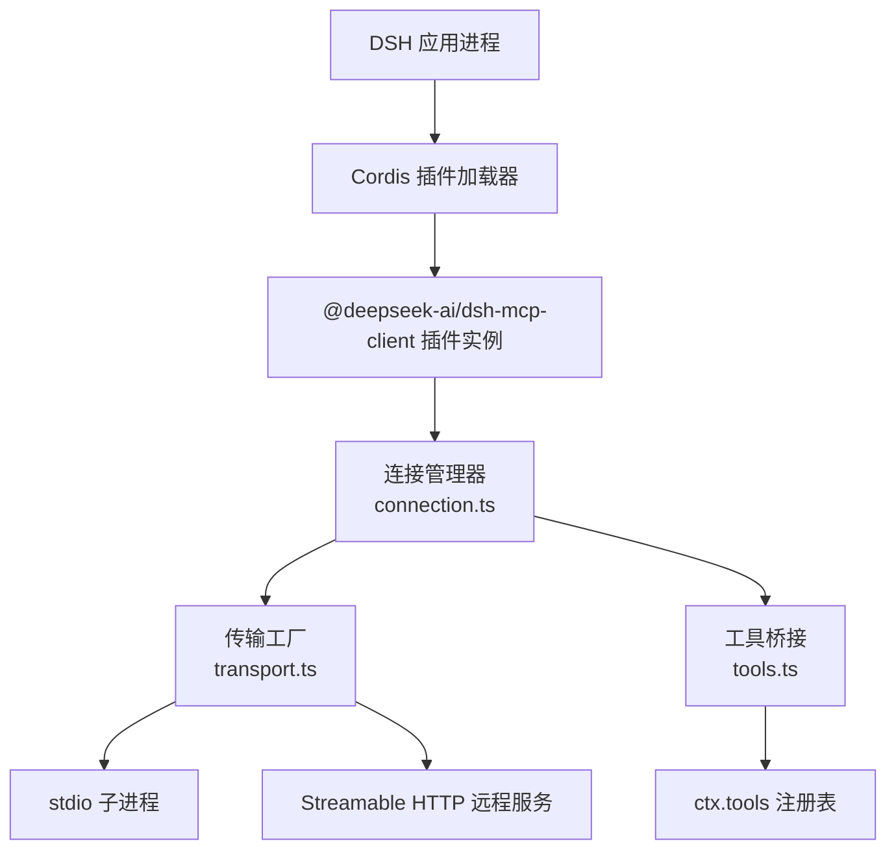
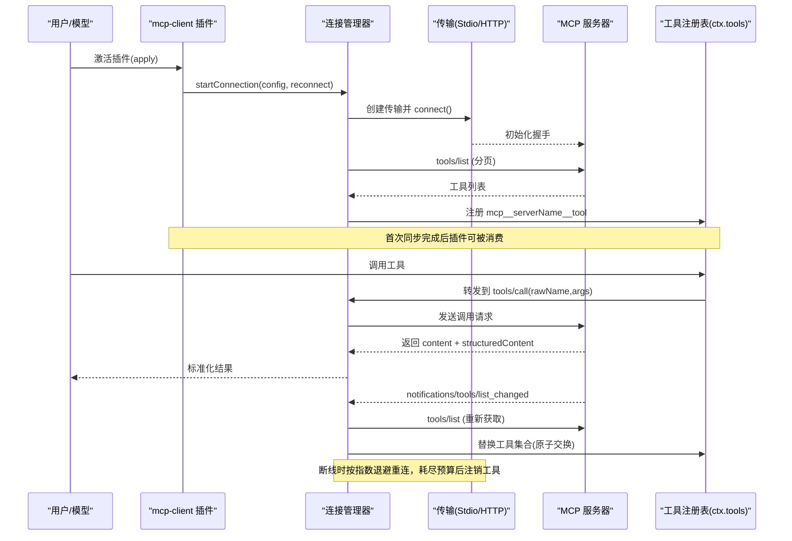
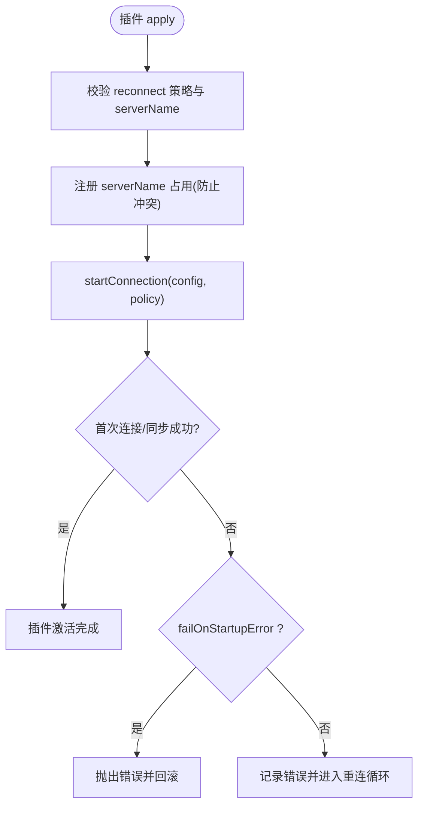
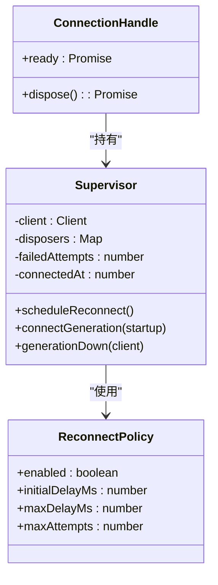
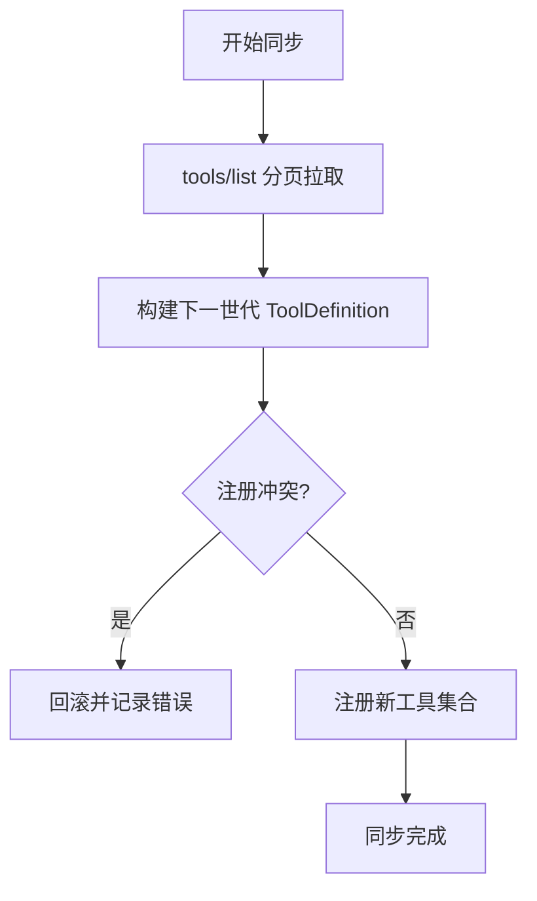
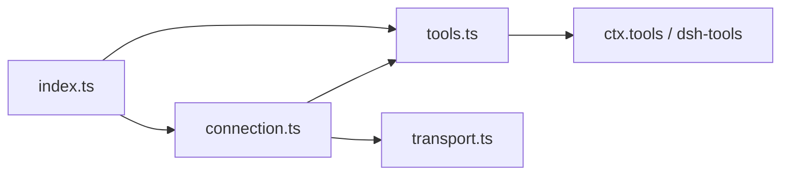

# MCP 内存示例

<cite>
**本文引用的文件**
- [examples/mcp-memory/README.md](file://examples/mcp-memory/README.md)
- [examples/mcp-memory/README.zh.md](file://examples/mcp-memory/README.zh.md)
- [examples/mcp-memory/engram.cordis.yml](file://examples/mcp-memory/engram.cordis.yml)
- [examples/mcp-memory/memorix.cordis.yml](file://examples/mcp-memory/memorix.cordis.yml)
- [examples/mcp-memory/mcp-reference-memory.cordis.yml](file://examples/mcp-memory/mcp-reference-memory.cordis.yml)
- [packages/mcp/README.md](file://packages/mcp/README.md)
- [packages/mcp/mcp-client/README.md](file://packages/mcp/mcp-client/README.md)
- [packages/mcp/mcp-client/README.zh.md](file://packages/mcp/mcp-client/README.zh.md)
- [packages/mcp/mcp-client/src/index.ts](file://packages/mcp/mcp-client/src/index.ts)
- [packages/mcp/mcp-client/src/connection.ts](file://packages/mcp/mcp-client/src/connection.ts)
- [packages/mcp/mcp-client/src/transport.ts](file://packages/mcp/mcp-client/src/transport.ts)
- [packages/mcp/mcp-client/src/tools.ts](file://packages/mcp/mcp-client/src/tools.ts)
- [apps/cli/tests/memory-mcp-configs.spec.ts](file://apps/cli/tests/memory-mcp-configs.spec.ts)
</cite>

## 目录
1. [简介](#简介)
2. [项目结构](#项目结构)
3. [核心组件](#核心组件)
4. [架构总览](#架构总览)
5. [详细组件分析](#详细组件分析)
6. [依赖关系分析](#依赖关系分析)
7. [性能与可扩展性](#性能与可扩展性)
8. [故障排查指南](#故障排查指南)
9. [结论](#结论)
10. [附录：配置与连接指南](#附录配置与连接指南)

## 简介
本文件面向 DeepSeek Harness（DSH）中的“MCP 内存示例”，系统性说明 Model Context Protocol（MCP）的概念、在 DSH 中的作用，以及如何通过通用 MCP 客户端插件将第三方记忆服务（如 Memorix、Engram、MCP Reference Memory）接入到 DSH。文档涵盖配置方式、连接选项、工具命名与发现机制、重连与生命周期管理、持久化与数据同步的边界、以及故障排查与性能优化建议，帮助用户构建可扩展的内存存储方案。

## 项目结构
- 示例配置位于 examples/mcp-memory，提供三份默认关闭的参考 overlay，分别对接 Memorix、MCP Reference Memory、Engram。
- 通用桥接实现位于 packages/mcp/mcp-client，负责连接外部 MCP 服务器、发现并注册工具、处理重连与生命周期。
- CLI 测试覆盖示例配置的解析与端到端验证，确保 overlay 字段、传输方式、包版本约束与环境变量安全策略正确。

图表来源
- [packages/mcp/mcp-client/src/index.ts:140-181](file://packages/mcp/mcp-client/src/index.ts#L140-L181)
- [packages/mcp/mcp-client/src/connection.ts:123-352](file://packages/mcp/mcp-client/src/connection.ts#L123-L352)
- [packages/mcp/mcp-client/src/transport.ts:31-50](file://packages/mcp/mcp-client/src/transport.ts#L31-L50)
- [packages/mcp/mcp-client/src/tools.ts:128-174](file://packages/mcp/mcp-client/src/tools.ts#L128-L174)

章节来源
- [examples/mcp-memory/README.md:1-102](file://examples/mcp-memory/README.md#L1-L102)
- [packages/mcp/README.md:1-10](file://packages/mcp/README.md#L1-L10)

## 核心组件
- 插件入口与配置校验：定义 stdio 与 streamable-http 两种传输的配置模式，校验 serverName、超时、启动失败策略与重连参数。
- 连接管理器：维护 MCP Client 的生命周期，监听工具列表变更通知，执行指数退避重连，并在耗尽重试预算后注销工具。
- 传输工厂：根据配置创建 stdio 或 Streamable HTTP 传输；stdio 模式下对子进程环境进行凭据清理。
- 工具桥接：拉取工具列表、生成公开名称（mcp__serverName__rawName）、注册到 ctx.tools，并将调用映射为 MCP tools/call，统一结果格式与渲染。

章节来源
- [packages/mcp/mcp-client/src/index.ts:49-128](file://packages/mcp/mcp-client/src/index.ts#L49-L128)
- [packages/mcp/mcp-client/src/connection.ts:27-90](file://packages/mcp/mcp-client/src/connection.ts#L27-L90)
- [packages/mcp/mcp-client/src/transport.ts:21-50](file://packages/mcp/mcp-client/src/transport.ts#L21-L50)
- [packages/mcp/mcp-client/src/tools.ts:24-39](file://packages/mcp/mcp-client/src/tools.ts#L24-L39)

## 架构总览
下图展示了从 DSH 到第三方 MCP 服务器的完整链路：插件加载 → 建立传输 → 初始工具发现 → 注册工具 → 运行时调用 → 工具列表变更重同步 → 断线重连。

图表来源
- [packages/mcp/mcp-client/src/index.ts:140-181](file://packages/mcp/mcp-client/src/index.ts#L140-L181)
- [packages/mcp/mcp-client/src/connection.ts:237-305](file://packages/mcp/mcp-client/src/connection.ts#L237-L305)
- [packages/mcp/mcp-client/src/tools.ts:128-174](file://packages/mcp/mcp-client/src/tools.ts#L128-L174)

## 详细组件分析

### 插件入口与配置（index.ts）
- 支持两种传输：stdio（本地子进程）与 streamable-http（远程 SSE）。
- serverName 用于限定工具命名空间，必须唯一且符合命名规范。
- toolCallTimeoutMs 控制单次工具调用超时；failOnStartupError 控制首次连接/同步失败是否拒绝插件激活。
- 插件 effect 中注册 serverName 占用，避免重复命名冲突。

图表来源
- [packages/mcp/mcp-client/src/index.ts:140-181](file://packages/mcp/mcp-client/src/index.ts#L140-L181)

章节来源
- [packages/mcp/mcp-client/src/index.ts:49-128](file://packages/mcp/mcp-client/src/index.ts#L49-L128)
- [packages/mcp/mcp-client/src/index.ts:140-181](file://packages/mcp/mcp-client/src/index.ts#L140-L181)

### 连接管理器（connection.ts）
- 维护当前 client 世代，监听 onclose 触发 down 流程。
- 工具列表变更通过通知触发重同步，保证注册表一致性。
- 指数退避重连：initialDelayMs 翻倍至 maxDelayMs，达到 maxAttempts 后彻底放弃并注销工具。
- dispose 时取消重连定时器、关闭客户端、等待进行中任务平息并释放所有工具注册。

图表来源
- [packages/mcp/mcp-client/src/connection.ts:27-90](file://packages/mcp/mcp-client/src/connection.ts#L27-L90)
- [packages/mcp/mcp-client/src/connection.ts:123-352](file://packages/mcp/mcp-client/src/connection.ts#L123-L352)

章节来源
- [packages/mcp/mcp-client/src/connection.ts:27-90](file://packages/mcp/mcp-client/src/connection.ts#L27-L90)
- [packages/mcp/mcp-client/src/connection.ts:123-352](file://packages/mcp/mcp-client/src/connection.ts#L123-L352)

### 传输工厂（transport.ts）
- stdio：使用已清理的环境变量（移除凭据形状与 DSH_*），合并额外 env，设置 cwd。
- streamable-http：构造 URL 与 headers，交由 SDK 管理 SSE 流。

章节来源
- [packages/mcp/mcp-client/src/transport.ts:21-50](file://packages/mcp/mcp-client/src/transport.ts#L21-L50)

### 工具桥接（tools.ts）
- 公开名称：mcp__serverName__rawName，并进行规范化与截断，必要时附加确定性 hash 避免冲突。
- 两阶段同步：先拉取全量工具定义（含分页），再原子替换注册表；注册冲突会回滚整代。
- 调用执行：以 rawName 发起 tools/call，携带信号与超时；统一结果为 content 数组与可选 structuredContent；isError 转为异常路径。
- 文本渲染：将 text 块拼接，其他类型转为占位符。

图表来源
- [packages/mcp/mcp-client/src/tools.ts:128-174](file://packages/mcp/mcp-client/src/tools.ts#L128-L174)

章节来源
- [packages/mcp/mcp-client/src/tools.ts:24-39](file://packages/mcp/mcp-client/src/tools.ts#L24-L39)
- [packages/mcp/mcp-client/src/tools.ts:128-174](file://packages/mcp/mcp-client/src/tools.ts#L128-L174)
- [packages/mcp/mcp-client/src/tools.ts:228-318](file://packages/mcp/mcp-client/src/tools.ts#L228-L318)

## 依赖关系分析
- 插件依赖 Cordis 上下文与工具注册表（ctx.tools）。
- 连接管理器依赖 MCP SDK Client 与通知类型。
- 传输工厂依赖 MCP SDK 的 stdio 与 Streamable HTTP 传输实现。
- 工具桥接依赖 JSON Schema 校验与 DSH 工具运行时。

图表来源
- [packages/mcp/mcp-client/src/index.ts:140-181](file://packages/mcp/mcp-client/src/index.ts#L140-L181)
- [packages/mcp/mcp-client/src/connection.ts:123-352](file://packages/mcp/mcp-client/src/connection.ts#L123-L352)
- [packages/mcp/mcp-client/src/tools.ts:128-174](file://packages/mcp/mcp-client/src/tools.ts#L128-L174)

章节来源
- [packages/mcp/mcp-client/src/index.ts:140-181](file://packages/mcp/mcp-client/src/index.ts#L140-L181)
- [packages/mcp/mcp-client/src/connection.ts:123-352](file://packages/mcp/mcp-client/src/connection.ts#L123-L352)
- [packages/mcp/mcp-client/src/tools.ts:128-174](file://packages/mcp/mcp-client/src/tools.ts#L128-L174)

## 性能与可扩展性
- 工具发现成本：每次 re-sync 都会重新拉取工具列表并替换 schema，注意 token 开销；保持工具集稳定有利于 KV Cache 复用。
- 调用超时：toolCallTimeoutMs 控制单次调用耗时，避免长尾阻塞；合理设置以避免资源浪费。
- 重连策略：指数退避上限与尝试次数需结合上游稳定性调优；长时间稳定后可重置尝试预算。
- 扩展多服务器：每个 MCP 服务器一个插件实例，使用不同 serverName 隔离命名空间；可通过复制 overlay 快速接入新服务。
- 远程服务：使用 streamable-http 可横向扩展服务端，客户端仅承担轻量桥接。

[本节为通用指导，不直接分析具体文件]

## 故障排查指南
- 工具未出现：初始发现异步，等待 mcp__... 工具出现后再发第一条提示词；若 failOnStartupError 为 true，首次失败会拒绝激活。
- 连接丢失：查看日志中的重连警告与恢复信息；若达到最大尝试次数，工具会被注销，需要 HMR 或重启 Host。
- 环境变量泄露风险：stdio 模式会自动清理凭据形状与 DSH_* 变量；如需额外密钥，放入 config.env。
- 名称冲突：重复 serverName 会在加载时报错；确保每个实例唯一。
- 工具列表重复：服务器列出同名工具会被拒绝；检查上游实现。
- 远程不可达：HTTP 模式按请求重试；检查网络与鉴权头。

章节来源
- [examples/mcp-memory/README.md:74-102](file://examples/mcp-memory/README.md#L74-L102)
- [packages/mcp/mcp-client/src/index.ts:140-181](file://packages/mcp/mcp-client/src/index.ts#L140-L181)
- [packages/mcp/mcp-client/src/connection.ts:192-225](file://packages/mcp/mcp-client/src/connection.ts#L192-L225)
- [packages/mcp/mcp-client/src/transport.ts:21-50](file://packages/mcp/mcp-client/src/transport.ts#L21-L50)
- [packages/mcp/mcp-client/src/tools.ts:128-174](file://packages/mcp/mcp-client/src/tools.ts#L128-L174)

## 结论
MCP 内存示例通过通用客户端插件将第三方记忆服务无缝接入 DSH，暴露为模型可直接调用的原生工具。其设计强调命名空间隔离、健壮的重连与生命周期管理、安全的子进程环境处理，以及稳定的工具发现与注册机制。借助该模式，用户可以以最小配置接入多种记忆后端，并根据业务需求扩展更多 MCP 服务器，构建可扩展、可观测、易运维的内存存储解决方案。

[本节为总结，不直接分析具体文件]

## 附录：配置与连接指南

### 支持的第三方记忆系统
- Memorix：本地启发式模式，无需 LLM/embedding；通过 npm 全局安装指定版本；数据目录可通过环境变量覆盖。
- MCP Reference Memory：本地 JSONL 知识图谱；通过 npm 全局安装指定版本；数据存储路径可通过环境变量覆盖；搜索为子串匹配而非语义检索。
- Engram：Go 实现，负责存储与项目选择；通过 go install 或发布二进制安装；支持环境变量覆盖数据目录与项目标识。

章节来源
- [examples/mcp-memory/README.md:35-65](file://examples/mcp-memory/README.md#L35-L65)
- [examples/mcp-memory/README.zh.md:35-65](file://examples/mcp-memory/README.zh.md#L35-L65)

### 启用与选择
- 通过 --patch 传入单个 overlay 启用对应记忆服务；不传则全部禁用。
- 可将 overlay 中的 insert patch 合并到用户层配置文件以跨次运行保留选择。

章节来源
- [examples/mcp-memory/README.md:23-34](file://examples/mcp-memory/README.md#L23-L34)
- [examples/mcp-memory/README.zh.md:23-34](file://examples/mcp-memory/README.zh.md#L23-L34)

### 示例配置要点
- Memorix：stdio 传输，命令 memorix，参数 serve，工作目录为当前进程目录。
- MCP Reference Memory：stdio 传输，命令 mcp-server-memory，通过环境变量设置 JSONL 存储路径。
- Engram：stdio 传输，命令 engram，参数 mcp，工作目录为当前进程目录。

章节来源
- [examples/mcp-memory/memorix.cordis.yml:1-12](file://examples/mcp-memory/memorix.cordis.yml#L1-L12)
- [examples/mcp-memory/mcp-reference-memory.cordis.yml:1-14](file://examples/mcp-memory/mcp-reference-memory.cordis.yml#L1-L14)
- [examples/mcp-memory/engram.cordis.yml:1-12](file://examples/mcp-memory/engram.cordis.yml#L1-L12)

### 通用插件配置项
- transport：stdio 或 streamable-http。
- serverName：命名空间，唯一且符合命名规范。
- stdio：command、args、env、cwd。
- http：url、headers。
- toolCallTimeoutMs：单次调用超时。
- failOnStartupError：首次失败是否拒绝激活。
- reconnect：enabled、initialDelayMs、maxDelayMs、maxAttempts。

章节来源
- [packages/mcp/mcp-client/README.md:34-51](file://packages/mcp/mcp-client/README.md#L34-L51)
- [packages/mcp/mcp-client/README.zh.md:34-51](file://packages/mcp/mcp-client/README.zh.md#L34-L51)
- [packages/mcp/mcp-client/src/index.ts:49-128](file://packages/mcp/mcp-client/src/index.ts#L49-L128)

### 工具命名与可见性
- 模型可见名称：mcp__serverName__rawName，经过规范化与必要截断，必要时附加确定性 hash。
- 同一 rawName 可在不同 serverName 下共存；重复 serverName 会报错。

章节来源
- [packages/mcp/mcp-client/README.md:53-60](file://packages/mcp/mcp-client/README.md#L53-L60)
- [packages/mcp/mcp-client/README.zh.md:53-60](file://packages/mcp/mcp-client/README.zh.md#L53-L60)
- [packages/mcp/mcp-client/src/tools.ts:82-102](file://packages/mcp/mcp-client/src/tools.ts#L82-L102)

### 行为与生命周期
- 首次连接成功后注册工具；工具列表变更会触发重同步。
- 断线后按指数退避重连；耗尽预算后注销工具。
- 工具调用支持超时与中止；统一结果格式与渲染。

章节来源
- [packages/mcp/mcp-client/README.md:62-71](file://packages/mcp/mcp-client/README.md#L62-L71)
- [packages/mcp/mcp-client/README.zh.md:62-71](file://packages/mcp/mcp-client/README.zh.md#L62-L71)
- [packages/mcp/mcp-client/src/connection.ts:192-225](file://packages/mcp/mcp-client/src/connection.ts#L192-L225)
- [packages/mcp/mcp-client/src/tools.ts:228-318](file://packages/mcp/mcp-client/src/tools.ts#L228-L318)

### 验证与测试
- CLI 测试会解析示例 overlay，校验包版本、传输方式与安全策略，并用内置 fixture 服务器验证工具发现。

章节来源
- [apps/cli/tests/memory-mcp-configs.spec.ts:1-133](file://apps/cli/tests/memory-mcp-configs.spec.ts#L1-L133)