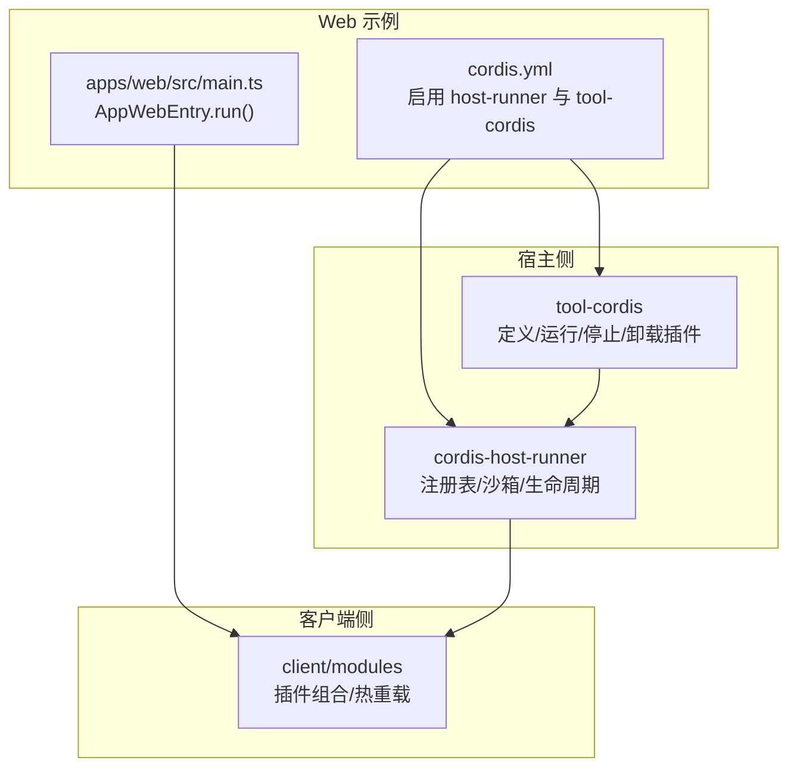
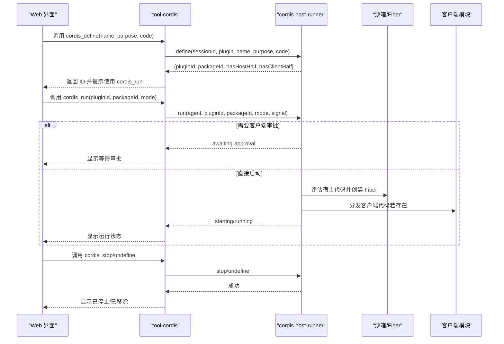
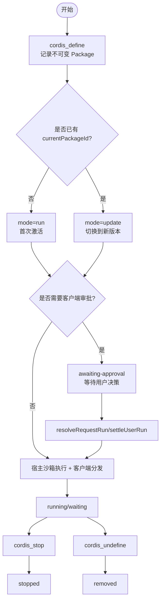
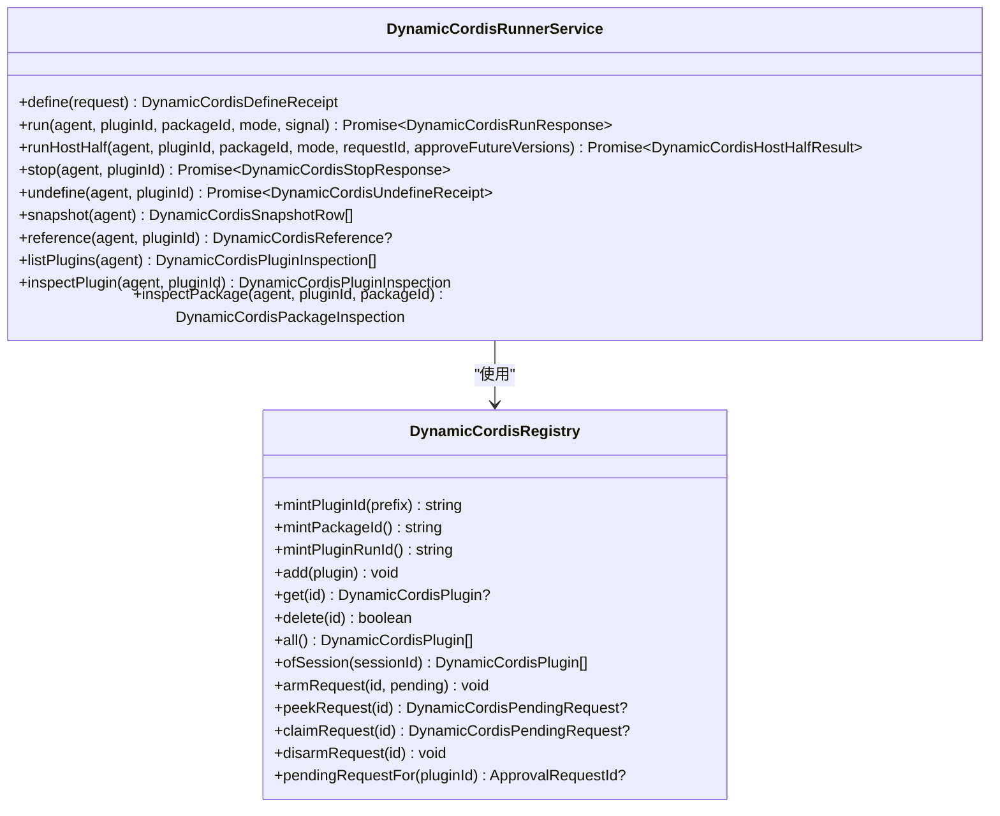
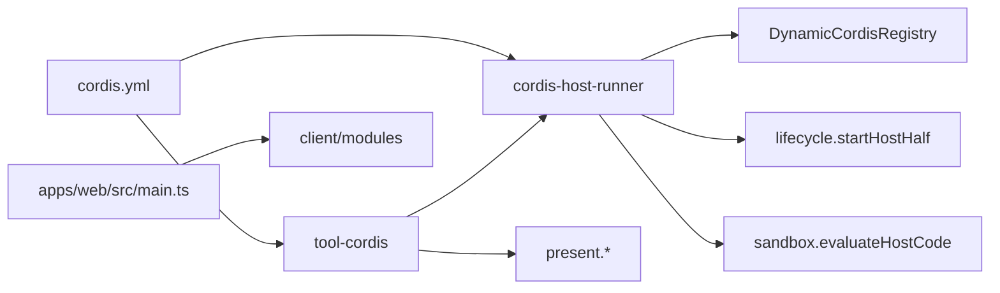

# Web Cordis 示例

<cite>
**本文引用的文件**
- [examples/web-cordis/README.md](file://examples/web-cordis/README.md)
- [examples/web-cordis/README.zh.md](file://examples/web-cordis/README.zh.md)
- [examples/web-cordis/cordis.yml](file://examples/web-cordis/cordis.yml)
- [apps/web/src/main.ts](file://apps/web/src/main.ts)
- [packages/extensions/tool-cordis/README.md](file://packages/extensions/tool-cordis/README.md)
- [packages/extensions/tool-cordis/src/index.ts](file://packages/extensions/tool-cordis/src/index.ts)
- [packages/extensions/tool-cordis/src/present.ts](file://packages/extensions/tool-cordis/src/present.ts)
- [packages/extensions/cordis-host-runner/src/index.ts](file://packages/extensions/cordis-host-runner/src/index.ts)
- [packages/extensions/cordis-host-runner/src/registry.ts](file://packages/extensions/cordis-host-runner/src/registry.ts)
- [packages/extensions/cordis-host-runner/src/lifecycle.ts](file://packages/extensions/cordis-host-runner/src/lifecycle.ts)
- [packages/client/modules/src/index.ts](file://packages/client/modules/src/index.ts)
- [docs/cordis-api/inherited.md](file://docs/cordis-api/inherited.md)
</cite>

## 目录
1. [简介](#简介)
2. [项目结构](#项目结构)
3. [核心组件](#核心组件)
4. [架构总览](#架构总览)
5. [详细组件分析](#详细组件分析)
6. [依赖关系分析](#依赖关系分析)
7. [性能与可扩展性](#性能与可扩展性)
8. [故障排查指南](#故障排查指南)
9. [结论](#结论)
10. [附录：插件开发与管理工作流](#附录插件开发与管理工作流)

## 简介
Web Cordis 示例是一个“自引用”的演示：通过 Web 界面，智能体可以检查当前 DSH 进程中的 Cordis 运行时，并在内存中动态挂载、运行、更新、停止和卸载模型编写的插件。这些插件是临时的，仅存在于当前进程内存中；卸载或进程退出后消失，且可能影响同一进程中的其他会话。该示例通过配置注入宿主侧的 Cordis 主机运行器与工具集，暴露一组面向模型的 API，用于检查和修改内存中的插件树。

## 项目结构
- 示例入口与说明
  - examples/web-cordis/README.md、README.zh.md：说明如何启动浏览器界面或 ACP 自动化服务器，并强调安全边界（类似 shell 访问）。
  - examples/web-cordis/cordis.yml：以补丁形式覆盖 web 配置文件，启用 cordis-host-runner 与 tool-cordis，并将 Web 服务端口固定到 3081。
- Web 应用入口
  - apps/web/src/main.ts：最小化引导，调用 dsh-client-web 的 AppWebEntry 完成挂载。
- 插件系统核心
  - packages/extensions/tool-cordis/*：面向模型的五个工具（inspect、define、run、stop、undefine），以及呈现层与提示词。
  - packages/extensions/cordis-host-runner/*：进程内动态插件注册表、沙箱执行、生命周期管理、客户端授权与广播。
- 客户端模块与热重载
  - packages/client/modules/src/index.ts：监听内部事件，刷新插件组合，注册 /plugins 路由，注入启动清单。
- 文档与事件
  - docs/cordis-api/inherited.md：列出框架级事件（如 hmr/change、hmr/reload），用于理解热重载机制。

图表来源
- [examples/web-cordis/cordis.yml:1-20](file://examples/web-cordis/cordis.yml#L1-L20)
- [apps/web/src/main.ts:1-11](file://apps/web/src/main.ts#L1-L11)
- [packages/extensions/tool-cordis/src/index.ts:26-39](file://packages/extensions/tool-cordis/src/index.ts#L26-L39)
- [packages/extensions/cordis-host-runner/src/index.ts:124-144](file://packages/extensions/cordis-host-runner/src/index.ts#L124-L144)
- [packages/client/modules/src/index.ts:215-249](file://packages/client/modules/src/index.ts#L215-L249)

章节来源
- [examples/web-cordis/README.md:1-22](file://examples/web-cordis/README.md#L1-L22)
- [examples/web-cordis/README.zh.md:1-22](file://examples/web-cordis/README.zh.md#L1-L22)
- [examples/web-cordis/cordis.yml:1-20](file://examples/web-cordis/cordis.yml#L1-L20)
- [apps/web/src/main.ts:1-11](file://apps/web/src/main.ts#L1-L11)

## 核心组件
- tool-cordis（工具集）
  - 提供面向模型的五个工具：
    - cordis_inspect_list/query/self：只读查询宿主/客户端能力、插件状态与自身上下文。
    - cordis_define：记录不可变 Package（名称、用途、宿主/客户端代码），不执行，仅校验语法。
    - cordis_run：激活指定 Package（首次 run 或 update 切换版本），支持审批流程与异步启动。
    - cordis_stop：停止当前运行，保留所有版本与指针。
    - cordis_undefine：永久移除插件及其所有版本。
  - 将系统提示与呈现逻辑注入到对话卡片，便于回放与可观测性。
- cordis-host-runner（宿主运行器）
  - 进程内动态插件注册表：维护 Plugin、Package、Run、审批请求等。
  - 沙箱执行宿主代码，创建 Fiber 并挂入 group fiber，失败时自动清理。
  - 客户端授权与广播：需要用户批准的客户端包会进入等待审批状态，批准后分发到页面。
  - 快照与参考：提供 inventory/snapshot/reference/inspect 等只读接口，供工具渲染结果。
- client/modules（客户端模块）
  - 监听内部事件（如 internal/plugin），增量刷新插件组合，注册 /plugins 路由，注入启动清单。
  - 支持按帧串行重载：invalidate → prefetch → registry.delete → dispose → refresh → await。

章节来源
- [packages/extensions/tool-cordis/src/index.ts:26-399](file://packages/extensions/tool-cordis/src/index.ts#L26-L399)
- [packages/extensions/cordis-host-runner/src/index.ts:124-800](file://packages/extensions/cordis-host-runner/src/index.ts#L124-L800)
- [packages/client/modules/src/index.ts:215-249](file://packages/client/modules/src/index.ts#L215-L249)

## 架构总览
Web Cordis 示例通过 cordis.yml 在 Web 配置中注入宿主运行器与工具集。工具集暴露给模型，模型通过工具调用宿主运行器来定义、运行、停止和卸载插件。宿主运行器负责沙箱执行、Fiber 生命周期、客户端授权与跨端通信。客户端侧根据事件进行插件组合与热重载。

图表来源
- [packages/extensions/tool-cordis/src/index.ts:148-379](file://packages/extensions/tool-cordis/src/index.ts#L148-L379)
- [packages/extensions/cordis-host-runner/src/index.ts:151-312](file://packages/extensions/cordis-host-runner/src/index.ts#L151-L312)
- [packages/extensions/cordis-host-runner/src/index.ts:324-471](file://packages/extensions/cordis-host-runner/src/index.ts#L324-L471)

## 详细组件分析

### 工具集 tool-cordis：自我引用与插件树管理
- 自我引用能力
  - cordis_inspect_self：按层级列出当前会话的动态插件、版本指针、最新运行与诊断信息；精确查询某个 Package 的宿主/客户端源码与运行时状态。
  - 当消息中出现 @pluginId 引用时，会在下一步前注入上下文，指导后续修改基于哪个版本进行追加。
- 插件树操作
  - define：记录不可变 Package（宿主/客户端代码），不执行；返回稳定 ID，用于后续 run/update。
  - run：首次 run 或 update 切换版本；若客户端代码未批准则进入 awaiting-approval。
  - stop：停止当前运行，保留版本与指针，便于重启或回滚。
  - undefine：永久移除插件及所有版本。
- 呈现与提示
  - present.ts 为每个工具调用生成可回放卡片标题与分类（read/execute/delete），便于调试与审计。

图表来源
- [packages/extensions/tool-cordis/src/index.ts:148-379](file://packages/extensions/tool-cordis/src/index.ts#L148-L379)
- [packages/extensions/cordis-host-runner/src/index.ts:248-471](file://packages/extensions/cordis-host-runner/src/index.ts#L248-L471)

章节来源
- [packages/extensions/tool-cordis/src/index.ts:26-399](file://packages/extensions/tool-cordis/src/index.ts#L26-L399)
- [packages/extensions/tool-cordis/src/present.ts:1-103](file://packages/extensions/tool-cordis/src/present.ts#L1-L103)
- [packages/extensions/tool-cordis/README.md:1-105](file://packages/extensions/tool-cordis/README.md#L1-L105)

### 宿主运行器 cordis-host-runner：动态加载、卸载与热重载
- 动态加载
  - define：校验参数与代码，分配稳定的 pluginId/packageId，存入注册表。
  - run：解析计划（resolvePlan），处理模式合法性（run vs update），创建尝试记录（attempt），必要时进入审批流程。
  - 宿主执行：runHostHalf 通过 startHostHalf 在 group fiber 下创建受保护的子 Fiber，捕获启动错误并清理。
- 动态卸载
  - stop：取消待处理请求，停止运行，标记 latestRun 状态。
  - undefine：删除插件与所有版本，清理 pending 请求。
- 热重载
  - 客户端侧通过监听 internal/plugin 等事件触发刷新；每帧串行执行 invalidate → prefetch → registry.delete → dispose → refresh → await，确保旧 fiber 被正确释放与新 fiber 替换。
  - 框架级事件（如 hmr/change、hmr/reload）由 loader/hmr 子系统产生，驱动整体重载。

图表来源
- [packages/extensions/cordis-host-runner/src/registry.ts:141-277](file://packages/extensions/cordis-host-runner/src/registry.ts#L141-L277)
- [packages/extensions/cordis-host-runner/src/index.ts:124-800](file://packages/extensions/cordis-host-runner/src/index.ts#L124-L800)

章节来源
- [packages/extensions/cordis-host-runner/src/index.ts:124-800](file://packages/extensions/cordis-host-runner/src/index.ts#L124-L800)
- [packages/extensions/cordis-host-runner/src/registry.ts:141-277](file://packages/extensions/cordis-host-runner/src/registry.ts#L141-L277)
- [packages/extensions/cordis-host-runner/src/lifecycle.ts:1-58](file://packages/extensions/cordis-host-runner/src/lifecycle.ts#L1-L58)
- [packages/client/modules/src/index.ts:215-249](file://packages/client/modules/src/index.ts#L215-L249)
- [docs/cordis-api/inherited.md:23-40](file://docs/cordis-api/inherited.md#L23-L40)

### 客户端侧：插槽、样式与 UI 贡献
- 客户端插件通过 slots.register 向宿主声明 UI 座位，宿主侧报告插槽树与属性，便于模型理解可注入位置。
- 客户端模块监听 internal/plugin 事件，增量刷新组合，注册 /plugins 路由，注入启动清单，使新定义的客户端代码能推送到打开的页面。

章节来源
- [packages/client/modules/src/index.ts:215-249](file://packages/client/modules/src/index.ts#L215-L249)
- [packages/extensions/tool-cordis/README.md:29-34](file://packages/extensions/tool-cordis/README.md#L29-L34)

## 依赖关系分析
- 配置依赖
  - cordis.yml 通过补丁方式注入 cordis-host-runner 与 tool-cordis，使 Web 应用具备动态插件能力。
- 运行时依赖
  - tool-cordis 依赖 dynamicCordisRunner 与 cordisInspect 服务，注册工具并注入系统提示。
  - cordis-host-runner 依赖注册表、沙箱、生命周期与远程方法（Remote），协调宿主与客户端。
  - 客户端模块依赖 loader 事件与 webServer，实现插件组合与资源注入。

图表来源
- [examples/web-cordis/cordis.yml:1-20](file://examples/web-cordis/cordis.yml#L1-L20)
- [packages/extensions/tool-cordis/src/index.ts:26-39](file://packages/extensions/tool-cordis/src/index.ts#L26-L39)
- [packages/extensions/cordis-host-runner/src/index.ts:124-144](file://packages/extensions/cordis-host-runner/src/index.ts#L124-L144)
- [packages/extensions/cordis-host-runner/src/registry.ts:141-277](file://packages/extensions/cordis-host-runner/src/registry.ts#L141-L277)
- [packages/extensions/cordis-host-runner/src/lifecycle.ts:1-58](file://packages/extensions/cordis-host-runner/src/lifecycle.ts#L1-L58)
- [apps/web/src/main.ts:1-11](file://apps/web/src/main.ts#L1-L11)
- [packages/client/modules/src/index.ts:215-249](file://packages/client/modules/src/index.ts#L215-L249)

章节来源
- [examples/web-cordis/cordis.yml:1-20](file://examples/web-cordis/cordis.yml#L1-L20)
- [packages/extensions/tool-cordis/src/index.ts:26-399](file://packages/extensions/tool-cordis/src/index.ts#L26-L399)
- [packages/extensions/cordis-host-runner/src/index.ts:124-800](file://packages/extensions/cordis-host-runner/src/index.ts#L124-L800)
- [packages/client/modules/src/index.ts:215-249](file://packages/client/modules/src/index.ts#L215-L249)

## 性能与可扩展性
- 动态插件的生命周期短且进程内共享，适合快速实验与迭代；但需注意对同进程其他会话的影响。
- 宿主代码在 VM 中执行，具有超时限制；异步宿主主体可能超出 vmTimeoutMs，需避免阻塞。
- 客户端重载串行执行，保证一致性；大量插槽或样式变更会带来一定开销，建议按需注册与复用。
- 扩展点
  - 通过 Inspect Provider 暴露新的只读能力，供模型查询运行时状态。
  - 通过 Slots 扩展 UI 座位，允许客户端插件贡献界面。
  - 通过事件（如 internal/plugin、hmr/reload）接入自定义监控与诊断。

[本节为通用指导，不直接分析具体文件]

## 故障排查指南
- 常见错误与定位
  - 名称冲突：宿主代码注册同名服务/工具时会抛出 already registered；需先停止旧版本再运行新版本。
  - 客户端未批准：客户端代码首次运行需要用户批准；可通过 resolveRequestRun/settleUserRun 解决。
  - 客户端渲染失败：reportRenderFailure 上报错误，latestRun.client.error 包含诊断信息。
  - 宿主处理器异常：invoke 调用失败时，steerHostHandlerFailure 记录错误并返回 handler-error。
- 诊断工具
  - cordis_inspect_self：查看插件与 Package 的状态、源码、等待的服务与错误。
  - cordis_inspect_query：查询宿主/客户端能力与方法签名，确认依赖是否存在。
  - snapshot/inventory：获取进程内所有动态插件的元数据与活动运行。
- 安全与权限
  - 沙箱隔离全局但非安全边界；宿主辅助函数可能逃逸到 Node，应谨慎授予能力。
  - 客户端代码需用户批准；批准后可覆盖后续版本（可选）。

章节来源
- [packages/extensions/cordis-host-runner/src/lifecycle.ts:22-45](file://packages/extensions/cordis-host-runner/src/lifecycle.ts#L22-L45)
- [packages/extensions/cordis-host-runner/src/index.ts:324-471](file://packages/extensions/cordis-host-runner/src/index.ts#L324-L471)
- [packages/extensions/cordis-host-runner/src/index.ts:683-766](file://packages/extensions/cordis-host-runner/src/index.ts#L683-L766)
- [packages/extensions/tool-cordis/README.md:21-27](file://packages/extensions/tool-cordis/README.md#L21-L27)

## 结论
Web Cordis 示例通过工具集与宿主运行器的协作，实现了在 Web 环境中对 Cordis 插件树的自我引用式检查与动态管理。开发者可以在内存中快速定义、运行、更新、停止和卸载插件，并通过客户端侧的热重载机制即时看到效果。尽管沙箱提供了基本隔离，但仍需将其视为高权限能力，谨慎使用。借助 inspect 与事件体系，开发者可以获得丰富的诊断信息，支撑调试与排障。

[本节为总结，不直接分析具体文件]

## 附录：插件开发与管理工作流
- 开发步骤
  1. 启动 Web 示例：pnpm run demo:cordis 或 pnpm run demo:cordis acp。
  2. 使用 cordis_inspect_list/query 了解可用能力与服务。
  3. 使用 cordis_define 记录不可变 Package（宿主/客户端代码），获得 pluginId/packageId。
  4. 使用 cordis_run 激活：首次使用 mode=run，后续更新使用 mode=update。
  5. 如需调整，重复 define/run；使用 cordis_stop 临时禁用，使用 cordis_undefine 彻底移除。
- 版本控制与依赖管理
  - 每个 Package 是不可变的，通过追加新版本实现版本演进；currentPackageId/nextPackageId 指示当前与目标版本。
  - 依赖通过 Inspect 查询与 inject 声明管理；缺失服务会导致 waiting 状态。
- 调试与诊断
  - 使用 cordis_inspect_self 查看插件与 Package 的详细状态与源码。
  - 关注 latestRun.host/client 的错误字段与 waitingFor 列表。
  - 利用客户端模块的事件与 /plugins 路由观察加载与重载过程。
- 安全与权限
  - 将动态插件视为 shell 访问级别；仅在可信场景启用。
  - 客户端代码需用户批准；批准策略可覆盖后续版本。

章节来源
- [examples/web-cordis/README.md:1-22](file://examples/web-cordis/README.md#L1-L22)
- [examples/web-cordis/README.zh.md:1-22](file://examples/web-cordis/README.zh.md#L1-L22)
- [packages/extensions/tool-cordis/src/index.ts:148-379](file://packages/extensions/tool-cordis/src/index.ts#L148-L379)
- [packages/extensions/cordis-host-runner/src/index.ts:248-471](file://packages/extensions/cordis-host-runner/src/index.ts#L248-L471)
- [packages/client/modules/src/index.ts:215-249](file://packages/client/modules/src/index.ts#L215-L249)
- [docs/cordis-api/inherited.md:23-40](file://docs/cordis-api/inherited.md#L23-L40)