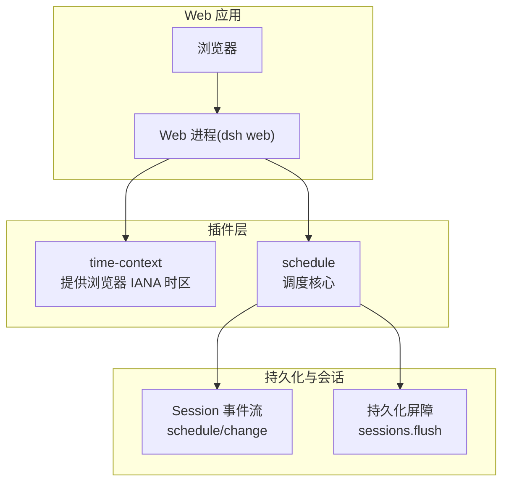
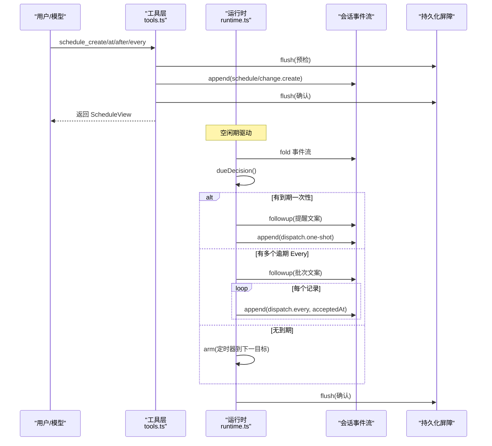
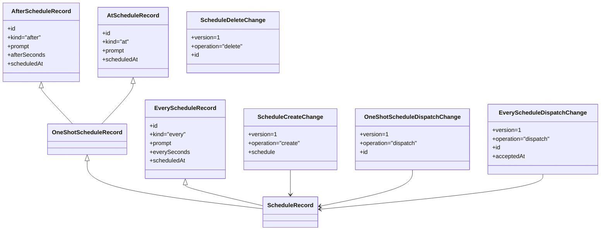
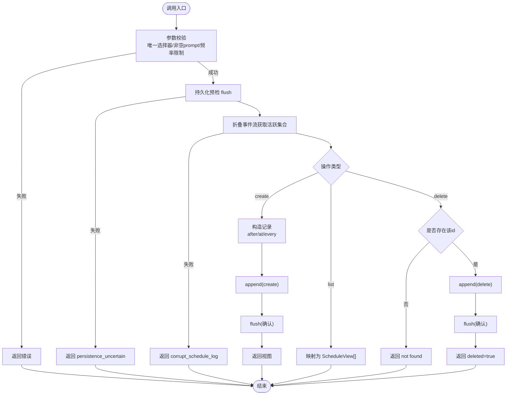
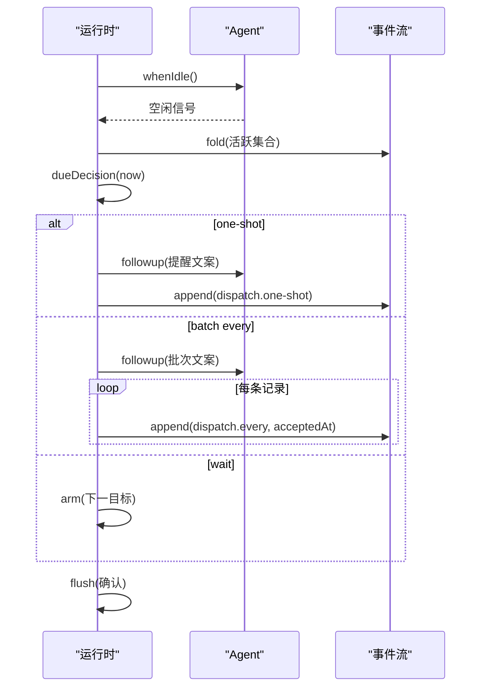
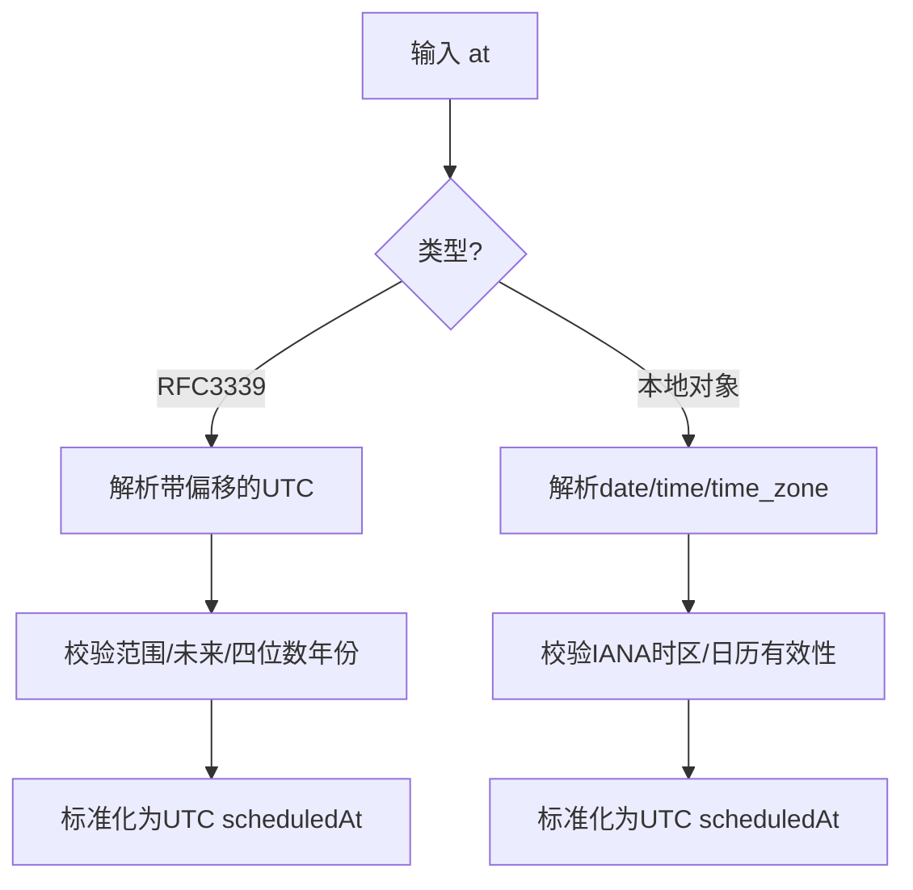
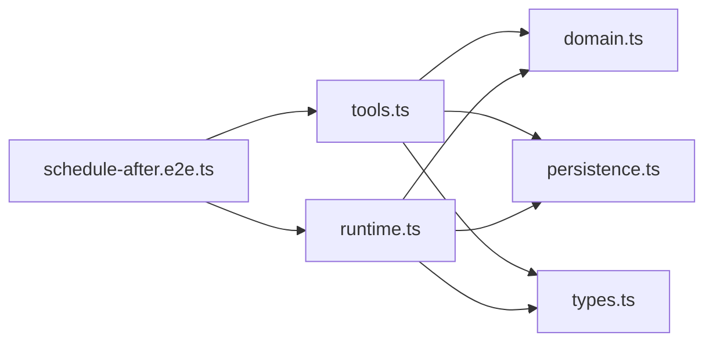

# Web 调度示例

<cite>
**本文引用的文件**
- [examples/web-schedule/README.md](file://examples/web-schedule/README.md)
- [examples/web-schedule/README.zh.md](file://examples/web-schedule/README.zh.md)
- [examples/web-schedule/cordis.yml](file://examples/web-schedule/cordis.yml)
- [packages/schedule/schedule/src/types.ts](file://packages/schedule/schedule/src/types.ts)
- [packages/schedule/schedule/src/tools.ts](file://packages/schedule/schedule/src/tools.ts)
- [packages/schedule/schedule/src/runtime.ts](file://packages/schedule/schedule/src/runtime.ts)
- [packages/schedule/schedule/src/persistence.ts](file://packages/schedule/schedule/src/persistence.ts)
- [packages/schedule/schedule/src/domain.ts](file://packages/schedule/schedule/src/domain.ts)
- [apps/web/tests/schedule-after.e2e.ts](file://apps/web/tests/schedule-after.e2e.ts)
- [docs/subsystems/schedule.md](file://docs/subsystems/schedule.md)
</cite>

## 目录
1. [简介](#简介)
2. [项目结构](#项目结构)
3. [核心组件](#核心组件)
4. [架构总览](#架构总览)
5. [详细组件分析](#详细组件分析)
6. [依赖关系分析](#依赖关系分析)
7. [性能考量](#性能考量)
8. [故障排查指南](#故障排查指南)
9. [结论](#结论)
10. [附录](#附录)

## 简介
本示例通过一个轻量 overlay，为 dsh web 进程启用“仅限 Session 内”的定时提醒能力。模型通过工具 schedule_create、schedule_list、schedule_delete 创建、查询与删除提醒；所有提醒以会话事件持久化，并在原会话恢复后继续执行。支持三类触发方式：
- 相对时间 after_seconds：正整数秒延迟的一次性提醒
- 绝对时间 at：严格 RFC 3339（带 Z 或数值偏移）或结构化本地日期时间（含显式时区）
- 固定频率 every_seconds：至少 300 秒的周期提醒，按创建时刻对齐，跳过已错过间隔，仅取最新一次到期

提醒交付模式固定为 session-local，即仅在原会话存活期间按时投递；关闭或冷启动不会丢失记录，重新打开后会恢复等待并投递逾期提醒。

**章节来源**
- [examples/web-schedule/README.md:5-19](file://examples/web-schedule/README.md#L5-L19)
- [examples/web-schedule/README.zh.md:5-19](file://examples/web-schedule/README.zh.md#L5-L19)
- [docs/subsystems/schedule.md:1-10](file://docs/subsystems/schedule.md#L1-L10)

## 项目结构
Web 侧通过 cordis.yml 注入 time-context 与 schedule 两个插件，使浏览器时区上下文可用并启用调度能力。调度实现位于 packages/schedule，包含类型定义、领域逻辑、工具注册、运行时驱动与持久化屏障。端到端测试覆盖 After/At/Every 三种场景及浏览器时区语义。

**图表来源**
- [examples/web-schedule/cordis.yml:1-10](file://examples/web-schedule/cordis.yml#L1-L10)
- [packages/schedule/schedule/src/persistence.ts:18-31](file://packages/schedule/schedule/src/persistence.ts#L18-L31)
- [packages/schedule/schedule/src/types.ts:213-221](file://packages/schedule/schedule/src/types.ts#L213-L221)

**章节来源**
- [examples/web-schedule/cordis.yml:1-10](file://examples/web-schedule/cordis.yml#L1-L10)
- [apps/web/tests/schedule-after.e2e.ts:215-240](file://apps/web/tests/schedule-after.e2e.ts#L215-L240)

## 核心组件
- 类型与协议：ScheduleRecord、ScheduleChange、ScheduleView、错误码等，定义了可持久化的提醒结构与变更事件。
- 领域逻辑：解析/校验输入、折叠事件流、计算下一次目标、渲染提醒文案。
- 工具 API：schedule_create、schedule_list、schedule_delete，封装参数校验、事务与持久化屏障。
- 运行时：基于空闲边界与定时器，决定何时投递一次性或批量固定频率提醒，并追加 dispatch 事件。
- 持久化：统一使用 sessions.flush 作为一致性屏障，确保 create/delete/di spatch 的可见性。

**章节来源**
- [packages/schedule/schedule/src/types.ts:12-119](file://packages/schedule/schedule/src/types.ts#L12-L119)
- [packages/schedule/schedule/src/domain.ts:20-24](file://packages/schedule/schedule/src/domain.ts#L20-L24)
- [packages/schedule/schedule/src/tools.ts:299-468](file://packages/schedule/schedule/src/tools.ts#L299-L468)
- [packages/schedule/schedule/src/runtime.ts:77-140](file://packages/schedule/schedule/src/runtime.ts#L77-L140)
- [packages/schedule/schedule/src/persistence.ts:18-31](file://packages/schedule/schedule/src/persistence.ts#L18-L31)

## 架构总览
调度系统围绕“会话事件流 + 空闲期维护”构建：
- 工具调用在 Agent 作用域内串行执行，先预检持久化屏障，再读取当前状态，最后写入变更并再次屏障确认。
- 运行时在 Agent 完全空闲时进入维护阶段，根据活跃提醒计算下一步动作：等待下一个目标、投递一次性提醒，或将多个逾期的 Every 合并为一批次投递。
- 每次投递会追加 schedule/change 的 dispatch 事件，并通过持久化屏障保证后续重启可恢复。

**图表来源**
- [packages/schedule/schedule/src/tools.ts:317-455](file://packages/schedule/schedule/src/tools.ts#L317-L455)
- [packages/schedule/schedule/src/runtime.ts:230-323](file://packages/schedule/schedule/src/runtime.ts#L230-L323)
- [packages/schedule/schedule/src/persistence.ts:24-31](file://packages/schedule/schedule/src/persistence.ts#L24-L31)

## 详细组件分析

### 数据模型与协议
- 提醒记录：
  - after：一次性，保留 afterSeconds 与 scheduledAt
  - at：一次性，仅保留标准化后的 scheduledAt
  - every：周期性，保留 everySeconds 与下一次 scheduledAt
- 变更事件：create、delete、dispatch（one-shot 或 every），版本号为 1。
- 视图：ScheduleView 附加 state（scheduled/overdue）与 deliveryMode（session-local）。

**图表来源**
- [packages/schedule/schedule/src/types.ts:12-119](file://packages/schedule/schedule/src/types.ts#L12-L119)
- [packages/schedule/schedule/src/types.ts:71-145](file://packages/schedule/schedule/src/types.ts#L71-L145)

**章节来源**
- [packages/schedule/schedule/src/types.ts:12-119](file://packages/schedule/schedule/src/types.ts#L12-L119)
- [docs/subsystems/schedule.md:7-65](file://docs/subsystems/schedule.md#L7-L65)

### 工具 API：schedule_create / schedule_list / schedule_delete
- schedule_create
  - 参数：prompt 必填；三选一 after_seconds、at、every_seconds
  - 校验：唯一选择器、非空 prompt、安全整数约束、最小频率 300s
  - 流程：预检持久化 -> 构造记录 -> 追加 create -> 再次屏障确认 -> 返回视图
- schedule_list
  - 返回当前会话中所有活跃提醒的视图列表（按创建顺序）
- schedule_delete
  - 按 id 删除活跃提醒；不存在返回 deleted=false 且 code=schedule_not_found

**图表来源**
- [packages/schedule/schedule/src/tools.ts:252-289](file://packages/schedule/schedule/src/tools.ts#L252-L289)
- [packages/schedule/schedule/src/tools.ts:317-455](file://packages/schedule/schedule/src/tools.ts#L317-L455)

**章节来源**
- [packages/schedule/schedule/src/tools.ts:252-289](file://packages/schedule/schedule/src/tools.ts#L252-L289)
- [packages/schedule/schedule/src/tools.ts:317-455](file://packages/schedule/schedule/src/tools.ts#L317-L455)

### 运行时与执行流程
- 空闲期驱动：当 Agent 完全空闲时进入维护阶段，避免打断当前工作。
- 决策函数：优先处理到期的一次性提醒；否则将多个逾期的 Every 合并为一批次，每条记录只取最新一次到期；若无到期则设置定时器等待下一个目标。
- 投递与持久化：生成提醒文案并通过 followup 投递；随后追加 dispatch 事件并 flush 确认。

**图表来源**
- [packages/schedule/schedule/src/runtime.ts:34-69](file://packages/schedule/schedule/src/runtime.ts#L34-L69)
- [packages/schedule/schedule/src/runtime.ts:230-323](file://packages/schedule/schedule/src/runtime.ts#L230-L323)

**章节来源**
- [packages/schedule/schedule/src/runtime.ts:77-140](file://packages/schedule/schedule/src/runtime.ts#L77-L140)
- [packages/schedule/schedule/src/runtime.ts:230-323](file://packages/schedule/schedule/src/runtime.ts#L230-L323)

### 绝对时间与相对时间的处理
- 相对时间 after_seconds：创建时保存原始延迟与标准化后的 scheduledAt；到期后一次性投递。
- 绝对时间 at：
  - 字符串形式：必须为严格 RFC 3339（Z 或数值偏移）
  - 对象形式：{ date, time, time_zone }，time_zone 必须为 UTC 或 IANA Area/Location
  - 拒绝夏令时缺口，重叠选最早时刻；最终仅存储 UTC 目标
- 固定频率 every_seconds：以创建时刻为锚点，间隔至少 300 秒；若多次错过，仅取最新一次到期，不形成积压。

**图表来源**
- [packages/schedule/schedule/src/domain.ts:26-39](file://packages/schedule/schedule/src/domain.ts#L26-L39)
- [packages/schedule/schedule/src/domain.ts:189-200](file://packages/schedule/schedule/src/domain.ts#L189-L200)

**章节来源**
- [docs/subsystems/schedule.md:67-99](file://docs/subsystems/schedule.md#L67-L99)
- [packages/schedule/schedule/src/domain.ts:189-200](file://packages/schedule/schedule/src/domain.ts#L189-L200)

### 任务持久化与恢复机制
- 所有变更通过 schedule/change 事件表达；fork 从 seedLength 开始折叠，保留历史但不继承父会话的活跃提醒。
- 创建与实际删除在 append 之后进行 flush 确认；运行时在投递前后也进行 flush，确保崩溃后可恢复。
- 冷启动重放：重新打开同一会话会重建定时器，并将过去目标视为 overdue 并投递。

**章节来源**
- [docs/subsystems/schedule.md:100-152](file://docs/subsystems/schedule.md#L100-L152)
- [packages/schedule/schedule/src/persistence.ts:18-31](file://packages/schedule/schedule/src/persistence.ts#L18-L31)
- [packages/schedule/schedule/src/runtime.ts:230-323](file://packages/schedule/schedule/src/runtime.ts#L230-L323)

### 配置与集成指南
- 启用 overlay：通过 --patch 加载 examples/web-schedule/cordis.yml，注入 time-context 与 schedule 插件。
- 浏览器时区：浏览器会为每条提示附加 IANA 时区；模型据此解释未明确时区的自然语言时间，但工具入参仍需显式时区或偏移。
- 最小频率：every_seconds 至少 300 秒，避免高频计时器开销。

**章节来源**
- [examples/web-schedule/README.md:5-13](file://examples/web-schedule/README.md#L5-L13)
- [examples/web-schedule/cordis.yml:1-10](file://examples/web-schedule/cordis.yml#L1-L10)
- [docs/subsystems/schedule.md:88-99](file://docs/subsystems/schedule.md#L88-L99)

### 最佳实践：优先级、冲突与错误恢复
- 优先级：一次性到期优先于固定频率批次；同批次的 Every 按目标时间与创建顺序合并。
- 冲突处理：每条 Every 独立维护状态；错过的间隔不累积，直接跳到下一个对齐目标。
- 错误恢复：
  - 持久化不确定：返回 persistence_uncertain，建议重试 schedule_list 确认状态
  - 日志损坏：返回 corrupt_schedule_log，需修复会话事件流
  - 运行时异常：记录警告并降级，不影响其他提醒

**章节来源**
- [packages/schedule/schedule/src/tools.ts:198-214](file://packages/schedule/schedule/src/tools.ts#L198-L214)
- [packages/schedule/schedule/src/runtime.ts:205-228](file://packages/schedule/schedule/src/runtime.ts#L205-L228)
- [docs/subsystems/schedule.md:154-186](file://docs/subsystems/schedule.md#L154-L186)

## 依赖关系分析
- tools.ts 依赖 domain.ts（记录构造、折叠、视图）、persistence.ts（flush 屏障）、transaction.ts（事务隔离）与 types.ts（类型与错误）。
- runtime.ts 依赖 domain.ts（决策与渲染）、persistence.ts（flush）与 types.ts。
- 测试通过 e2e 验证工具调用、事件追加、followup 内容与持久化一致性。

**图表来源**
- [packages/schedule/schedule/src/tools.ts:1-36](file://packages/schedule/schedule/src/tools.ts#L1-L36)
- [packages/schedule/schedule/src/runtime.ts:1-19](file://packages/schedule/schedule/src/runtime.ts#L1-L19)
- [apps/web/tests/schedule-after.e2e.ts:1-28](file://apps/web/tests/schedule-after.e2e.ts#L1-L28)

**章节来源**
- [packages/schedule/schedule/src/tools.ts:1-36](file://packages/schedule/schedule/src/tools.ts#L1-L36)
- [packages/schedule/schedule/src/runtime.ts:1-19](file://packages/schedule/schedule/src/runtime.ts#L1-L19)
- [apps/web/tests/schedule-after.e2e.ts:1-28](file://apps/web/tests/schedule-after.e2e.ts#L1-L28)

## 性能考量
- 固定频率下限 300 秒，避免过多定时器与频繁唤醒。
- 批量合并：同一次 idle 决策中，多个逾期的 Every 合并为一次 follow-up，减少模型轮次。
- 定时器分段：单次最大延迟受平台限制，运行时会在到达上限前分片唤醒，避免被系统裁剪。
- 空闲期执行：仅在 Agent 完全空闲时运行维护，避免干扰当前对话。

**章节来源**
- [packages/schedule/schedule/src/domain.ts:20-24](file://packages/schedule/schedule/src/domain.ts#L20-L24)
- [packages/schedule/schedule/src/runtime.ts:21-22](file://packages/schedule/schedule/src/runtime.ts#L21-L22)
- [docs/subsystems/schedule.md:92-99](file://docs/subsystems/schedule.md#L92-L99)

## 故障排查指南
- 常见错误码：
  - invalid_prompt：提醒内容为空
  - invalid_selector：未提供或提供了多个选择器
  - invalid_rule：参数不符合规则（如 after_seconds 非正整数）
  - invalid_time_zone：时区无效或不支持
  - not_future：绝对时间不是严格未来
  - time_out_of_range：无法表示为四位数年份的 UTC 时间
  - frequency_too_high：every_seconds 小于 300
  - corrupt_schedule_log：事件流损坏
  - persistence_uncertain：持久化未完成，建议重试 list
  - internal_error：内部错误
- 排查步骤：
  - 检查 schedule/change 事件是否完整追加
  - 确认 flush 是否成功
  - 查看运行时日志中的警告信息
  - 对 corrupted log 进行回滚或重建会话

**章节来源**
- [packages/schedule/schedule/src/types.ts:124-197](file://packages/schedule/schedule/src/types.ts#L124-L197)
- [packages/schedule/schedule/src/tools.ts:198-214](file://packages/schedule/schedule/src/tools.ts#L198-L214)
- [packages/schedule/schedule/src/runtime.ts:205-228](file://packages/schedule/schedule/src/runtime.ts#L205-L228)

## 结论
Web 调度示例以“会话事件流 + 空闲期维护”的方式实现了可靠、可恢复的定时提醒。通过严格的输入校验、明确的时区边界与固定的 session-local 交付模式，系统在保持简洁的同时具备强一致性与可观测性。结合批量合并与最低频率限制，能够在多提醒场景下维持良好的性能与用户体验。

## 附录
- 快速上手
  - 启用 overlay：dsh web --patch examples/web-schedule/cordis.yml
  - 使用工具：schedule_create（after/at/every）、schedule_list、schedule_delete
  - 观察行为：关闭/冷启动后，逾期提醒会在恢复时投递
- 参考文档
  - 子系统说明：docs/subsystems/schedule.md
  - 端到端用例：apps/web/tests/schedule-after.e2e.ts

**章节来源**
- [examples/web-schedule/README.md:5-13](file://examples/web-schedule/README.md#L5-L13)
- [docs/subsystems/schedule.md:1-10](file://docs/subsystems/schedule.md#L1-L10)
- [apps/web/tests/schedule-after.e2e.ts:215-240](file://apps/web/tests/schedule-after.e2e.ts#L215-L240)