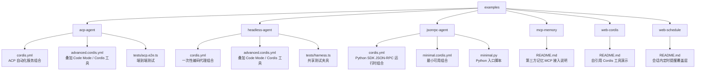
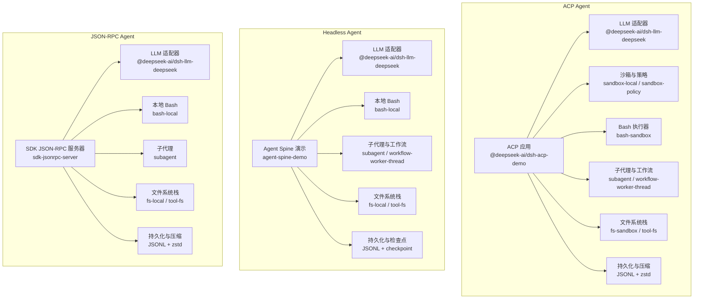
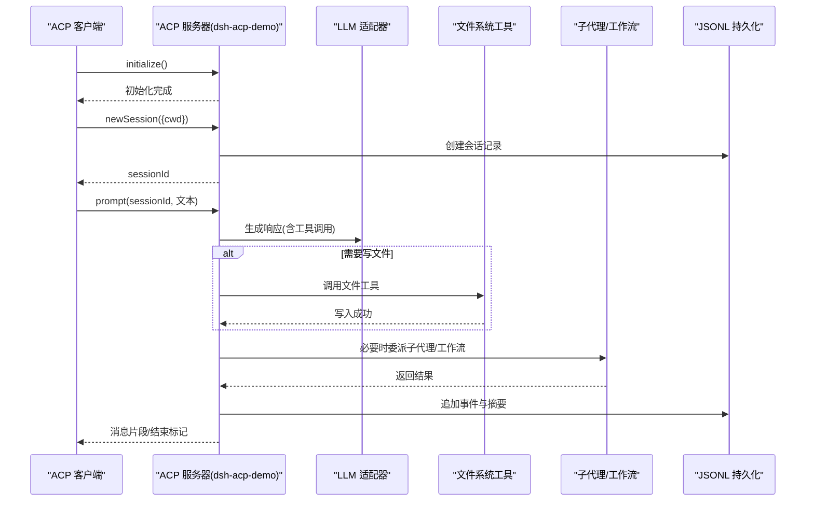
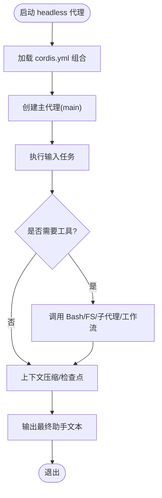
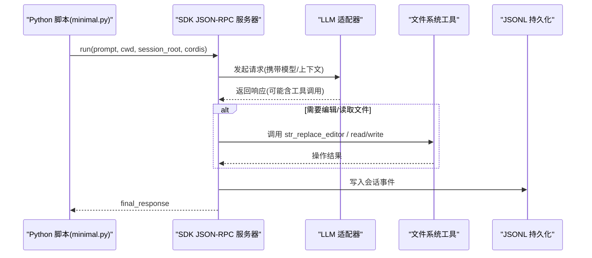
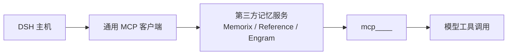
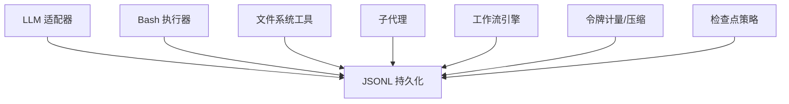

# 示例应用

<cite>
**本文引用的文件**
- [examples/README.md](file://examples/README.md)
- [examples/acp-agent/README.md](file://examples/acp-agent/README.md)
- [examples/acp-agent/cordis.yml](file://examples/acp-agent/cordis.yml)
- [examples/acp-agent/advanced.cordis.yml](file://examples/acp-agent/advanced.cordis.yml)
- [examples/acp-agent/tests/acp.e2e.ts](file://examples/acp-agent/tests/acp.e2e.ts)
- [examples/headless-agent/README.md](file://examples/headless-agent/README.md)
- [examples/headless-agent/cordis.yml](file://examples/headless-agent/cordis.yml)
- [examples/headless-agent/advanced.cordis.yml](file://examples/headless-agent/advanced.cordis.yml)
- [examples/headless-agent/tests/harness.ts](file://examples/headless-agent/tests/harness.ts)
- [examples/jsonrpc-agent/README.md](file://examples/jsonrpc-agent/README.md)
- [examples/jsonrpc-agent/cordis.yml](file://examples/jsonrpc-agent/cordis.yml)
- [examples/jsonrpc-agent/minimal.cordis.yml](file://examples/jsonrpc-agent/minimal.cordis.yml)
- [examples/jsonrpc-agent/minimal.py](file://examples/jsonrpc-agent/minimal.py)
- [examples/mcp-memory/README.md](file://examples/mcp-memory/README.md)
- [examples/web-cordis/README.md](file://examples/web-cordis/README.md)
- [examples/web-schedule/README.md](file://examples/web-schedule/README.md)
</cite>

## 目录
1. [简介](#简介)
2. [项目结构](#项目结构)
3. [核心组件](#核心组件)
4. [架构总览](#架构总览)
5. [详细组件分析](#详细组件分析)
6. [依赖关系分析](#依赖关系分析)
7. [性能与可扩展性](#性能与可扩展性)
8. [故障排查指南](#故障排查指南)
9. [结论](#结论)
10. [附录：快速上手与定制](#附录快速上手与定制)

## 简介
本章节面向希望以 DeepSeek Harness 示例为起点进行二次开发的读者，系统介绍 ACP Agent、Headless Agent、JSON-RPC Agent、MCP Memory、Web Cordis、Web Schedule 等示例的功能特点、适用场景、架构设计与实现细节，并给出如何基于这些示例构建自有项目的步骤、扩展方式、测试方法与最佳实践。

## 项目结构
示例位于仓库根目录 examples 下，每个子目录是一个可独立运行的“组合（composition）”，通过 Cordis 配置文件声明插件、工具、持久化、沙箱、工作流等能力。顶层 README 对示例进行了概览说明，各示例目录包含自己的 README、配置与测试。

图表来源
- [examples/README.md:1-30](file://examples/README.md#L1-L30)
- [examples/acp-agent/cordis.yml:1-193](file://examples/acp-agent/cordis.yml#L1-L193)
- [examples/headless-agent/cordis.yml:1-166](file://examples/headless-agent/cordis.yml#L1-L166)
- [examples/jsonrpc-agent/cordis.yml:1-90](file://examples/jsonrpc-agent/cordis.yml#L1-L90)
- [examples/jsonrpc-agent/minimal.cordis.yml:1-83](file://examples/jsonrpc-agent/minimal.cordis.yml#L1-L83)
- [examples/mcp-memory/README.md:1-102](file://examples/mcp-memory/README.md#L1-L102)
- [examples/web-cordis/README.md:1-22](file://examples/web-cordis/README.md#L1-L22)
- [examples/web-schedule/README.md:1-20](file://examples/web-schedule/README.md#L1-L20)

章节来源
- [examples/README.md:1-30](file://examples/README.md#L1-L30)

## 核心组件
- ACP Agent：面向程序化客户端的自动化服务器，基于 JSON-RPC over stdio，提供会话、权限、取消、子代理与工作流等能力，适合父代理或子代理提供者集成。
- Headless Agent：无交互的一次性编码代理，接受单一任务后输出机器可读或人类可读结果，适合批处理与 CI 流水线。
- JSON-RPC Agent：配合 Python SDK 的无头编码代理组合，stdout 专用于协议，适合通过 Python 驱动的任务执行。
- MCP Memory：通过通用 MCP 客户端连接第三方记忆服务，将外部工具暴露为模型可调用的工具。
- Web Cordis：自引用演示，允许在内存中动态挂载/卸载插件，便于调试与实验。
- Web Schedule：可选的 Web 覆盖层，提供会话内定时提醒能力，支持绝对时间与固定间隔。

章节来源
- [examples/acp-agent/README.md:1-25](file://examples/acp-agent/README.md#L1-L25)
- [examples/headless-agent/README.md:1-33](file://examples/headless-agent/README.md#L1-L33)
- [examples/jsonrpc-agent/README.md:1-41](file://examples/jsonrpc-agent/README.md#L1-L41)
- [examples/mcp-memory/README.md:1-102](file://examples/mcp-memory/README.md#L1-L102)
- [examples/web-cordis/README.md:1-22](file://examples/web-cordis/README.md#L1-L22)
- [examples/web-schedule/README.md:1-20](file://examples/web-schedule/README.md#L1-L20)

## 架构总览
以下图展示了三个主要示例的核心运行路径与关键插件协作关系。

图表来源
- [examples/acp-agent/cordis.yml:1-193](file://examples/acp-agent/cordis.yml#L1-L193)
- [examples/headless-agent/cordis.yml:1-166](file://examples/headless-agent/cordis.yml#L1-L166)
- [examples/jsonrpc-agent/cordis.yml:1-90](file://examples/jsonrpc-agent/cordis.yml#L1-L90)

## 详细组件分析

### ACP Agent 示例
- 功能特点
  - 通过 JSON-RPC over stdio 暴露 ACP 协议，适合程序化调用。
  - 默认启用思考模式与最大推理努力；可按需切换 Code Mode。
  - 沙箱与权限策略可配置，支持 workspace-write 与 danger-full-access。
  - 子代理支持 spawn/fork 两种后端，工作流引擎通过 worker-thread 执行模型生成的脚本。
  - 会话持久化为 JSONL，支持压缩；快照模式下关闭压缩以便回放。
- 适用场景
  - 父代理、子代理提供者、自动化编排与批量任务。
- 架构要点
  - LLM 适配器、沙箱、Bash、子代理、工作流、文件系统、持久化、令牌计量与压缩等插件协同。
  - 通过 hooks 桥接 Claude/Codex 事件，便于审计与扩展。
- 定制与扩展
  - 使用 advanced.cordis.yml 叠加 Code Mode 与 Cordis 工具，增强代码执行与插件管理能力。
  - 通过环境变量控制权限模式与持久化路径。
- 测试与验证
  - e2e 测试验证 stdout 仅输出 JSON-RPC 帧，以及 session/new 流程与真实提示下的文件写入效果。

图表来源
- [examples/acp-agent/cordis.yml:1-193](file://examples/acp-agent/cordis.yml#L1-L193)
- [examples/acp-agent/tests/acp.e2e.ts:1-127](file://examples/acp-agent/tests/acp.e2e.ts#L1-L127)

章节来源
- [examples/acp-agent/README.md:1-25](file://examples/acp-agent/README.md#L1-L25)
- [examples/acp-agent/cordis.yml:1-193](file://examples/acp-agent/cordis.yml#L1-L193)
- [examples/acp-agent/advanced.cordis.yml:1-30](file://examples/acp-agent/advanced.cordis.yml#L1-L30)
- [examples/acp-agent/tests/acp.e2e.ts:1-127](file://examples/acp-agent/tests/acp.e2e.ts#L1-L127)

### Headless Agent 示例
- 功能特点
  - 无交互的一次性编码代理，接收单一任务后输出最终助手文本。
  - 内置 Bash、Todo、子代理与工作流；支持上下文压缩与检查点。
  - 可通过 E2B 覆盖层替换本地文件系统与子进程，实现在隔离沙箱中执行。
- 适用场景
  - CI/CD 中的自动化修复、批量任务、离线环境。
- 架构要点
  - Agent Spine 定义主代理与 persona；LLM 适配器、Bash、子代理、工作流、文件系统、持久化与检查点共同构成完整链路。
  - advanced 配置叠加 Code Mode 与 Cordis 工具，增强代码执行与插件管理。
- 定制与扩展
  - 通过 advanced.cordis.yml 开启更多工具；通过环境变量调整模型、上下文窗口与持久化路径。
- 测试与验证
  - 共享 harness 提供测试夹具，支持注入 compaction、persistence 等能力；e2e 用例覆盖代码模式、恢复、子代理诊断等。

图表来源
- [examples/headless-agent/cordis.yml:1-166](file://examples/headless-agent/cordis.yml#L1-L166)
- [examples/headless-agent/advanced.cordis.yml:1-35](file://examples/headless-agent/advanced.cordis.yml#L1-L35)
- [examples/headless-agent/tests/harness.ts:1-105](file://examples/headless-agent/tests/harness.ts#L1-L105)

章节来源
- [examples/headless-agent/README.md:1-33](file://examples/headless-agent/README.md#L1-L33)
- [examples/headless-agent/cordis.yml:1-166](file://examples/headless-agent/cordis.yml#L1-L166)
- [examples/headless-agent/advanced.cordis.yml:1-35](file://examples/headless-agent/advanced.cordis.yml#L1-L35)
- [examples/headless-agent/tests/harness.ts:1-105](file://examples/headless-agent/tests/harness.ts#L1-L105)

### JSON-RPC Agent 示例
- 功能特点
  - 专为 Python SDK 的 JSON-RPC 运行时设计，stdout 保留给协议，不加载终端 UI 与审批界面。
  - 提供 Bash、文件编辑、子代理与 Todo 工具；支持自动上下文压缩与 JSONL 持久化。
  - minimal 变体为最小可用组合，仅包含必要工具与持久化，适合容器或无 Node 环境。
- 适用场景
  - 通过 Python 驱动的一次性或长时任务；无需 Node 环境的部署。
- 架构要点
  - sdk-jsonrpc-server 作为入口；LLM 适配器、Bash、子代理、文件系统、持久化与令牌计量组成核心链路。
  - minimal.cordis.yml 明确禁用不必要的上下文注入与技能，确保最小依赖。
- 定制与扩展
  - 通过环境变量选择模型、会话根目录、系统提示与是否将 token 限制视为成功。
  - 使用 minimal.py 作为 Python 入口，传入工作区与会话参数。
- 测试与验证
  - 文档与配置说明了最小变体的行为边界；结合 Python SDK 教程与参考进行验证。

图表来源
- [examples/jsonrpc-agent/cordis.yml:1-90](file://examples/jsonrpc-agent/cordis.yml#L1-L90)
- [examples/jsonrpc-agent/minimal.cordis.yml:1-83](file://examples/jsonrpc-agent/minimal.cordis.yml#L1-L83)
- [examples/jsonrpc-agent/minimal.py:1-44](file://examples/jsonrpc-agent/minimal.py#L1-L44)

章节来源
- [examples/jsonrpc-agent/README.md:1-41](file://examples/jsonrpc-agent/README.md#L1-L41)
- [examples/jsonrpc-agent/cordis.yml:1-90](file://examples/jsonrpc-agent/cordis.yml#L1-L90)
- [examples/jsonrpc-agent/minimal.cordis.yml:1-83](file://examples/jsonrpc-agent/minimal.cordis.yml#L1-L83)
- [examples/jsonrpc-agent/minimal.py:1-44](file://examples/jsonrpc-agent/minimal.py#L1-L44)

### MCP Memory 示例
- 功能特点
  - 通过通用 MCP 客户端连接第三方记忆服务（Memorix、MCP Reference Memory、Engram），将外部工具暴露为 mcp__<serverName>__<tool>。
  - 默认关闭，需通过 --patch 启用；stdio 传输会清理敏感环境变量，HTTP 传输要求上游服务已运行。
- 适用场景
  - 需要跨会话记忆、知识图谱或检索增强的场景。
- 架构要点
  - DSH 负责发现与注册 MCP 工具；具体存储、模型、嵌入与鉴权由上游服务负责。
  - 提供可选的模型指令，引导模型在合适时机调用记忆工具。
- 定制与扩展
  - 复制现有条目并修改 id/serverName/transport/command/url 即可接入新 MCP 服务。
- 测试与验证
  - 通过唯一值在会话 A 写入、会话 B 召回并使用，验证读写与回忆链路。

图表来源
- [examples/mcp-memory/README.md:1-102](file://examples/mcp-memory/README.md#L1-L102)

章节来源
- [examples/mcp-memory/README.md:1-102](file://examples/mcp-memory/README.md#L1-L102)

### Web Cordis 示例
- 功能特点
  - 自引用演示，允许在内存中动态挂载/卸载插件，便于调试与实验。
- 适用场景
  - 插件开发、热更新与在线调试。
- 架构要点
  - 通过 tool-cordis 暴露能力，临时插件在卸载或进程退出后消失。
- 测试与验证
  - 通过 demo 命令启动浏览器或 ACP 模式，按工具参考验证生命周期与安全契约。

章节来源
- [examples/web-cordis/README.md:1-22](file://examples/web-cordis/README.md#L1-L22)

### Web Schedule 示例
- 功能特点
  - 可选覆盖层，为 dsh web 进程添加会话内定时提醒能力，支持 after_seconds、at、every_seconds。
  - 提醒由原会话日志拥有，活着的根代理在空闲时排队后续回合；冷态停止计时，重启恢复。
- 适用场景
  - 需要在浏览器会话内设置提醒且无需外部通知通道的场景。
- 架构要点
  - 通过 schedule_create/list/delete 管理提醒；交付标识为 session-local。
- 测试与验证
  - 文档描述了时间解释、过期处理与批量合并规则，便于编写验收用例。

章节来源
- [examples/web-schedule/README.md:1-20](file://examples/web-schedule/README.md#L1-L20)

## 依赖关系分析
- 插件耦合与内聚
  - 各示例通过 Cordis 配置文件显式声明插件与配置，降低隐式耦合；LLM 适配器、沙箱、Bash、子代理、工作流、文件系统与持久化形成清晰分层。
- 直接依赖
  - ACP/Headless/JSON-RPC 均依赖 LLM 适配器与 Bash/FS 工具；Headless 与 ACP 额外引入子代理与工作流；JSON-RPC 通过 SDK 服务器暴露协议。
- 间接依赖
  - 令牌计量与上下文压缩影响历史长度与重试策略；检查点与持久化影响恢复与回放。
- 外部依赖
  - MCP Memory 依赖上游服务；E2B 覆盖层依赖云端沙箱。

图表来源
- [examples/acp-agent/cordis.yml:1-193](file://examples/acp-agent/cordis.yml#L1-L193)
- [examples/headless-agent/cordis.yml:1-166](file://examples/headless-agent/cordis.yml#L1-L166)
- [examples/jsonrpc-agent/cordis.yml:1-90](file://examples/jsonrpc-agent/cordis.yml#L1-L90)

章节来源
- [examples/acp-agent/cordis.yml:1-193](file://examples/acp-agent/cordis.yml#L1-L193)
- [examples/headless-agent/cordis.yml:1-166](file://examples/headless-agent/cordis.yml#L1-L166)
- [examples/jsonrpc-agent/cordis.yml:1-90](file://examples/jsonrpc-agent/cordis.yml#L1-L90)

## 性能与可扩展性
- 上下文压缩与令牌计量
  - 通过阈值比例与保留比例控制历史范围，避免溢出；压缩可减少存储与传输开销。
- 子代理与工作流
  - 子代理支持并发与深度限制；工作流通过 worker-thread 执行脚本，提升复杂任务吞吐。
- 沙箱与权限
  - workspace-write 限制写入范围，danger-full-access 适用于受控环境；权限策略与沙箱策略协同保障安全。
- 持久化与恢复
  - JSONL 持久化支持压缩；检查点策略保证中断后可恢复。
- 可扩展点
  - 通过 Cordis 覆盖层叠加新插件；MCP Memory 接入第三方记忆；E2B 覆盖层替换底层资源。

[本节为通用指导，不直接分析具体文件]

## 故障排查指南
- ACP 示例
  - stdout 必须仅包含 JSON-RPC 帧；若出现非 JSON 行，说明有日志泄漏到协议通道。
  - session/new 失败可能是注入或懒加载问题；e2e 用例覆盖了该回归场景。
- Headless 示例
  - 若任务未产出预期结果，检查 Bash 超时、权限模式与文件系统路径；确认检查点与持久化路径正确。
- JSON-RPC 示例
  - 若 token 限制被视为错误，调整 DSH_MAX_TOKENS_AS_SUCCESS；确认 DSH_CWD 与 DSH_SESSION_ROOT 指向有效目录。
- MCP Memory 示例
  - 初始发现异步，首次调用前等待 mcp__... 工具就绪；上游服务崩溃不会自动重连，需手动重启或重新同步。

章节来源
- [examples/acp-agent/tests/acp.e2e.ts:1-127](file://examples/acp-agent/tests/acp.e2e.ts#L1-L127)
- [examples/mcp-memory/README.md:1-102](file://examples/mcp-memory/README.md#L1-L102)

## 结论
DeepSeek Harness 的示例提供了从自动化服务（ACP）、无头任务（Headless）到 Python SDK 驱动（JSON-RPC）的完整谱系，并通过 MCP Memory、Web Cordis 与 Web Schedule 展示扩展能力。借助 Cordis 组合与覆盖层，开发者可以快速搭建稳定、可观测、可恢复的 AI 代理系统，并在安全沙箱与持久化基础上进行定制化与规模化扩展。

[本节为总结，不直接分析具体文件]

## 附录：快速上手与定制
- 快速启动
  - ACP：运行 demo:acp 或 demo:code-mode，准备 DEEPSEEK_API_KEY。
  - Headless：使用 dsh --profile headless 提交任务，输出最终助手文本。
  - JSON-RPC：通过 minimal.py 传入 prompt、workspace、session-root 等参数。
- 定制与扩展
  - 使用 advanced.cordis.yml 叠加 Code Mode 与 Cordis 工具。
  - 通过环境变量控制权限模式、模型、上下文窗口与持久化路径。
  - 接入 MCP Memory：选择并启用一个覆盖层，等待工具就绪后验证读写与回忆。
- 测试与最佳实践
  - 复用示例 e2e 与 harness，验证 stdout 纯度、会话创建、文件写入与恢复。
  - 在生产环境优先使用 workspace-write 权限，仅在受控场景使用 danger-full-access。
  - 启用上下文压缩与检查点，确保长会话稳定性与可恢复性。

章节来源
- [examples/acp-agent/README.md:1-25](file://examples/acp-agent/README.md#L1-L25)
- [examples/headless-agent/README.md:1-33](file://examples/headless-agent/README.md#L1-L33)
- [examples/jsonrpc-agent/README.md:1-41](file://examples/jsonrpc-agent/README.md#L1-L41)
- [examples/mcp-memory/README.md:1-102](file://examples/mcp-memory/README.md#L1-L102)
- [examples/acp-agent/advanced.cordis.yml:1-30](file://examples/acp-agent/advanced.cordis.yml#L1-L30)
- [examples/headless-agent/advanced.cordis.yml:1-35](file://examples/headless-agent/advanced.cordis.yml#L1-L35)
- [examples/jsonrpc-agent/minimal.py:1-44](file://examples/jsonrpc-agent/minimal.py#L1-L44)