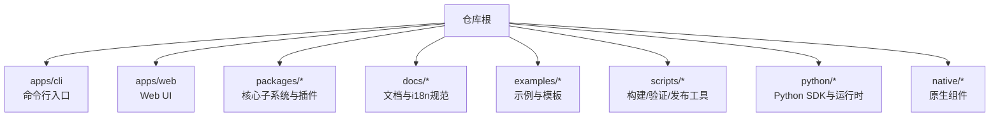
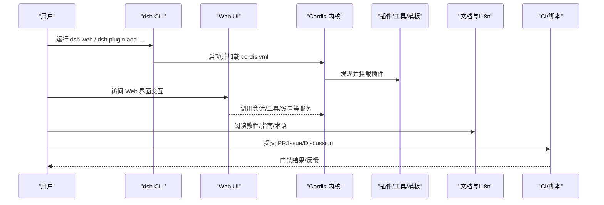
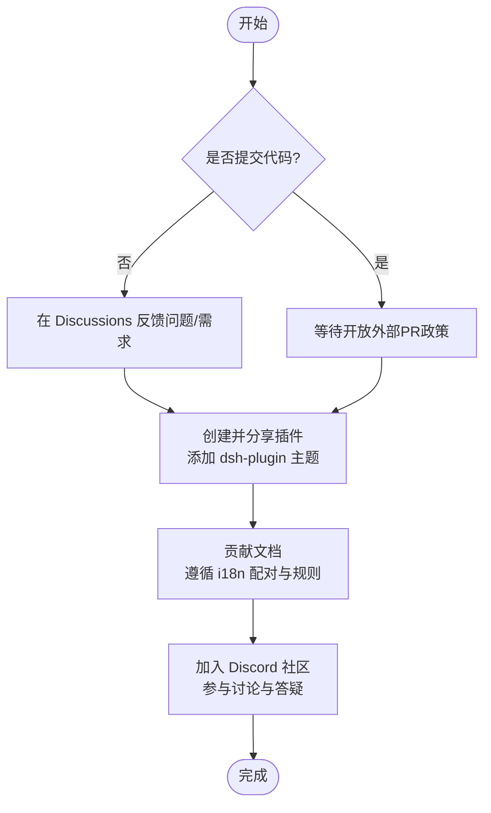
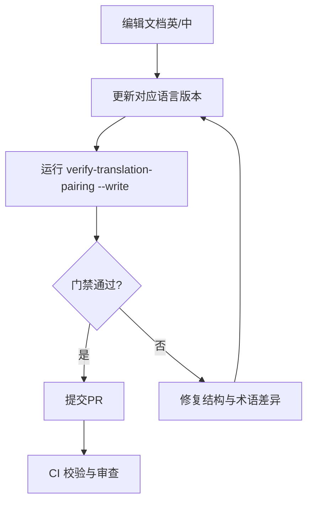
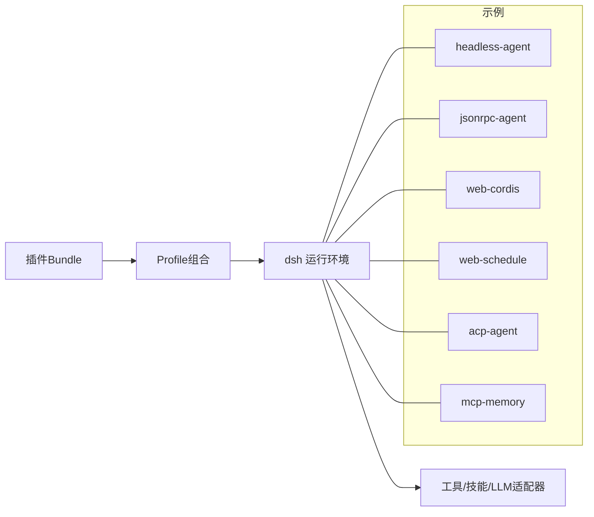
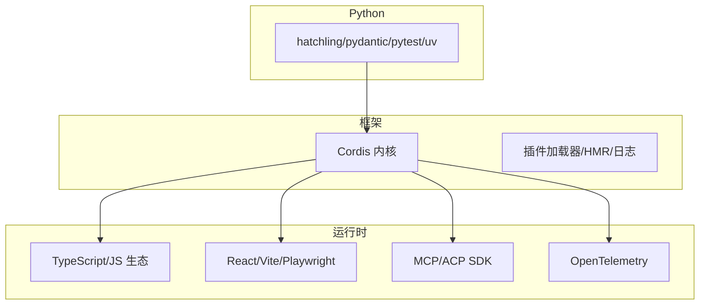

# 社区生态

<cite>
**本文引用的文件**
- [README.md](file://README.md)
- [CONTRIBUTING.md](file://CONTRIBUTING.md)
- [THIRD_PARTY_NOTICES.md](file://THIRD_PARTY_NOTICES.md)
- [docs/i18n/README.md](file://docs/i18n/README.md)
- [docs/i18n/translation-rules.md](file://docs/i18n/translation-rules.md)
- [examples/README.md](file://examples/README.md)
- [docs/user/develop/basic/publish.md](file://docs/user/develop/basic/publish.md)
- [docs/cordis-tutorial/index.md](file://docs/cordis-tutorial/index.md)
</cite>

## 目录
1. [简介](#简介)
2. [项目结构](#项目结构)
3. [核心组件](#核心组件)
4. [架构总览](#架构总览)
5. [详细组件分析](#详细组件分析)
6. [依赖分析](#依赖分析)
7. [性能考虑](#性能考虑)
8. [故障排查指南](#故障排查指南)
9. [结论](#结论)
10. [附录](#附录)

## 简介
DeepSeek Harness（简称 dsh）是一个开源的“智能体编排框架”，采用“一切皆插件”的架构，由 Cordis 驱动。当前处于开发者预览阶段，迭代迅速，API 可能包含破坏性变更。社区鼓励通过讨论区反馈问题、贡献插件与教程，并欢迎在 Discord 社区交流。仓库提供 CLI、Web UI、Python SDK、示例与丰富的文档体系，便于快速上手与扩展。

## 项目结构
从社区生态视角，仓库围绕“核心框架 + 应用层 + 文档与示例 + 工具链”组织：
- 核心框架与子系统：packages 下按能力划分模块（如 core、llm、session、web、shell、tools 等），通过 Cordis 插件机制组合。
- 应用层：apps/cli 提供命令行入口；apps/web 提供 Web UI 前端与测试。
- 文档与国际化：docs 下包含用户指南、子系统说明、Cordis 教程、i18n 规范与术语表。
- 示例与模板：examples 提供可运行的演示（headless-agent、jsonrpc-agent、web-cordis、web-schedule、acp-agent、mcp-memory 等）。
- 工具链与脚本：scripts 提供构建、验证、翻译配对、发布辅助等自动化流程。
- 原生与 Python SDK：native 提供安全沙箱相关二进制；python/sdk 与 python/sdk-runtime 提供 Python 侧集成与运行时。

**图表来源**
- [README.md:1-58](file://README.md#L1-L58)
- [examples/README.md:1-30](file://examples/README.md#L1-L30)

**章节来源**
- [README.md:1-58](file://README.md#L1-L58)
- [examples/README.md:1-30](file://examples/README.md#L1-L30)

## 核心组件
- 插件化内核（Cordis）：所有能力以插件形式挂载到共享上下文，支持生命周期、事件、服务注册与配置校验。
- CLI 与 Web UI：dsh web 启动 Web 界面，默认监听本地端口；CLI 提供安装、打包、运行与管理命令。
- 示例与模板：涵盖无头代理、JSON-RPC 驱动、Web 调度、ACP 自动化服务器、MCP 记忆等场景。
- 文档与 i18n：中英双语文档、术语表、翻译规则与一致性门禁，确保内容质量与可维护性。
- 工具链：CI、类型检查、链接检查、第三方许可证清单生成、翻译配对校验等。

**章节来源**
- [docs/cordis-tutorial/index.md:1-61](file://docs/cordis-tutorial/index.md#L1-L61)
- [examples/README.md:1-30](file://examples/README.md#L1-L30)
- [docs/i18n/README.md:1-61](file://docs/i18n/README.md#L1-L61)

## 架构总览
下图展示社区参与的主要路径：用户通过 CLI/Web 使用 dsh，基于 Cordis 加载插件；社区贡献包括插件、文档、示例与工具；CI 与脚本保障质量与合规。

**图表来源**
- [README.md:13-45](file://README.md#L13-L45)
- [docs/cordis-tutorial/index.md:13-46](file://docs/cordis-tutorial/index.md#L13-L46)
- [examples/README.md:7-29](file://examples/README.md#L7-L29)

## 详细组件分析

### 社区贡献流程与规范
- 代码贡献现状：项目仍处于早期活跃开发阶段，暂不接收外部 Pull Request；可通过 GitHub Discussions 反馈问题与需求，或贡献生态资源。
- 插件生态：鼓励创建并分享插件，使用 `dsh-plugin` 主题提升可发现性；官方仓库定位为“理念、展示与灵感来源”，社区包同等重要。
- 文档贡献：遵循中英双语配对与一致性门禁；修改任一语言需同步更新另一方并记录哈希；遵循术语表与排版规则。
- 问题反馈：通过 GitHub Discussions 提交反馈与 bug 报告；加入 Discord 社区获取支持与讨论。

**图表来源**
- [CONTRIBUTING.md:5-23](file://CONTRIBUTING.md#L5-L23)
- [README.md:37-45](file://README.md#L37-L45)
- [docs/i18n/README.md:7-38](file://docs/i18n/README.md#L7-L38)

**章节来源**
- [CONTRIBUTING.md:5-23](file://CONTRIBUTING.md#L5-L23)
- [README.md:37-45](file://README.md#L37-L45)
- [docs/i18n/README.md:7-38](file://docs/i18n/README.md#L7-L38)

### 国际化支持与多语言社区建设
- 双语文档：每篇文档维护英文与简体中文版本，并通过 `.i18n.yaml` 记录双方最新一致内容的 blob 哈希。
- 翻译规则：忠实原文、术语统一、结构保持（标题层级、列表、表格、代码块、链接目标）、排版规范（中英文混排、标点、数字）。
- 门禁与工具：`verify-translation-pairing` 强制完整性与一致性；合并时 Git 驱动自动处理配对记录；生成的英文参考页与中文对照独立维护。
- 术语权威：terminology.md 为术语唯一来源；未列出的技术词优先采用成熟译法或保留英文并列入待定。

**图表来源**
- [docs/i18n/README.md:7-38](file://docs/i18n/README.md#L7-L38)
- [docs/i18n/translation-rules.md:7-57](file://docs/i18n/translation-rules.md#L7-L57)

**章节来源**
- [docs/i18n/README.md:7-38](file://docs/i18n/README.md#L7-L38)
- [docs/i18n/translation-rules.md:7-57](file://docs/i18n/translation-rules.md#L7-L57)

### 插件、工具与模板资源
- 插件与打包：通过 bundle（npm 包）声明配置层，profile 描述可运行组合；使用 `dsh plugin add` 安装并管理组合顺序。
- 示例集合：
  - headless-agent：一次性任务执行与输出。
  - jsonrpc-agent：通过 Python SDK 与 JSON-RPC 驱动。
  - web-cordis：自引用 Agent，可检查和修改内存中的插件树。
  - web-schedule：可选 Web 叠加层，提供持久化提醒。
  - acp-agent：Agent Client Protocol 自动化服务器。
  - mcp-memory：连接第三方记忆服务器的覆盖配置。
- 教程与入门：Cordis 教程从零开始编写插件，逐步接入真实 harness 服务。

**图表来源**
- [docs/user/develop/basic/publish.md:9-16](file://docs/user/develop/basic/publish.md#L9-L16)
- [examples/README.md:7-29](file://examples/README.md#L7-L29)
- [docs/cordis-tutorial/index.md:13-46](file://docs/cordis-tutorial/index.md#L13-L46)

**章节来源**
- [docs/user/develop/basic/publish.md:9-16](file://docs/user/develop/basic/publish.md#L9-L16)
- [examples/README.md:7-29](file://examples/README.md#L7-L29)
- [docs/cordis-tutorial/index.md:13-46](file://docs/cordis-tutorial/index.md#L13-L46)

### 开源许可证与合规
- 主许可证：MIT。
- 第三方依赖：THIRD_PARTY_NOTICES.md 列出直接依赖、vendored 源码、运行时 npm 依赖、开发依赖、Python SDK 依赖及构建期拉取包的许可证信息；vendor 下的 Cordis 基础库均为 MIT。
- 平台载荷授权：对官方 Claude Code 平台载荷的特定分发授权已明确；版本、许可证字段与载荷集变更仍需常规审查。
- 合规门禁：预提交钩子与脚本会再生成并校验第三方通知清单，确保发布物与锁文件一致。

**章节来源**
- [README.md:53-57](file://README.md#L53-L57)
- [THIRD_PARTY_NOTICES.md:1-193](file://THIRD_PARTY_NOTICES.md#L1-L193)

### 参与社区活动与联系方式
- 反馈与支持：通过 GitHub Discussions 提交反馈与 bug 报告；加入 DeepSeek Harness Discord 社区进行实时交流与互助。
- 插件可见性：将插件仓库关联 `dsh-plugin` 主题，便于他人发现与复用。
- 学习路径：从 README 的运行方式入手，结合 docs 中的用户指南与 Cordis 教程快速上手。

**章节来源**
- [README.md:37-45](file://README.md#L37-L45)
- [docs/cordis-tutorial/index.md:13-46](file://docs/cordis-tutorial/index.md#L13-L46)

### 长期发展规划与社区愿景
- 愿景：坚持“一切皆插件”的可组合架构，鼓励社区生态繁荣；官方仓库作为理念、展示与灵感来源，而非唯一权威。
- 发展节奏：开发者预览阶段迭代迅速，兼容性问题不可避免；持续完善文档、工具链与示例，降低参与门槛。
- 生态方向：推动插件、工具、模板与教程的多样化，形成健康、自组织的社区生态。

**章节来源**
- [CONTRIBUTING.md:19-23](file://CONTRIBUTING.md#L19-L23)
- [README.md:9-11](file://README.md#L9-L11)

## 依赖分析
- 核心依赖：Cordis 及其插件加载器、日志、计时、HMR 等基础插件均 vendored 并 MIT 许可。
- 运行时依赖：广泛使用 TypeScript、React、Vite、Playwright、OpenTelemetry、MCP/ACP SDK 等，许可证多为 MIT/Apache-2.0/BSD-3-Clause/ISC。
- 开发依赖：构建、测试、文档站点与校验工具（如 vitest、vitepress、mermaid、oxlint、lefthook 等）。
- Python 依赖：hatchling、pydantic、pytest、uv 等，用于 SDK 与运行时。
- 合规性：通过脚本自动生成并校验第三方通知清单，确保发布物透明与可审计。

**图表来源**
- [THIRD_PARTY_NOTICES.md:12-193](file://THIRD_PARTY_NOTICES.md#L12-L193)

**章节来源**
- [THIRD_PARTY_NOTICES.md:12-193](file://THIRD_PARTY_NOTICES.md#L12-L193)

## 性能考虑
- 插件按需加载与组合：通过 Cordis 的生命周期与服务注册减少冷启动开销。
- 构建与热重载：HMR 与分模块构建提升开发体验；示例与脚本确保产物一致性。
- 文档与 i18n：结构化签名与最小化补丁策略降低翻译与维护成本。

[本节为通用指导，不直接分析具体文件]

## 故障排查指南
- 常见问题定位：
  - Web UI 插件加载失败：确认已完成完整构建，确保客户端插件 bundle 存在并被正确服务。
  - 文档不一致：运行 `verify-translation-pairing` 检查缺失、不同步或结构签名不匹配的问题。
  - 第三方许可证告警：重新生成并校验 THIRD_PARTY_NOTICES.md，确保锁文件与清单一致。
- 建议步骤：
  - 清理缓存后重建；检查 pnpm-lock.yaml 与 uv.lock 的版本锁定。
  - 使用示例工程复现问题；对比 cordis.yml 与 profile 组合顺序。
  - 在 Discussions 提交最小可复现案例与环境信息。

**章节来源**
- [README.md:25-35](file://README.md#L25-L35)
- [docs/i18n/README.md:24-38](file://docs/i18n/README.md#L24-L38)
- [THIRD_PARTY_NOTICES.md:1-10](file://THIRD_PARTY_NOTICES.md#L1-L10)

## 结论
DeepSeek Harness 以插件化为核心，构建了可扩展、可组合的智能体编排平台。社区当前以反馈、插件与文档贡献为主，未来随着生态壮大，预计将进一步开放协作流程。借助完善的 i18n 规范、示例与工具链，开发者可以快速上手并持续贡献价值。

[本节为总结性内容，不直接分析具体文件]

## 附录
- 快速上手：
  - 从 README 的运行方式开始，安装依赖并启动 Web UI。
  - 阅读 Cordis 教程，逐步编写并挂载你的第一个插件。
- 资源导航：
  - 示例：headless-agent、jsonrpc-agent、web-cordis、web-schedule、acp-agent、mcp-memory。
  - 文档：用户指南、子系统说明、i18n 规范与术语表。
- 社区渠道：
  - GitHub Discussions 反馈问题与需求。
  - Discord 社区实时交流。
  - 插件仓库添加 `dsh-plugin` 主题提升可见性。

**章节来源**
- [README.md:13-45](file://README.md#L13-L45)
- [examples/README.md:7-29](file://examples/README.md#L7-L29)
- [docs/cordis-tutorial/index.md:13-46](file://docs/cordis-tutorial/index.md#L13-L46)