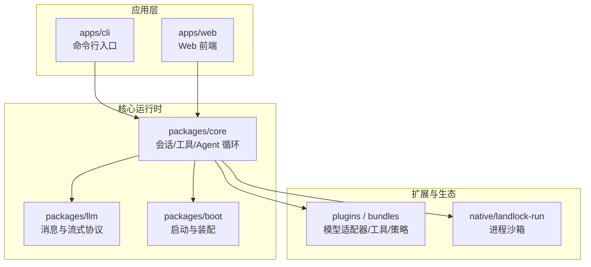
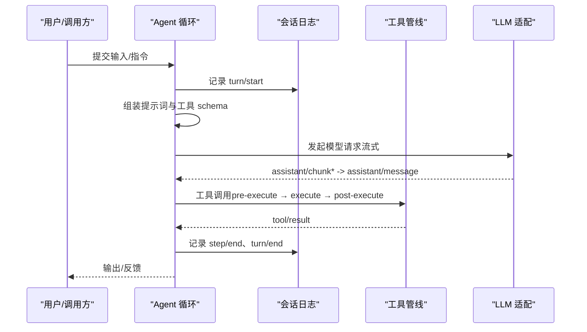
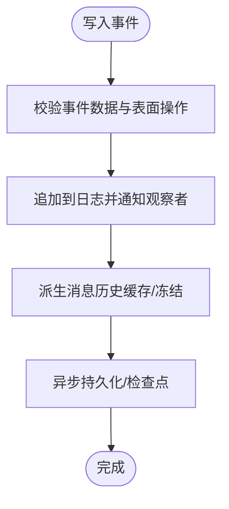
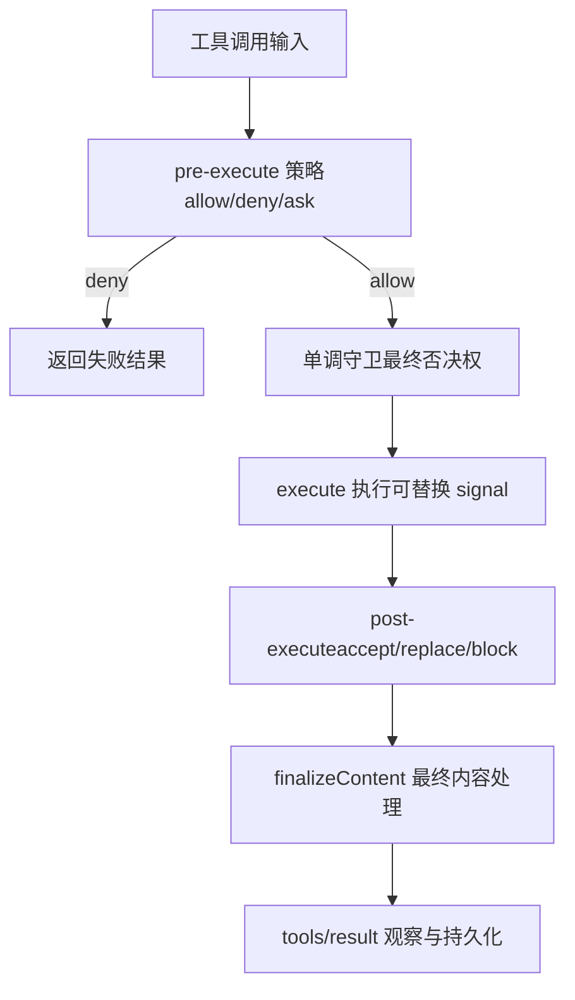
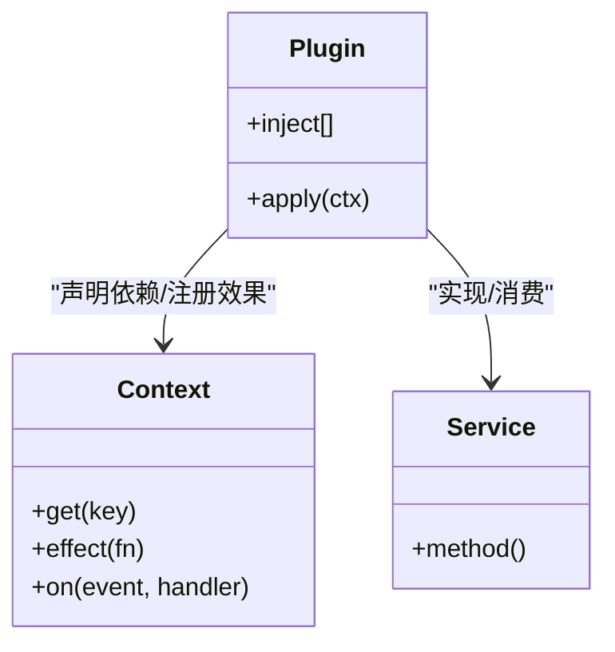
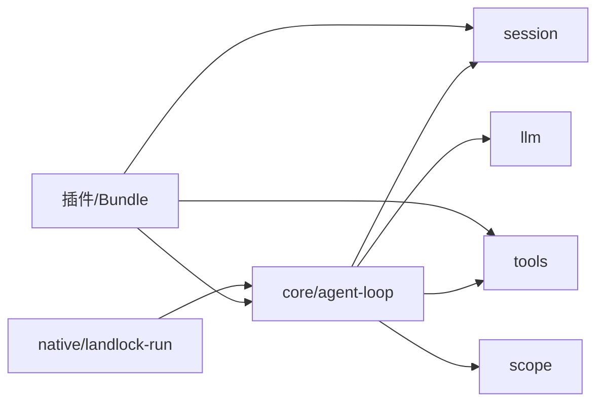

# 项目介绍

<cite>
**本文引用的文件**
- [README.md](file://README.md)
- [package.json](file://package.json)
- [docs/architecture.md](file://docs/architecture.md)
- [docs/cordis-primer.md](file://docs/cordis-primer.md)
- [docs/subsystems/core.md](file://docs/subsystems/core.md)
- [docs/subsystems/tools.md](file://docs/subsystems/tools.md)
- [docs/subsystems/session.md](file://docs/subsystems/session.md)
- [CONTRIBUTING.md](file://CONTRIBUTING.md)
</cite>

## 目录
1. [简介](#简介)
2. [项目结构](#项目结构)
3. [核心组件](#核心组件)
4. [架构总览](#架构总览)
5. [详细组件分析](#详细组件分析)
6. [依赖关系分析](#依赖关系分析)
7. [性能与可扩展性](#性能与可扩展性)
8. [故障排查指南](#故障排查指南)
9. [结论](#结论)
10. [附录](#附录)

## 简介
DeepSeek Harness（简称 dsh）是由 DeepSeek AI 开源的智能体运行环境。它的核心价值在于：以“一切皆插件”的架构理念，将模型适配、工具注册、会话日志、智能体循环等全部可插拔化，借助 Cordis 插件框架提供极高的可扩展性与灵活性。开发者可以通过配置与插件组合，快速搭建面向不同场景的智能体应用；同时，dsh 提供了 Web UI 与 CLI 两种运行形态，便于从原型到生产的多阶段使用。

- 定位：开源智能体运行环境与编排平台
- 设计哲学：一切皆插件、能力即服务、事件驱动的可组合系统
- 技术底座：Cordis 插件框架（服务、事件、效果/副作用的统一抽象）
- 运行形态：Web 前端 + CLI 命令行；支持无头模式与浏览器界面
- 社区与协议：MIT 协议开放；通过 GitHub Discussions、Discord 社区交流

**章节来源**
- [README.md:1-58](file://README.md#L1-L58)
- [package.json:1-10](file://package.json#L1-L10)

## 项目结构
仓库采用多包工作区组织，核心由 apps（CLI/Web）、packages（功能子系统）、docs（文档与教程）、examples（示例工程）、native（原生安全沙箱）等组成。启动入口在 CLI 中，Web 应用作为可选前端；所有能力通过 Cordis 插件树装配，按 profile/bundle 分层叠加。



**图示来源**
- [docs/architecture.md:9-37](file://docs/architecture.md#L9-L37)
- [package.json:11-18](file://package.json#L11-L18)

**章节来源**
- [docs/architecture.md:9-37](file://docs/architecture.md#L9-L37)
- [package.json:11-18](file://package.json#L11-L18)

## 核心组件
- 会话与会话日志：以追加型事件日志为唯一事实源，消息历史由日志派生，支持回放、持久化、压缩与分叉。
- 工具执行管线：统一的工具注册、参数校验、执行水线、结果呈现与审计，支持并行/独占调度、超时、审批与策略拦截。
- Agent 与循环：定义 Agent 接口与默认驱动，管理 turn/step 生命周期、输入投递、取消与恢复。
- 模型适配与流式：抽象 LLM 消息与流式协议，屏蔽后端差异，统一接入。
- 插件与装配：基于 Cordis 的服务、事件与效果机制，profile/bundle 分层叠加，可热替换与卸载。

**章节来源**
- [docs/subsystems/session.md:1-12](file://docs/subsystems/session.md#L1-L12)
- [docs/subsystems/tools.md:1-12](file://docs/subsystems/tools.md#L1-L12)
- [docs/subsystems/core.md:1-20](file://docs/subsystems/core.md#L1-L20)
- [docs/architecture.md:39-51](file://docs/architecture.md#L39-L51)

## 架构总览
dsh 的架构围绕“能力即服务”和“事件驱动”展开。每个能力以 Service 暴露稳定键名（如 ctx.tools、ctx.llm、ctx.sessions），通过事件进行解耦通信；插件通过 effect/on 注册副作用，并在卸载时自动回滚。运行期通过 profile/bundle 分层装配，任何一行配置都可被上层覆盖或替换。



**图示来源**
- [docs/architecture.md:63-90](file://docs/architecture.md#L63-L90)
- [docs/subsystems/core.md:244-249](file://docs/subsystems/core.md#L244-L249)

**章节来源**
- [docs/architecture.md:9-37](file://docs/architecture.md#L9-L37)
- [docs/architecture.md:63-90](file://docs/architecture.md#L63-L90)

## 详细组件分析

### 会话与会话日志（Session）
- 追加型事件日志：turn/step/user/assistant/tool 等事件构成完整交互历史。
- 派生历史：deriveMessages() 从有序表面投影出模型可见的消息序列，保证可重放与一致性。
- 持久化与恢复：支持 JSONL/SQLite 等后端，崩溃恢复与 checkpoint 机制。
- 分叉与续跑：可从任意稳定边界创建子会话，支持 fork/resume。



**图示来源**
- [docs/subsystems/session.md:244-249](file://docs/subsystems/session.md#L244-L249)
- [docs/subsystems/session.md:493-518](file://docs/subsystems/session.md#L493-L518)

**章节来源**
- [docs/subsystems/session.md:1-12](file://docs/subsystems/session.md#L1-L12)
- [docs/subsystems/session.md:244-249](file://docs/subsystems/session.md#L244-L249)
- [docs/subsystems/session.md:493-518](file://docs/subsystems/session.md#L493-L518)

### 工具执行管线（Tools）
- 统一注册与声明：ToolDefinition 包含模型可见 schema、执行函数、输出渲染与 UI 呈现。
- 执行水线：tools/pre-execute（允许/拒绝/询问）→ 单调守卫 → tools/execute（环绕包装）→ tools/post-execute（接受/替换/阻断）→ finalizeContent → tools/result。
- 调度与并发：支持 parallel/exclusive 模式，结合 isConcurrencySafe 实现滚动池并行。
- 安全与审计：参数冻结、结构化错误、元数据透传、代码分发日志。



**图示来源**
- [docs/subsystems/tools.md:170-173](file://docs/subsystems/tools.md#L170-L173)
- [docs/subsystems/tools.md:376-404](file://docs/subsystems/tools.md#L376-L404)

**章节来源**
- [docs/subsystems/tools.md:1-12](file://docs/subsystems/tools.md#L1-L12)
- [docs/subsystems/tools.md:170-173](file://docs/subsystems/tools.md#L170-L173)
- [docs/subsystems/tools.md:376-404](file://docs/subsystems/tools.md#L376-L404)

### Agent 与循环（Core）
- Agent 接口：send/followup/steer/inject/cancel/whenIdle/runMaintenance 等，统一投递与生命周期控制。
- Turn/Step：一个 turn 包含零或多个 step；每个 step 是一次模型请求及工具调用集合。
- 事件与拦截：agent/pre-step、agent/request、agent/turn-stopping 等用于注入上下文、策略与诊断。
- 默认驱动：agent-loop 提供默认实现，保持可替换性。

```mermaid
sequenceDiagram
participant Loop as "AgentLoop"
participant Session as "Session"
participant Tools as "Tools"
participant LLM as "LLM"
Loop->>Session : turn/start
Loop->>Loop : pre-step 决策enter/reject
Loop->>LLM : 发起请求流式
LLM-->>Loop : assistant/chunk* → assistant/message
Loop->>Tools : 工具调用pre/execute/post
Tools-->>Loop : tool/result
Loop->>Session : step/end, turn/end
```

**图示来源**
- [docs/architecture.md:63-90](file://docs/architecture.md#L63-L90)
- [docs/subsystems/core.md:244-249](file://docs/subsystems/core.md#L244-L249)

**章节来源**
- [docs/subsystems/core.md:1-20](file://docs/subsystems/core.md#L1-L20)
- [docs/architecture.md:63-90](file://docs/architecture.md#L63-L90)

### 插件与装配（Cordis）
- 服务与上下文：插件通过 ctx.<key> 暴露能力，其他插件通过依赖注入获取，避免硬耦合。
- 事件通信：emit/waterfall/parallel/serial 四种分发模式，契约清晰、可组合。
- 可逆效果：注册行为通过 effect/on 安装，卸载时自动回滚，确保热更新与清理可靠。
- Profile/Bundle：分层装配，每层可 patch/替换，支持 web/headless 模板与自定义组合。



**图示来源**
- [docs/cordis-primer.md:7-14](file://docs/cordis-primer.md#L7-L14)
- [docs/architecture.md:9-13](file://docs/architecture.md#L9-L13)

**章节来源**
- [docs/cordis-primer.md:7-14](file://docs/cordis-primer.md#L7-L14)
- [docs/architecture.md:9-13](file://docs/architecture.md#L9-L13)

## 依赖关系分析
- 低耦合高内聚：各子系统通过 ctx 键与事件解耦，新增能力只需注册服务/监听事件。
- 可替换性强：模型适配、工具集、持久化、沙箱等均通过 seam 切换，无需改动主循环。
- 装配层次清晰：profile/bundle 顺序叠加，patch 机制保证可定制与可维护。
- 外部集成：Python SDK、Web 前端、原生沙箱等通过明确接口与事件协作。



**图示来源**
- [docs/architecture.md:39-51](file://docs/architecture.md#L39-L51)
- [docs/subsystems/core.md:1-20](file://docs/subsystems/core.md#L1-L20)

**章节来源**
- [docs/architecture.md:39-51](file://docs/architecture.md#L39-L51)
- [docs/subsystems/core.md:1-20](file://docs/subsystems/core.md#L1-L20)

## 性能与可扩展性
- 会话日志派生历史缓存：首次投影后复用冻结对象，减少重复计算与内存拷贝。
- 工具并行与独占：根据 isConcurrencySafe 动态分组执行，提升吞吐。
- 流式响应：assistant/chunk 细粒度推进 UI 与下游消费者，降低首字节延迟。
- 插件卸载与回滚：effect/on 自动清理，避免资源泄漏与状态不一致。
- 配置覆盖与补丁：profile/bundle 分层 patch，按需启用/禁用能力，优化冷启动与运行时开销。

[本节为通用指导，不直接分析具体文件]

## 故障排查指南
- 工具调用失败：检查 tools/pre-execute 是否 deny/ask，确认 monotonic guard 未否决；查看 tools/result 的结构化错误码。
- 会话不一致：核对 session/event 的 seq 连续性，确认 surfaceOp 与 sourceEventSeqs 正确；必要时使用 deriveMessages() 验证派生历史。
- Agent 卡住：关注 agent/status 与 whenIdle；检查 agent/pre-step 是否 reject 或空 enter；确认 cancel 信号传播。
- 插件问题：确认 effect/on 已注册且存在 disposer；通过 dump-config 查看实际装配树，定位冲突或覆盖。

**章节来源**
- [docs/subsystems/tools.md:376-404](file://docs/subsystems/tools.md#L376-L404)
- [docs/subsystems/session.md:493-518](file://docs/subsystems/session.md#L493-L518)
- [docs/subsystems/core.md:244-249](file://docs/subsystems/core.md#L244-L249)
- [docs/architecture.md:29-37](file://docs/architecture.md#L29-L37)

## 结论
DeepSeek Harness 以“一切皆插件”的架构，将智能体的核心能力模块化、可插拔化，并通过 Cordis 提供统一的服务、事件与效果抽象。它既适合初学者快速上手（Web UI/CLI），也为高级用户提供深度定制能力（profile/bundle、seam 替换、事件拦截）。配合完善的文档、示例与社区生态，dsh 成为构建多样化智能体应用的坚实基座。

[本节为总结性内容，不直接分析具体文件]

## 附录
- 运行方式：可通过 npm 命令启动 Web UI，或从源码构建运行；支持 headless 模式。
- 开发指引：参考 development 与 architecture 文档，理解插件开发与装配流程。
- 贡献与社区：MIT 协议开放；通过 GitHub Discussions 与 Discord 参与讨论与反馈；鼓励社区插件与内容创作。

**章节来源**
- [README.md:13-52](file://README.md#L13-L52)
- [CONTRIBUTING.md:9-23](file://CONTRIBUTING.md#L9-L23)