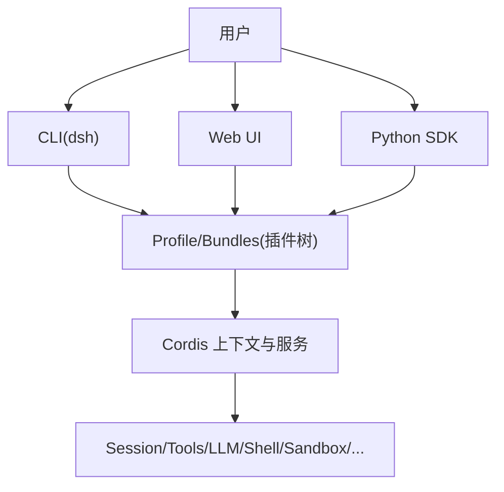
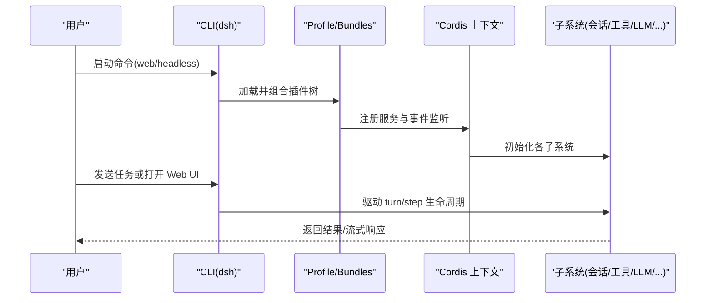
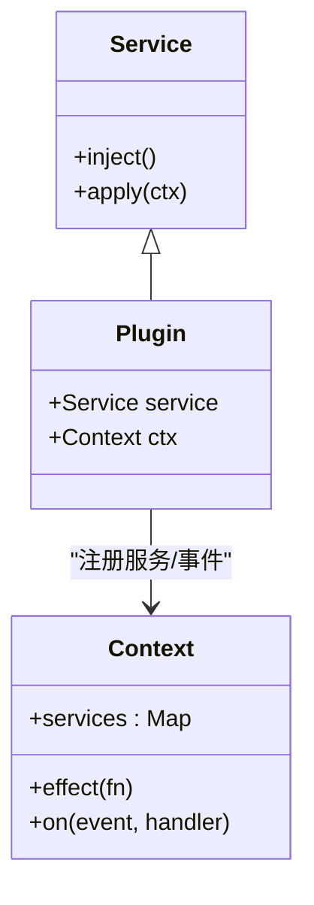
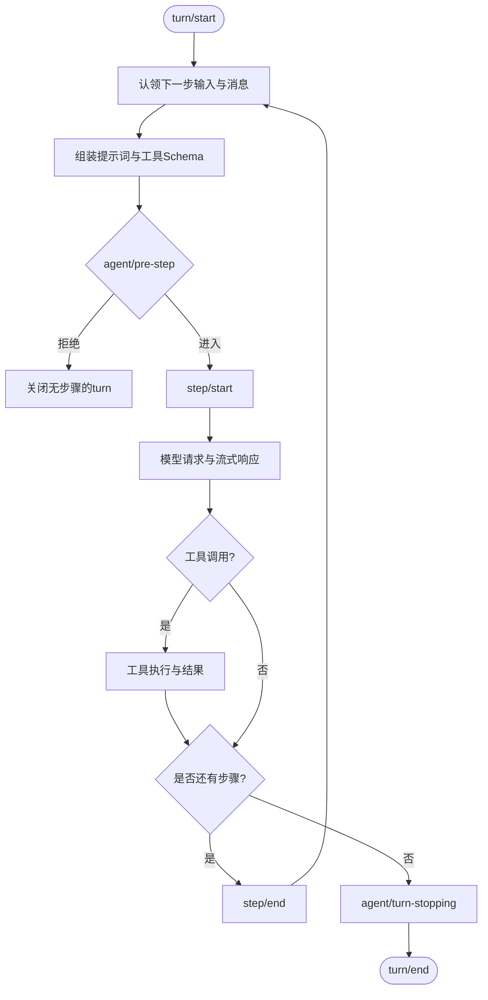
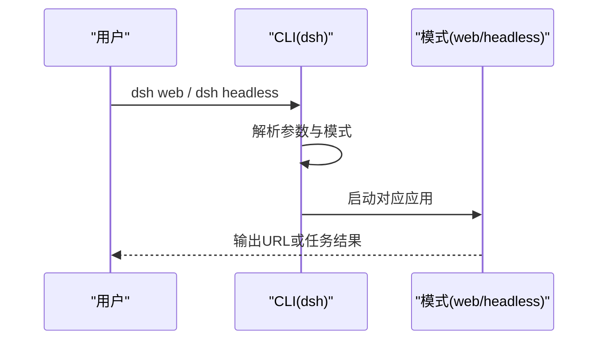
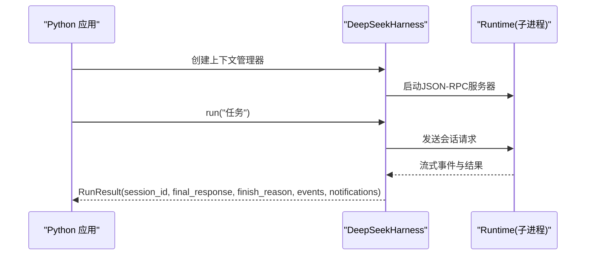
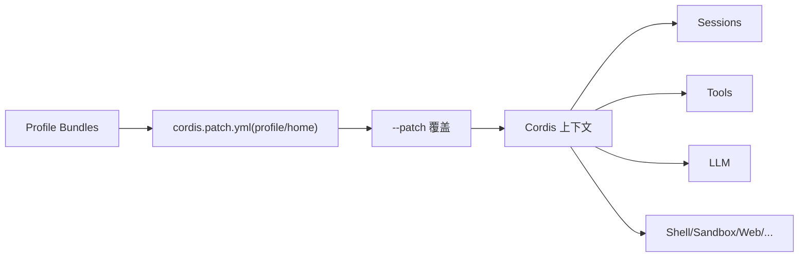

# 项目介绍

<cite>
**本文引用的文件**
- [README.md](file://README.md)
- [apps/cli/README.md](file://apps/cli/README.md)
- [apps/cli/src/args.ts](file://apps/cli/src/args.ts)
- [docs/architecture.md](file://docs/architecture.md)
- [docs/cordis-primer.md](file://docs/cordis-primer.md)
- [docs/subsystems/README.md](file://docs/subsystems/README.md)
- [docs/glossary.md](file://docs/glossary.md)
- [python/sdk/README.md](file://python/sdk/README.md)
- [examples/README.md](file://examples/README.md)
</cite>

## 目录
1. [简介](#简介)
2. [项目结构](#项目结构)
3. [核心组件](#核心组件)
4. [架构总览](#架构总览)
5. [详细组件分析](#详细组件分析)
6. [依赖关系分析](#依赖关系分析)
7. [性能与可扩展性](#性能与可扩展性)
8. [故障排查指南](#故障排查指南)
9. [结论](#结论)
10. [附录](#附录)

## 简介
DeepSeek Harness（简称 dsh）是由 DeepSeek AI 开源的智能体运行框架。它的核心目标是提供一个“一切皆插件”的可组合智能体平台，使模型适配器、工具注册表、会话日志、Agent 循环等所有能力都可通过插件进行替换与扩展。项目基于 Cordis 插件框架构建，强调通过服务、事件与可逆效果在共享上下文中组装系统行为，从而实现高内聚、低耦合的模块化架构。

作为开源智能体框架，dsh 的价值在于：
- 以插件为中心的统一扩展点：任何功能均可通过插件挂载，无需修改核心代码。
- 多运行模式：支持 Web UI、CLI 和无头模式，覆盖交互式开发、自动化执行与集成场景。
- Python SDK 集成：通过 JSON-RPC stdio 驱动 dsh，便于在 Python 生态中编排 Agent 任务。
- 面向生产的能力边界：提供沙箱、权限策略、持久化、流式 LLM 通信、工作流与子代理等子系统，满足复杂业务需求。

## 项目结构
仓库采用多包与多应用组织方式：
- apps：产品入口与应用层，包括 CLI（命令行启动器）和 Web（浏览器界面）。
- packages：按子系统拆分的插件与核心能力，如 session、tools、llm、core、shell、sandbox、workflow 等。
- docs：架构、子系统参考、教程与用户指南，帮助开发者理解并扩展系统。
- examples：可运行的示例，演示无头 Agent、JSON-RPC 驱动、Web 插件等用法。
- python：Python SDK 与运行时载体，提供进程外驱动与默认配置注入。
- scripts：构建、验证、文档生成与发布脚本。

图表来源
- [apps/cli/README.md:1-48](file://apps/cli/README.md#L1-L48)
- [docs/architecture.md:15-38](file://docs/architecture.md#L15-L38)

章节来源
- [README.md:1-58](file://README.md#L1-L58)
- [apps/cli/README.md:1-48](file://apps/cli/README.md#L1-L48)

## 核心组件
- 插件框架（Cordis）：将插件视为实现 Service 的对象，通过上下文键（ctx.*）暴露服务；使用类型化事件进行通信；注册为可逆效果，卸载时自动回滚。
- 配置文件与组合：通过 Profile 与 Bundle 分层叠加，形成可插拔的插件树；支持 patch 覆盖与调试输出。
- 会话与事件：会话日志是模型可见输入的唯一事实源；turn/step 生命周期由事件驱动，确保可回放与可恢复。
- 能力接缝（Capability Seams）：每个能力包含服务定义、提供者与消费者，允许在不改动调用方的情况下替换实现（如文件系统、子进程、终端、Web 访问等）。
- 运行模式：
  - Web UI：交互式对话、工作区选择、模型配置与审批流程。
  - CLI：命令解析与分发，支持 web、headless 等模式。
  - 无头模式：一次性任务执行，适合自动化与批处理。
- Python SDK：通过 JSON-RPC stdio 驱动 dsh，支持上下文管理器、默认配置注入、自定义 Cordis 配置与结果对象。

章节来源
- [docs/cordis-primer.md:7-14](file://docs/cordis-primer.md#L7-L14)
- [docs/architecture.md:9-38](file://docs/architecture.md#L9-L38)
- [docs/architecture.md:53-90](file://docs/architecture.md#L53-L90)
- [docs/subsystems/README.md:7-53](file://docs/subsystems/README.md#L7-L53)
- [apps/cli/README.md:7-43](file://apps/cli/README.md#L7-L43)
- [python/sdk/README.md:1-52](file://python/sdk/README.md#L1-L52)

## 架构总览
dsh 的架构围绕“插件即服务”的理念展开：
- 启动时从 Profile 与 Bundle 组装插件树，顺序叠加补丁层，最终形成完整的 Cordis 上下文。
- 核心子系统通过 ctx 键提供服务（如 sessions、tools、llm、agents），并通过事件进行跨模块通信。
- 会话日志是所有模型可见输入的权威来源，用于回放、投影、遥测与持久化。
- 能力接缝允许对任意能力进行替换（例如将本地 Bash 切换到远程沙箱），从而改变整个产品的执行环境而不影响上层逻辑。

图表来源
- [docs/architecture.md:15-38](file://docs/architecture.md#L15-L38)
- [docs/architecture.md:53-90](file://docs/architecture.md#L53-L90)

章节来源
- [docs/architecture.md:1-130](file://docs/architecture.md#L1-L130)

## 详细组件分析

### 插件与上下文（Cordis）
- 插件实现 Service，声明依赖 inject，并在 apply(ctx) 中注册效果。
- 上下文是服务的仓库，插件通过稳定键访问服务，避免硬编码导入。
- 事件分为 emit、waterfall、parallel、serial 四种分发模式，明确契约与副作用。
- 注册是可逆效果，卸载时自动回滚，保证热重载与清理的一致性。

图表来源
- [docs/cordis-primer.md:7-14](file://docs/cordis-primer.md#L7-L14)
- [docs/cordis-primer.md:15-35](file://docs/cordis-primer.md#L15-L35)

章节来源
- [docs/cordis-primer.md:1-45](file://docs/cordis-primer.md#L1-L45)

### 会话与轮次（Turn/Step）
- Turn：一次被允许的输入消费周期，可能包含零或多个 Step。
- Step：一次模型请求及其引发的工具调用。
- 事件驱动：turn/start、step/start、assistant/chunk、tool/call、step/end、turn/end 等事件贯穿生命周期。
- 日志优先：所有模型可见输入必须可重放，新增输入需新增会话事件。

图表来源
- [docs/architecture.md:63-90](file://docs/architecture.md#L63-L90)

章节来源
- [docs/architecture.md:53-90](file://docs/architecture.md#L53-L90)

### 能力接缝（Capability Seams）
- 每个能力由三部分构成：服务定义（接口）、提供者（实现）、消费者（调用方）。
- 典型能力包括文件系统、子进程、终端、Web 访问、工作流、子代理等。
- 通过更换提供者即可改变执行环境（如从本地 Bash 切换到远程沙箱），无需修改调用方。

章节来源
- [docs/architecture.md:98-127](file://docs/architecture.md#L98-L127)
- [docs/subsystems/README.md:7-53](file://docs/subsystems/README.md#L7-L53)

### 运行模式与入口
- CLI 入口负责命令解析与分发，支持 web、headless 等模式，并将参数传递给已启动的应用插件。
- Web 模式：启动 Web UI，默认端口与主机可配置，适合交互式开发与调试。
- Headless 模式：一次性任务执行，打印最终答案后退出，适合自动化流水线。
- 通过 --dump-config 与 --dump-default-config 可检查实际装配的插件树。

图表来源
- [apps/cli/README.md:7-43](file://apps/cli/README.md#L7-L43)
- [apps/cli/src/args.ts:147-169](file://apps/cli/src/args.ts#L147-L169)

章节来源
- [apps/cli/README.md:1-48](file://apps/cli/README.md#L1-L48)
- [apps/cli/src/args.ts:147-169](file://apps/cli/src/args.ts#L147-L169)

### Python SDK 集成
- 通过 deepseek-harness-sdk 安装，模块名为 deepseek_harness。
- 默认使用 bundled runtime 与 JSON-RPC stdio，支持上下文管理器与复用子进程。
- 可注入自定义 Cordis 配置，选择 provider/model，设置 max_tokens 等参数。
- Session.run 返回 RunResult，包含会话ID、最终响应、结束原因、事件与通知。

图表来源
- [python/sdk/README.md:1-52](file://python/sdk/README.md#L1-L52)

章节来源
- [python/sdk/README.md:1-52](file://python/sdk/README.md#L1-L52)

### 概念总览（术语与约定）
- 会话（Session）、轮次（Turn）、步骤（Step）、目标（Goal）、人类命令（Human Command）等术语在仓库中具有一致的定义与使用方式。
- 这些概念支撑了 Agent 的生命周期管理与可观测性，确保行为可回放、可审计、可恢复。

章节来源
- [docs/glossary.md:7-46](file://docs/glossary.md#L7-L46)

## 依赖关系分析
- 插件树依赖顺序：Profile 中的 Bundle 列表顺序决定补丁层叠加顺序；随后是 profile 与 home 层的 cordis.patch.yml，最后是 --patch 覆盖。
- 核心子系统通过 ctx 键解耦，消费者仅依赖抽象服务定义，降低耦合度。
- 事件作为扩展点，生产者与消费者通过类型化事件契约协作，避免直接依赖。

图表来源
- [docs/architecture.md:15-38](file://docs/architecture.md#L15-L38)

章节来源
- [docs/architecture.md:15-38](file://docs/architecture.md#L15-L38)

## 性能与可扩展性
- 流式 LLM 通信：通过 StreamChunk 与 BlockAssembler 提升交互体验与资源利用率。
- 会话日志优先：所有模型可见输入可重放，便于回放、压缩与诊断。
- 能力接缝：通过替换提供者实现执行环境切换（如沙箱化），不影响上层调用。
- 插件热重载：注册为可逆效果，支持开发期快速迭代与测试。
- 批量与并发：事件支持 parallel 与 serial 分发，满足不同场景的性能与顺序要求。

[本节为通用指导，不直接分析具体文件]

## 故障排查指南
- 启动失败与配置错误：CLI 会输出非零退出码；使用 --dump-config 与 --dump-default-config 检查实际装配的插件树。
- 会话回放问题：确认新增模型可见输入是否新增了对应的会话事件，确保 deriveMessages 可重建历史。
- 工具执行异常：检查 tools/* 事件的水流拦截与执行管道，确认工具 Schema 与权限策略。
- 子进程与沙箱：确认 SubprocessSpawnSpec 与 ConfinedArgv 配置，关注 fail-closed 的错误分类。
- Python SDK：确认 DSH_CORDIS_CONFIG 与 provider/model 配置，检查 RunResult.finish_reason 与 events 定位问题。

章节来源
- [apps/cli/README.md:18-43](file://apps/cli/README.md#L18-L43)
- [docs/architecture.md:92-127](file://docs/architecture.md#L92-L127)
- [python/sdk/README.md:27-52](file://python/sdk/README.md#L27-L52)

## 结论
DeepSeek Harness 以“一切皆插件”为核心设计理念，借助 Cordis 插件框架实现了高度可组合、可替换的智能体运行平台。其多运行模式（Web UI、CLI、无头模式）与 Python SDK 集成能力，覆盖了从交互式开发到自动化集成的广泛场景。通过会话日志优先、能力接缝与类型化事件，项目在可扩展性、可维护性与可观测性方面具备显著优势，适合构建复杂、安全且可演进的智能体系统。

[本节为总结，不直接分析具体文件]

## 附录
- 示例集合：提供 headless-agent、jsonrpc-agent、web-cordis、web-schedule、acp-agent 等可运行示例，便于快速上手与学习。
- 用户指南：Web UI 使用、模型配置、工作区选择与任务执行流程。
- 开发指南：插件开发、子系统参考与架构文档，帮助深入理解与扩展。

章节来源
- [examples/README.md:1-30](file://examples/README.md#L1-L30)
- [docs/user/guide/index.md:1-31](file://docs/user/guide/index.md#L1-L31)