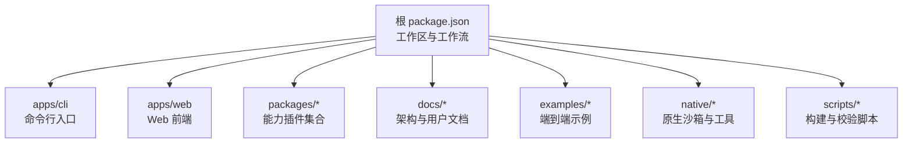
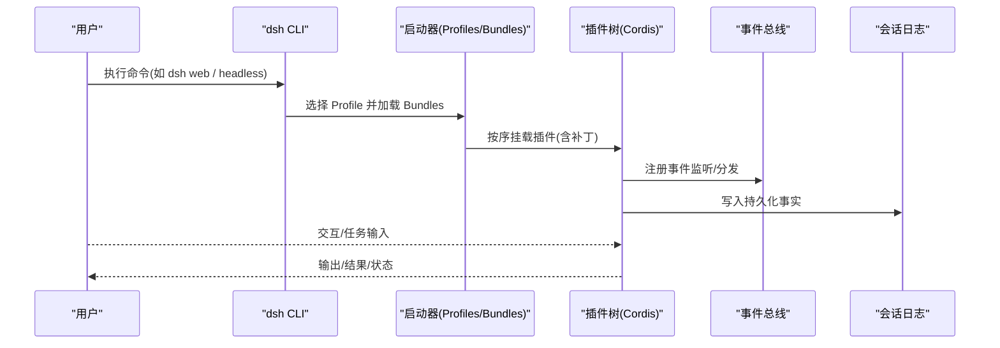
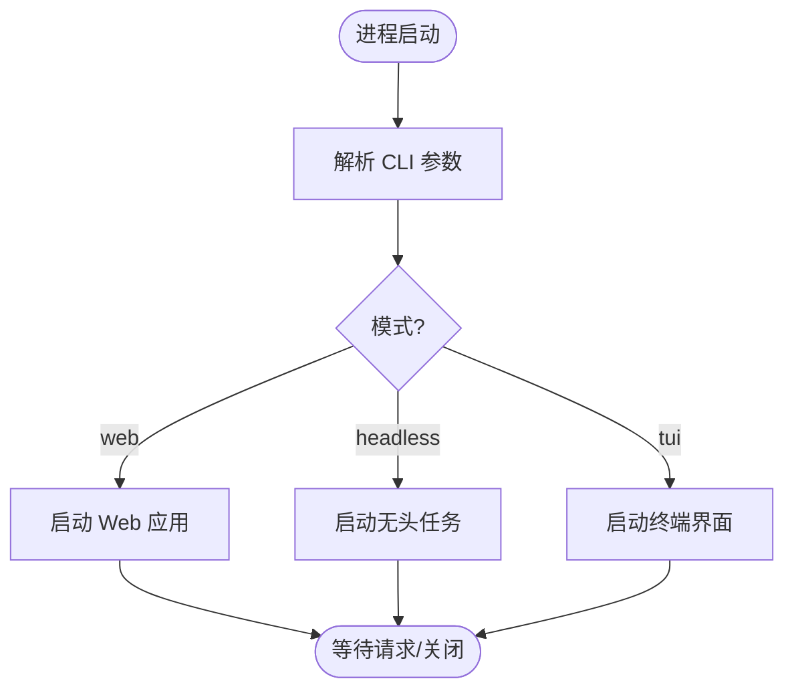
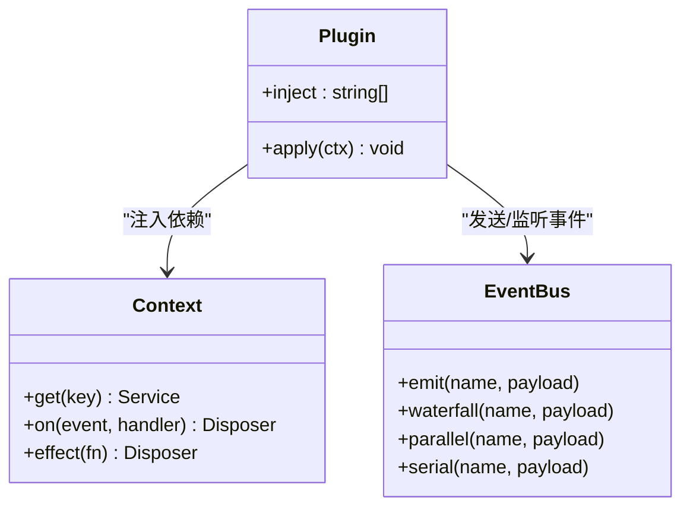
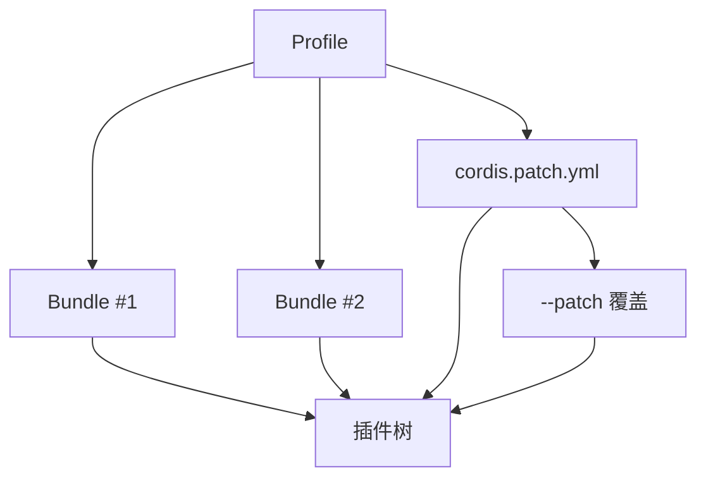
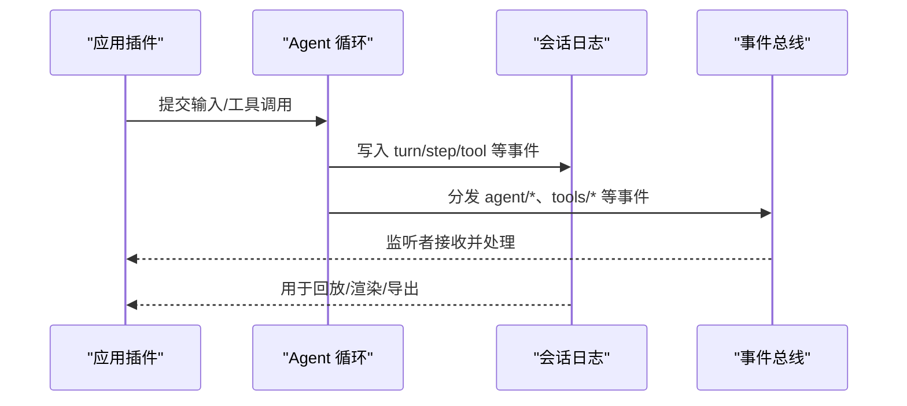
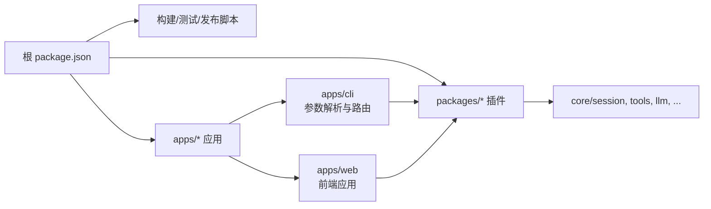

# 项目概览

<cite>
**本文引用的文件**
- [README.md](file://README.md)
- [package.json](file://package.json)
- [apps/cli/README.md](file://apps/cli/README.md)
- [docs/architecture.md](file://docs/architecture.md)
- [docs/cordis-primer.md](file://docs/cordis-primer.md)
- [docs/user/guide/index.md](file://docs/user/guide/index.md)
- [docs/user/guide/providers.md](file://docs/user/guide/providers.md)
- [.agents/notes/implemented/architecture/2026-08-06-app-owned-command-line.md](file://.agents/notes/implemented/architecture/2026-08-06-app-owned-command-line.md)
- [.agents/notes/archived/architecture/2026-07-24-dsh-commander-argument-adapter.md](file://.agents/notes/archived/architecture/2026-07-24-dsh-commander-argument-adapter.md)
</cite>

## 目录
1. [简介](#简介)
2. [项目结构](#项目结构)
3. [核心组件](#核心组件)
4. [架构总览](#架构总览)
5. [详细组件分析](#详细组件分析)
6. [依赖关系分析](#依赖关系分析)
7. [性能与可扩展性](#性能与可扩展性)
8. [故障排查指南](#故障排查指南)
9. [结论](#结论)
10. [附录：快速开始与使用示例](#附录快速开始与使用示例)

## 简介
DeepSeek Harness（简称 dsh）是一个开源的 Agent 运行框架，采用“一切皆插件”的设计哲学，基于 Cordis 插件框架构建。它通过可组合的插件树、服务注册、类型化事件和可逆副作用，将模型适配器、工具注册表、会话日志、Agent 循环等全部能力以插件形式暴露，从而支持高度可配置、可替换、可热插拔的产品形态。

核心价值包括：
- 统一扩展点：所有功能都以插件方式贡献到共享上下文，无需修改核心即可扩展或替换。
- 多运行模式：提供 Web UI、CLI 和无头模式，覆盖交互式开发、自动化任务与集成场景。
- 可组合的启动层：通过 Profile 与 Bundle 分层叠加，用户可在顶层进行补丁式覆盖，保持可维护性与可移植性。
- 强类型与可观测性：通过 Typed Events 与 Session Log 实现可回放、可审计、可调试的运行轨迹。

**章节来源**
- [README.md:5-11](file://README.md#L5-L11)
- [docs/architecture.md:9-13](file://docs/architecture.md#L9-L13)

## 项目结构
仓库采用 Monorepo 组织，核心入口与应用位于 apps，通用能力以 packages 形式拆分，文档集中在 docs，示例在 examples，原生安全沙箱在 native，构建与脚本在 scripts。

- apps
  - cli：命令行入口与 Profile 管理，负责解析参数、选择并启动对应 Runner。
  - web：Web UI 前端应用与测试，提供交互式会话与可视化能力。
- packages：按能力划分的插件包（如 core、llm、tools、session、web、shell、sandbox 等），每个包通常贡献一个或多个 Service、Event 或 Provider。
- docs：架构、子系统、教程、用户指南、Cookbook 等文档。
- examples：端到端示例（ACp、Headless、JSON-RPC、MCP 等）。
- native：Landlock 相关原生二进制与打包脚本。
- scripts：构建、校验、生成目录、发布等工程脚本。

**图表来源**
- [package.json:11-18](file://package.json#L11-L18)
- [apps/cli/README.md:1-15](file://apps/cli/README.md#L1-L15)

**章节来源**
- [package.json:11-18](file://package.json#L11-L18)
- [apps/cli/README.md:1-15](file://apps/cli/README.md#L1-L15)

## 核心组件
- 插件框架（Cordis）：插件即 Service，通过 Context 暴露稳定键；依赖通过 inject 声明；通信通过 Typed Events；副作用通过 effect/on 注册并可逆卸载。
- 启动层（Profile/Bundles）：以有序层叠加的方式组装插件树，支持用户级 patch 与 --patch 覆盖。
- 核心子系统：Session、System Prompt、Tools、Agent、LLM 适配器等，均作为插件贡献到 ctx。
- 事件系统：Session 事件持久化，Agent 事件用于拦截与观察，Capability 事件用于能力装配。
- 运行模式：Web UI、CLI、无头模式，均由 CLI 入口根据参数路由到对应 Runner。

**章节来源**
- [docs/cordis-primer.md:7-13](file://docs/cordis-primer.md#L7-L13)
- [docs/architecture.md:15-37](file://docs/architecture.md#L15-L37)
- [docs/architecture.md:39-61](file://docs/architecture.md#L39-L61)

## 架构总览
dsh 的运行时由“插件树 + 事件总线 + 会话日志”构成。启动时，CLI 解析参数并选择 Profile，随后按顺序加载 Bundles，再应用用户补丁与 --patch 覆盖，最终形成完整的插件树。各插件通过 ctx 暴露服务，通过事件协作，通过 Session Log 记录可重放的事实。

**图表来源**
- [docs/architecture.md:15-37](file://docs/architecture.md#L15-L37)
- [docs/architecture.md:53-84](file://docs/architecture.md#L53-L84)
- [apps/cli/README.md:7-28](file://apps/cli/README.md#L7-L28)

**章节来源**
- [docs/architecture.md:15-37](file://docs/architecture.md#L15-L37)
- [apps/cli/README.md:7-28](file://apps/cli/README.md#L7-L28)

## 详细组件分析

### CLI 与运行模式
- 入口与语法：CLI 通过 Commander 适配器统一解析 argv，区分 tui/headless/web 三种模式，并将自身不识别的参数透传给已启动的应用。
- 应用参数所有权：Launcher 仅解析自身标志，其余参数交由被启动的 Profile/App 处理，避免硬编码与错位。
- 运行模式
  - Web UI：默认端口 3080，提供交互式会话与可视化。
  - Headless：一次性任务执行，打印最终答案后退出。
  - TUI：终端界面（由 Profile 决定）。

**图表来源**
- [.agents/notes/archived/architecture/2026-07-24-dsh-commander-argument-adapter.md:8-14](file://.agents/notes/archived/architecture/2026-07-24-dsh-commander-argument-adapter.md#L8-L14)
- [.agents/notes/implemented/architecture/2026-08-06-app-owned-command-line.md:1-21](file://.agents/notes/implemented/architecture/2026-08-06-app-owned-command-line.md#L1-L21)
- [apps/cli/README.md:7-28](file://apps/cli/README.md#L7-L28)

**章节来源**
- [apps/cli/README.md:7-28](file://apps/cli/README.md#L7-L28)
- [.agents/notes/archived/architecture/2026-07-24-dsh-commander-argument-adapter.md:8-14](file://.agents/notes/archived/architecture/2026-07-24-dsh-commander-argument-adapter.md#L8-L14)
- [.agents/notes/implemented/architecture/2026-08-06-app-owned-command-line.md:1-21](file://.agents/notes/implemented/architecture/2026-08-06-app-owned-command-line.md#L1-L21)

### 插件体系与“一切皆插件”
- 插件即 Service：插件对象实现 Service，可通过 inject 声明依赖，apply(ctx) 中完成初始化与注册。
- 上下文与键：ctx 是服务容器，插件通过稳定键访问其他服务，降低耦合。
- 事件通信：Typed Events 支持 emit/waterfall/parallel/serial 多种分发策略。
- 可逆副作用：注册行为通过 effect/on 安装，卸载时可预测地回滚。

**图表来源**
- [docs/cordis-primer.md:7-13](file://docs/cordis-primer.md#L7-L13)

**章节来源**
- [docs/cordis-primer.md:7-13](file://docs/cordis-primer.md#L7-L13)

### 启动层：Profile 与 Bundle
- Profile：命名化的组合，列出要堆叠的 Bundle，并持有用户自定义 cordis.patch.yml。
- Bundle：包含 Cordis 配置行与挂载代码的分发格式，保证上层仍可补丁。
- 组合顺序：Bundle 列表顺序 → Profile 补丁 → 家目录补丁 → --patch 覆盖。
- 查看实际树：通过 --dump-config 输出当前机器实际启动的插件树。

**图表来源**
- [docs/architecture.md:15-37](file://docs/architecture.md#L15-L37)

**章节来源**
- [docs/architecture.md:15-37](file://docs/architecture.md#L15-L37)

### 事件与会话日志
- 事件分类
  - Session 事件：持久化事实，追加到日志并通过 session/event 广播。
  - Agent 事件：携带 live Agent，用于观察或拦截进行中工作。
  - Capability 事件：为能力接缝装配策略与适配器。
- 会话日志：模型可见的一切必须可从日志重建，这是关键不变量。

**图表来源**
- [docs/architecture.md:53-97](file://docs/architecture.md#L53-L97)

**章节来源**
- [docs/architecture.md:53-97](file://docs/architecture.md#L53-L97)

### Web UI 与模型配置
- 启动与使用：通过根 README 提供的命令启动 Web UI，默认端口 3080。
- 模型配置：在 Settings → Models 中添加提供商与 API Key，保存后立即生效。
- 工作空间：选择本地项目目录后，Composer 可用，Agent 可读写文件、执行命令、委派任务与维护计划。

**章节来源**
- [docs/user/guide/index.md:1-23](file://docs/user/guide/index.md#L1-L23)
- [docs/user/guide/providers.md:7-30](file://docs/user/guide/providers.md#L7-L30)

## 依赖关系分析
- 工作区与脚本：根 package.json 定义 workspaces、engines、scripts，统一管理构建、测试、文档与发布流程。
- CLI 与 Runner：CLI 仅解析自身参数，将剩余参数传递给已启动的应用（Web/Headless/TUI），由各自插件解析。
- 插件间耦合：通过 ctx 键与事件解耦，避免直接导入具体实现，提升可替换性。

**图表来源**
- [package.json:11-18](file://package.json#L11-L18)
- [package.json:19-142](file://package.json#L19-L142)

**章节来源**
- [package.json:11-18](file://package.json#L11-L18)
- [package.json:19-142](file://package.json#L19-L142)

## 性能与可扩展性
- 可扩展性
  - 新增模型提供商：注册 LLM 适配器。
  - 新增工具：注册到工具注册表，参与提示词组装与执行管线。
  - 新增 Shell/终端：注册 shell 后端与持久化终端工具。
  - 新增后台任务：注册 jobs 并提供收集/停止工具。
  - 新增文件系统访问或策略：注册 fs 提供者或监听 fs/* 事件。
  - 新增 UI/编辑器集成：驱动 agents 并从 session/event 渲染。
- 性能考量
  - 事件选择：合理选择 emit/waterfall/parallel/serial，避免不必要的阻塞。
  - 会话日志：仅记录模型可见事实，减少冗余并保证可回放。
  - 插件卸载：确保 effect/on 返回的 disposer 正确释放资源，避免内存泄漏。

**章节来源**
- [docs/architecture.md:98-129](file://docs/architecture.md#L98-L129)

## 故障排查指南
- 常见模型问题
  - MISSING_CREDENTIAL：未存储密钥或未设置环境变量。
  - UNKNOWN_MODEL：未选择配置的模型或未添加模型。
  - 获取模型列表失败：检查 API Key 或手动填写模型。
  - 图片被拒绝：模型未声明图像模态或端点不支持。
- CLI 与参数
  - 参数归属错误：Launcher 只解析自身标志，后续参数由应用解析；注意 --help 的位置与含义。
  - 启动失败：检查 Profile 是否存在、Bundle 是否可解析、补丁是否合法。
- 插件与事件
  - 事件未触发：确认监听器是否正确注册且未被提前卸载。
  - 副作用未清理：确保 effect/on 返回的 disposer 被调用。

**章节来源**
- [docs/user/guide/providers.md:88-99](file://docs/user/guide/providers.md#L88-L99)
- [apps/cli/README.md:18-28](file://apps/cli/README.md#L18-L28)

## 结论
DeepSeek Harness 以“一切皆插件”为核心，借助 Cordis 将产品能力模块化、可组合、可替换。通过 Profile/Bundles 的启动层设计，用户可以在不改动核心的前提下定制行为；通过事件与日志，系统具备强可观测性与可回放能力；通过多运行模式，覆盖从交互式开发到自动化任务的广泛场景。对于初学者，建议从 Web UI 快速上手；对于有经验的开发者，建议深入阅读架构与子系统文档，按需扩展插件与能力。

## 附录：快速开始与使用示例

### 安装与运行
- 从 npm 运行（需 Node.js）：
  - 执行命令启动 Web UI，默认地址 http://127.0.0.1:3080。
- 从源码运行：
  - 克隆仓库，安装依赖，构建产物，然后运行 dsh web。

**章节来源**
- [README.md:13-35](file://README.md#L13-L35)

### 基本使用示例
- Web UI
  - 打开 Settings → Models，添加 DeepSeek API Key 并保存。
  - 选择工作空间后，在 Composer 中输入任务，例如“总结本仓库并识别主要包”。
- 无头模式
  - 使用 headless Profile 执行一次性任务，完成后退出并输出结果。
- CLI 参数
  - Launcher 仅解析自身标志，后续参数由应用解析；注意 --help 与 --profile 的组合。

**章节来源**
- [docs/user/guide/index.md:7-23](file://docs/user/guide/index.md#L7-L23)
- [apps/cli/README.md:7-28](file://apps/cli/README.md#L7-L28)