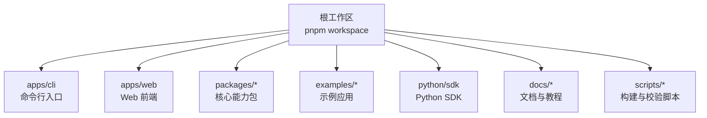
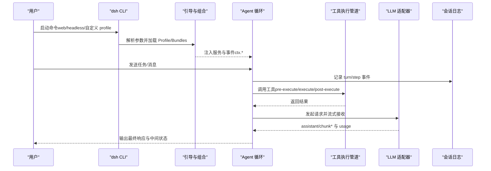
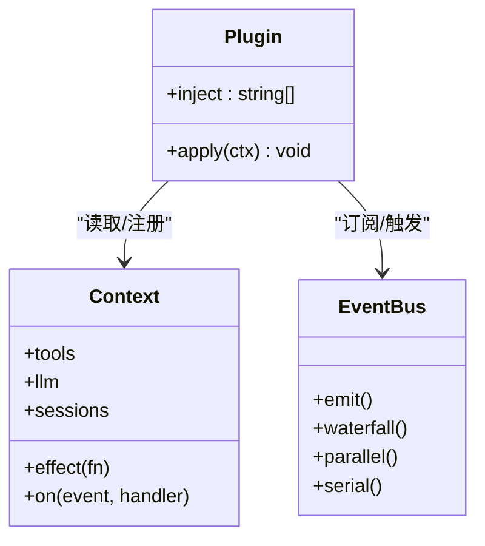
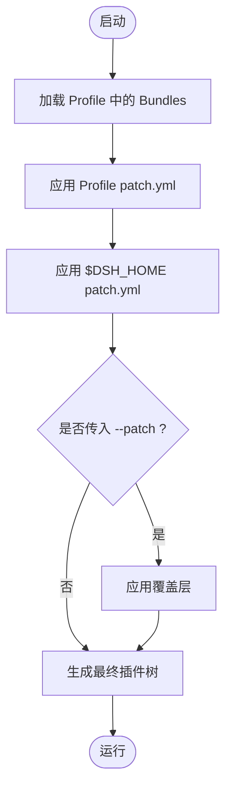
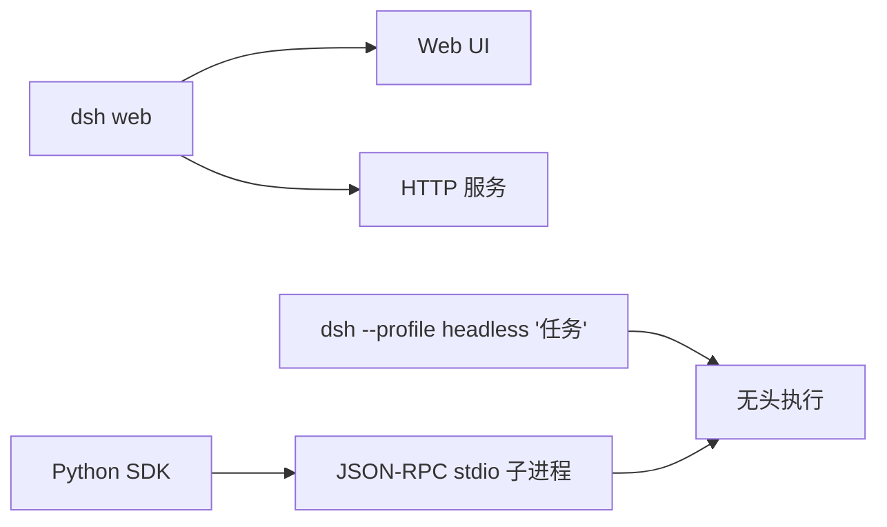
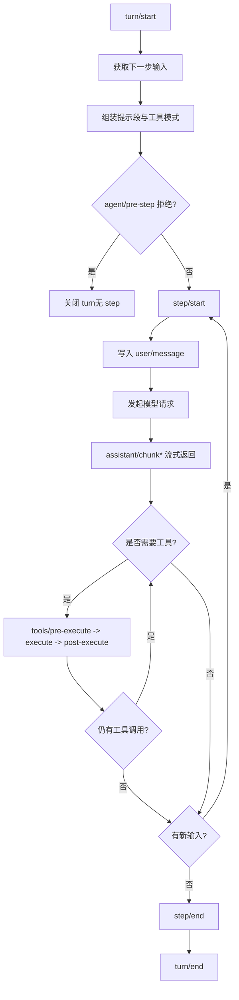
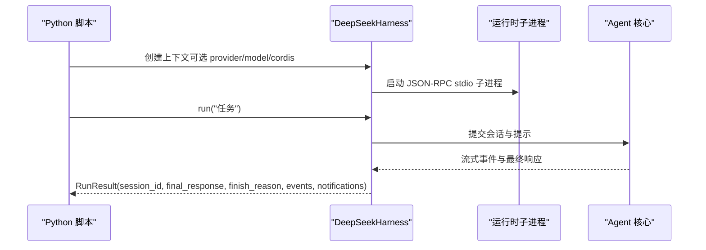
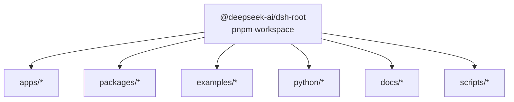

# 项目概览

<cite>
**本文引用的文件**
- [README.md](file://README.md)
- [package.json](file://package.json)
- [apps/cli/README.md](file://apps/cli/README.md)
- [docs/architecture.md](file://docs/architecture.md)
- [docs/cordis-primer.md](file://docs/cordis-primer.md)
- [packages/README.md](file://packages/README.md)
- [examples/README.md](file://examples/README.md)
- [python/sdk/README.md](file://python/sdk/README.md)
- [docs/user/guide/index.md](file://docs/user/guide/index.md)
</cite>

## 目录
1. [简介](#简介)
2. [项目结构](#项目结构)
3. [核心组件](#核心组件)
4. [架构总览](#架构总览)
5. [详细组件分析](#详细组件分析)
6. [依赖关系分析](#依赖关系分析)
7. [性能与可扩展性](#性能与可扩展性)
8. [故障排查指南](#故障排查指南)
9. [结论](#结论)
10. [附录：快速开始](#附录快速开始)

## 简介
DeepSeek Harness（简称 dsh）是由 DeepSeek AI 开源的智能体编排框架。其核心理念是“一切皆插件”，基于 Cordis 插件框架，将模型适配器、工具注册表、会话日志、代理循环等全部以插件形式提供，并通过可组合的配置文件层叠加运行。项目同时支持 Web UI、CLI 和无头模式，并提供 Python SDK 通过 JSON-RPC stdio 驱动运行时，便于在 Python 环境中集成和自动化。

## 项目结构
仓库采用多包工作区组织，顶层包含应用入口、核心包、示例、文档与脚本等：
- apps：产品化应用入口，包括 CLI 与 Web 前端
- packages：按能力分组的核心包（会话、工具、LLM、沙箱、工作区、设置、存储、SDK 等）
- examples：可运行的示例应用（无头智能体、JSON-RPC 智能体、Web 插件示例等）
- docs：架构、子系统、用户指南、Cordis 教程与开发文档
- python：Python SDK 与运行时载体
- scripts：构建、校验、发布与测试辅助脚本

**图表来源**
- [package.json:11-18](file://package.json#L11-L18)
- [apps/cli/README.md:1-48](file://apps/cli/README.md#L1-L48)
- [packages/README.md:1-70](file://packages/README.md#L1-L70)

**章节来源**
- [package.json:11-18](file://package.json#L11-L18)
- [apps/cli/README.md:1-48](file://apps/cli/README.md#L1-L48)
- [packages/README.md:1-70](file://packages/README.md#L1-L70)

## 核心组件
- 插件框架与上下文：Cordis 提供 Service、Context、事件与可逆效果，所有功能以插件形式挂载到共享上下文，支持热重载与卸载清理。
- 配置与组合：通过 Profile 与 Bundle 分层叠加，基础层提供模型适配、工具、持久化、沙箱、权限策略、设置与遥测；上层覆盖或插入新行为。
- 会话与代理：会话日志为不可变追加流，代理循环驱动 step/turn，工具执行走受控管道，事件贯穿宿主与客户端。
- 能力接缝：文件系统、子进程、Shell、终端、代码执行、工作流、Web 搜索/抓取、凭据、设置、存储等均以“定义-提供者-消费者”三角色解耦。
- 运行模式：Web UI、CLI（含 headless）、以及通过 Python SDK 的 JSON-RPC 驱动。

**章节来源**
- [docs/cordis-primer.md:1-13](file://docs/cordis-primer.md#L1-L13)
- [docs/architecture.md:9-38](file://docs/architecture.md#L9-L38)
- [docs/architecture.md:39-129](file://docs/architecture.md#L39-L129)
- [packages/README.md:1-70](file://packages/README.md#L1-L70)

## 架构总览
下图展示了从 CLI/Web 启动到插件树组装、代理循环、工具执行与事件广播的主流程。

**图表来源**
- [docs/architecture.md:63-90](file://docs/architecture.md#L63-L90)
- [docs/architecture.md:92-129](file://docs/architecture.md#L92-L129)
- [apps/cli/README.md:7-43](file://apps/cli/README.md#L7-L43)

## 详细组件分析

### 插件系统与“一切皆插件”
- 插件即实现 Service 的对象，可通过 inject 声明依赖，apply(ctx) 中注册效果。
- 上下文 ctx 提供稳定键（如 tools、llm、sessions），插件间通过键通信而非直接耦合。
- 事件为类型安全扩展点，支持 emit/waterfall/parallel/serial 多种分发模式。
- 注册是可逆效果，卸载时自动回滚，保证热重载与生命周期可控。

**图表来源**
- [docs/cordis-primer.md:7-13](file://docs/cordis-primer.md#L7-L13)

**章节来源**
- [docs/cordis-primer.md:1-13](file://docs/cordis-primer.md#L1-L13)

### 配置与组合（Profile 与 Bundle）
- Profile 是命名组合，列出要堆叠的 Bundle 与用户 patch。
- Bundle 是带补丁行的分发格式，任何插入均可被上层覆盖。
- 组合顺序：Bundle 列表 → Profile patch → 家目录 patch → --patch 覆盖。
- 可通过 dump-config 查看实际装配树。

**图表来源**
- [docs/architecture.md:15-38](file://docs/architecture.md#L15-L38)
- [apps/cli/README.md:30-43](file://apps/cli/README.md#L30-L43)

**章节来源**
- [docs/architecture.md:15-38](file://docs/architecture.md#L15-L38)
- [apps/cli/README.md:30-43](file://apps/cli/README.md#L30-L43)

### 运行模式
- Web UI：默认监听本地地址，提供会话、工具与模型配置的交互界面。
- CLI：支持指定 profile 运行，headless 模式一次性执行任务后退出。
- Python SDK：通过 JSON-RPC stdio 驱动运行时，复用子进程，支持自定义 cordis 配置。

**图表来源**
- [README.md:13-35](file://README.md#L13-L35)
- [apps/cli/README.md:7-17](file://apps/cli/README.md#L7-L17)
- [python/sdk/README.md:1-52](file://python/sdk/README.md#L1-L52)

**章节来源**
- [README.md:13-35](file://README.md#L13-L35)
- [apps/cli/README.md:7-17](file://apps/cli/README.md#L7-L17)
- [python/sdk/README.md:1-52](file://python/sdk/README.md#L1-L52)

### 工具执行与事件流
- 一次 step 包含一次模型请求及其调用的工具；一次 turn 由零或多个 step 组成。
- 工具执行经过 pre-execute/execute/post-execute 三段式管道，事件可被拦截与改写。
- 会话日志作为唯一事实源，衍生提示词、回放、遥测与持久化。

**图表来源**
- [docs/architecture.md:63-90](file://docs/architecture.md#L63-L90)

**章节来源**
- [docs/architecture.md:63-90](file://docs/architecture.md#L63-L90)

### Python SDK 集成
- 安装 deepseek-harness-sdk 后，使用 DeepSeekHarness 上下文管理器驱动运行时。
- 默认使用内置单文件运行时与默认 Cordis 配置；也可传入自定义 cordis.yml 选择 provider/model。
- Session.run 返回最终响应、结束原因、事件与通知，支持子代理通知与事件收集。

**图表来源**
- [python/sdk/README.md:1-52](file://python/sdk/README.md#L1-L52)

**章节来源**
- [python/sdk/README.md:1-52](file://python/sdk/README.md#L1-L52)

### 示例与应用生态
- headless-agent：非交互式任务执行，输出机器可读或人类可读结果。
- jsonrpc-agent：通过 Python SDK 驱动的无值守编码智能体。
- web-cordis：可在 Web 端自引用地检查与修改内存中的 Cordis 插件树。
- web-schedule：可选 Web 覆盖，提供会话内定时提醒与恢复。
- acp-agent：面向程序化客户端的 Agent Client Protocol 自动化服务器。

**章节来源**
- [examples/README.md:1-30](file://examples/README.md#L1-L30)

## 依赖关系分析
- 工作区管理：pnpm workspace 聚合 apps、packages、native、website 等模块。
- 构建与脚本：根 package.json 提供 build/test/lint/docs 等统一脚本，集中管理产物与验证。
- 包职责划分：core/api/typert/session/llm/fs/shell/sandbox/workflow 等按能力分组，遵循“定义-提供者-消费者”解耦原则。

**图表来源**
- [package.json:11-18](file://package.json#L11-L18)
- [packages/README.md:1-70](file://packages/README.md#L1-L70)

**章节来源**
- [package.json:11-18](file://package.json#L11-L18)
- [packages/README.md:1-70](file://packages/README.md#L1-L70)

## 性能与可扩展性
- 会话日志为不可变追加流，天然支持回放、投影与持久化，避免重复计算。
- 工具执行三段式管道与事件拦截，便于引入限流、超时、审计与缓存。
- 能力接缝使替换后端（如沙箱、Shell、LLM 提供商）无需改动消费方，提升可插拔性。
- 通过 Profile/Bundles 分层组合，可按场景裁剪最小可用集，降低启动开销。

[本节为通用指导，不直接分析具体文件]

## 故障排查指南
- 启动失败或端口冲突：确认已正确安装依赖并构建产物；Web 模式默认绑定本地地址，必要时调整 host/port。
- 模型未生效：检查 Settings → Models 中是否已配置 API Key 与 Provider；确保所选 Provider 已在当前 Composition 中注册。
- 工具无权限或被拒绝：根据权限策略审批操作；必要时调整 preset 或 patch 以放宽限制。
- Python SDK 无法连接：确认子进程已启动且 JSON-RPC 通道正常；如需自定义配置，传入 cordis 路径或设置环境变量。
- 调试组合：使用 --dump-config 查看实际装配树，定位覆盖与冲突。

**章节来源**
- [docs/user/guide/index.md:1-31](file://docs/user/guide/index.md#L1-L31)
- [apps/cli/README.md:30-43](file://apps/cli/README.md#L30-L43)

## 结论
DeepSeek Harness 以“一切皆插件”为核心，借助 Cordis 将复杂系统拆分为可组合、可替换的能力单元。通过 Profile/Bundles 的组合机制，既能提供开箱即用的 Web UI 与 CLI，也能支撑无头模式与 Python SDK 集成。丰富的能力接缝与事件体系使得扩展与定制变得直观而稳健，适合从个人开发者到企业级自动化场景的多层次需求。

## 附录：快速开始
- 通过 npm 运行 Web UI：安装 Node.js 后执行 npx @deepseek-ai/dsh web，默认在本地地址提供服务。
- 从源码运行：克隆仓库，安装依赖并构建，然后使用 pnpm dsh web 启动。
- 配置模型与选择工作区：在 Web UI 的设置中配置模型，选择工作区后即可开始对话与任务执行。
- 使用 Python SDK：安装 deepseek-harness-sdk，使用 DeepSeekHarness 上下文管理器驱动运行时，或通过 cordis 配置选择 provider 与 model。

**章节来源**
- [README.md:13-35](file://README.md#L13-L35)
- [docs/user/guide/index.md:1-31](file://docs/user/guide/index.md#L1-L31)
- [python/sdk/README.md:1-52](file://python/sdk/README.md#L1-L52)