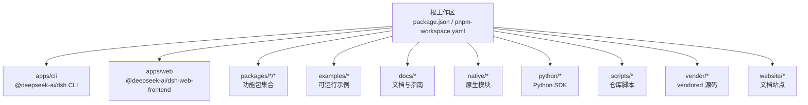
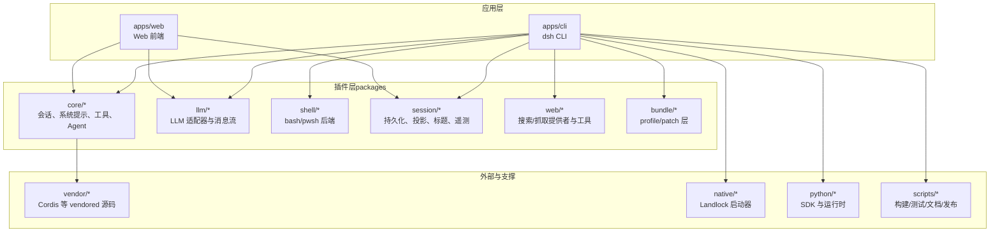
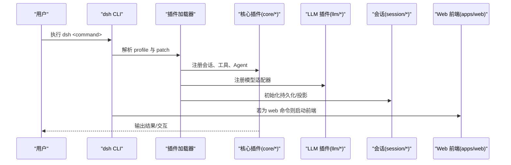
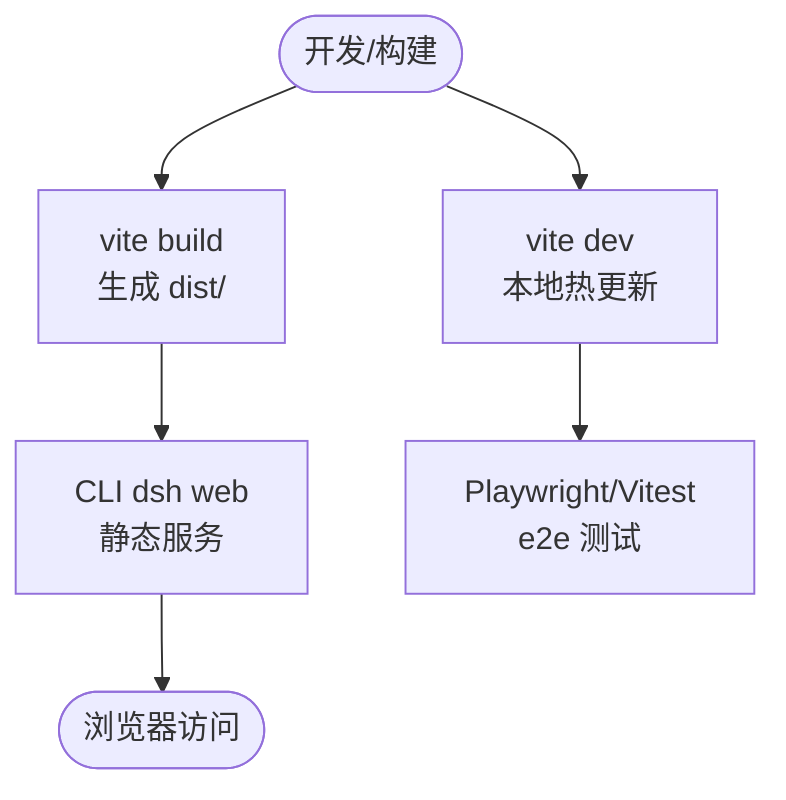
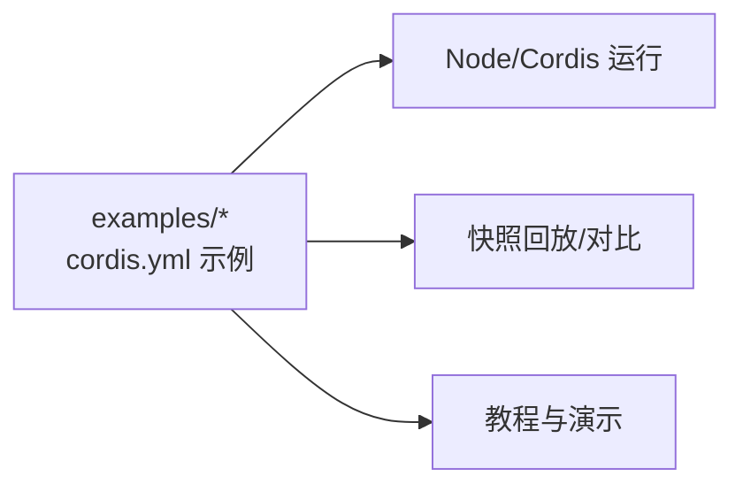
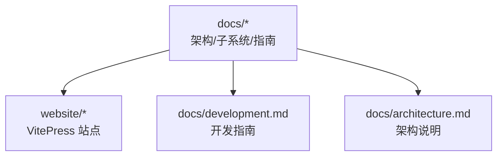
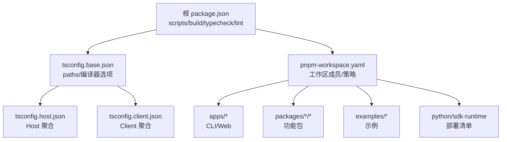

# 项目结构

<cite>
**本文引用的文件**
- [package.json](file://package.json)
- [pnpm-workspace.yaml](file://pnpm-workspace.yaml)
- [README.md](file://README.md)
- [apps/cli/package.json](file://apps/cli/package.json)
- [apps/web/package.json](file://apps/web/package.json)
- [examples/package.json](file://examples/package.json)
- [tsconfig.base.json](file://tsconfig.base.json)
- [docs/development.md](file://docs/development.md)
- [docs/architecture.md](file://docs/architecture.md)
- [AGENTS.md](file://AGENTS.md)
- [packages/AGENTS.md](file://packages/AGENTS.md)
</cite>

## 目录
1. [简介](#简介)
2. [项目结构总览](#项目结构总览)
3. [核心组件与职责划分](#核心组件与职责划分)
4. [架构总览](#架构总览)
5. [详细组件分析](#详细组件分析)
6. [依赖关系与模块化设计](#依赖关系与模块化设计)
7. [性能与构建特性](#性能与构建特性)
8. [故障排查指南](#故障排查指南)
9. [结论](#结论)
10. [附录：新开发者导航](#附录：新开发者导航)

## 简介
DeepSeek Harness（dsh）是一个基于插件化架构的 Agent 运行框架，采用 Cordis 作为运行时。仓库采用 pnpm monorepo 组织，将应用、包、示例、文档、原生模块和 Python SDK 等统一在一个工作区中管理。根脚本提供统一的构建、测试、文档生成与发布流程；各子包通过 workspace 协议相互引用，形成清晰的边界与可插拔能力。

## 项目结构总览
仓库顶层包含以下关键区域：
- apps/：产品级应用入口（CLI 与 Web 前端）
- packages/：按领域分组的功能包（core、llm、shell、session、web 等），每个包以 @deepseek-ai/dsh-* 命名
- examples/：可运行的 cordis.yml 示例与演示，用于端到端验证与快照回放
- docs/：架构、子系统、用户指南、Cookbook、i18n 等文档
- native/：原生 Landlock 启动器源码与打包脚本
- python/：Python SDK 与运行时
- scripts/：仓库级脚本（类型检查、文档生成、质量门禁、发布工具等）
- vendor/：vendored 第三方源码（如 Cordis 等）
- website/：VitePress 站点，聚合部分文档

**图表来源**
- [package.json:11-18](file://package.json#L11-L18)
- [pnpm-workspace.yaml:1-22](file://pnpm-workspace.yaml#L1-L22)

**章节来源**
- [package.json:1-18](file://package.json#L1-L18)
- [pnpm-workspace.yaml:1-22](file://pnpm-workspace.yaml#L1-L22)
- [README.md:1-58](file://README.md#L1-L58)

## 核心组件与职责划分
- apps/cli
  - 角色：命令行入口 dsh，负责 profile 启动、插件加载、Web UI 别名等
  - 产物：bin 指向 lib/bin.js，发布时包含 lib/*.js 与 config
  - 依赖：大量 @deepseek-ai/dsh-* 插件与服务，组合出完整运行时
- apps/web
  - 角色：Web 前端应用，基于 Vite 构建，依赖 dsh-client-web 壳库
  - 产物：dist/ 由 CLI 的 dsh web 命令提供服务
  - 依赖：React、Playwright、Vitest 等开发与测试工具
- packages
  - 角色：按领域划分的可复用能力包，遵循“一切皆插件”的设计
  - 组织：packages/<group>/<pkg>/，例如 core、llm、shell、session、web、bundle 等
  - 约定：服务包默认导出服务类；函数插件使用具名导出；每个包拥有 invariants 与 README
- examples
  - 角色：可运行的 cordis.yml 示例，覆盖 headless、ACP、JSON-RPC、Web 等场景
  - 作用：端到端验证、快照回放、演示与教学
- docs
  - 角色：架构说明、子系统文档、用户指南、Cookbook、i18n 规则与翻译策略
- native
  - 角色：Landlock 启动器的源码与发布脚本，跨平台二进制产物
- python
  - 角色：Python SDK 与运行时，提供 Python 侧的客户端与执行环境
- scripts
  - 角色：仓库级脚本，涵盖类型检查、文档生成、质量门禁、发布、快照管理等

**章节来源**
- [apps/cli/package.json:1-102](file://apps/cli/package.json#L1-L102)
- [apps/web/package.json:1-52](file://apps/web/package.json#L1-L52)
- [packages/AGENTS.md:1-28](file://packages/AGENTS.md#L1-L28)
- [examples/package.json:1-118](file://examples/package.json#L1-L118)
- [AGENTS.md:9-55](file://AGENTS.md#L9-L55)

## 架构总览
dsh 基于 Cordis 的插件树模型：每个功能都是插件，通过配置层叠加组成运行时。Profile 是命名化的组合模板，Bundle 是可安装的补丁层。CLI 与 Web 前端作为装配点，加载并编排 packages 中的插件，形成完整的 Agent 运行环境。

**图表来源**
- [docs/architecture.md:15-37](file://docs/architecture.md#L15-L37)
- [AGENTS.md:9-55](file://AGENTS.md#L9-L55)

**章节来源**
- [docs/architecture.md:1-130](file://docs/architecture.md#L1-L130)
- [AGENTS.md:9-55](file://AGENTS.md#L9-L55)

## 详细组件分析

### CLI（apps/cli）
- 入口：bin 指向 lib/bin.js，通过 root 脚本 dsh 调用
- 职责：profile 启动、插件加载、Web UI 别名、命令行参数解析、进程生命周期管理
- 依赖：大量 @deepseek-ai/dsh-* 插件，组合出完整运行时能力
- 构建：由根脚本 tsc/tsdown 产出 lib，再被 CLI 消费

**图表来源**
- [apps/cli/package.json:14-84](file://apps/cli/package.json#L14-L84)
- [docs/architecture.md:15-37](file://docs/architecture.md#L15-L37)

**章节来源**
- [apps/cli/package.json:1-102](file://apps/cli/package.json#L1-L102)
- [docs/architecture.md:15-37](file://docs/architecture.md#L15-L37)

### Web 前端（apps/web）
- 角色：基于 Vite 的前端应用，依赖 dsh-client-web 壳库
- 构建：vite build 产出 dist/，由 CLI 的 dsh web 命令提供服务
- 测试：Playwright + Vitest，支持 e2e 与快照回放

**图表来源**
- [apps/web/package.json:22-50](file://apps/web/package.json#L22-L50)

**章节来源**
- [apps/web/package.json:1-52](file://apps/web/package.json#L1-L52)

### 示例（examples）
- 角色：可运行的 cordis.yml 示例，覆盖 headless、ACP、JSON-RPC、Web 等场景
- 作用：端到端验证、快照回放、演示与教学
- 工作区：作为依赖解析的工作区成员，但不参与 tsdown 构建目标

**图表来源**
- [examples/package.json:1-118](file://examples/package.json#L1-L118)
- [pnpm-workspace.yaml:11-22](file://pnpm-workspace.yaml#L11-L22)

**章节来源**
- [examples/package.json:1-118](file://examples/package.json#L1-L118)
- [pnpm-workspace.yaml:11-22](file://pnpm-workspace.yaml#L11-L22)

### 文档（docs）
- 角色：架构说明、子系统文档、用户指南、Cookbook、i18n 规则与翻译策略
- 内容：agent 生命周期、事件模型、工具执行管线、子系统详解、开发指南等
- 站点：website/ 聚合部分文档，支持构建与预览

**图表来源**
- [docs/development.md:1-172](file://docs/development.md#L1-L172)
- [docs/architecture.md:1-130](file://docs/architecture.md#L1-L130)

**章节来源**
- [docs/development.md:1-172](file://docs/development.md#L1-L172)
- [docs/architecture.md:1-130](file://docs/architecture.md#L1-L130)

## 依赖关系与模块化设计
- 工作区配置
  - pnpm-workspace.yaml 声明了所有工作区成员，包括 vendor、packages、apps、website、examples、python/sdk-runtime 等
  - linkWorkspacePackages: true 确保本地包链接解析
  - overrides/allowBuilds/patchedDependencies 控制依赖行为与安全策略
- TypeScript 工程布局
  - tsconfig.base.json 提供共享编译选项与路径映射，Host/Client 双聚合分离
  - tsconfig.host.json 与 tsconfig.client.json 分别聚合 Host 与 Client 包，避免 Context 合并冲突
  - 根 package.json 的 scripts 定义构建顺序：tsc -> tsdown -> vite build
- 包命名与分组
  - 包名统一为 @deepseek-ai/dsh-*，按领域分组在 packages/<group>/<pkg>/
  - 每个包遵循插件导出约定与 invariants 要求

**图表来源**
- [package.json:19-142](file://package.json#L19-L142)
- [pnpm-workspace.yaml:1-22](file://pnpm-workspace.yaml#L1-L22)
- [tsconfig.base.json:1-280](file://tsconfig.base.json#L1-L280)

**章节来源**
- [pnpm-workspace.yaml:1-73](file://pnpm-workspace.yaml#L1-L73)
- [tsconfig.base.json:1-280](file://tsconfig.base.json#L1-L280)
- [package.json:19-142](file://package.json#L19-L142)

## 性能与构建特性
- 构建流水线
  - 根脚本按依赖顺序执行：tsc 发射 lib/types，tsdown 进行 bundle，最后 vite build 前端
  - Typert 仅在 Host 阶段运行，生成 Host-for-Client 远程类型与贡献
- 增量与缓存
  - tsc 启用 composite/incremental，提升增量构建速度
  - vitest 与 playwright 支持快照回放与并发测试
- 安全与依赖治理
  - allowBuilds 白名单控制带安装脚本的依赖
  - patchedDependencies 对 node-pty 进行补丁
  - verify-* 脚本保障包契约、许可证、文档一致性

[本节为通用性能讨论，不直接分析具体文件]

## 故障排查指南
- 常见构建问题
  - 未先构建即运行依赖 lib/ 的命令：需先执行根脚本 build
  - TypeScript 聚合冲突：确保使用 host/client 聚合而非根 solution
- 依赖安装失败
  - 检查 allowBuilds 白名单是否包含必要原生依赖
  - 确认 patchedDependencies 是否正确应用
- 测试与快照
  - 快照回放失败：核对 fixtures 与预期输出，必要时记录新快照
  - 真实 API 测试跳过：缺少 DEEPSEEK_API_KEY 时会自跳过

**章节来源**
- [docs/development.md:82-89](file://docs/development.md#L82-L89)
- [pnpm-workspace.yaml:35-73](file://pnpm-workspace.yaml#L35-L73)
- [package.json:34-47](file://package.json#L34-L47)

## 结论
该 monorepo 通过清晰的分层与模块化设计，实现了插件化 Agent 运行框架的可扩展性与可维护性。apps/ 提供产品入口，packages/ 按领域拆分能力，examples/ 与 docs/ 支撑验证与学习，native/ 与 python/ 拓展多语言与原生能力，scripts/ 保障质量与发布。工作区配置与 TypeScript 双聚合确保了构建效率与类型安全。

[本节为总结，不直接分析具体文件]

## 附录：新开发者导航
- 快速开始
  - 安装依赖：pnpm install
  - 类型检查：pnpm run typecheck
  - 构建：pnpm run build
  - 运行 CLI：pnpm dsh --profile headless "任务"
  - 运行 Web：pnpm dsh web
- 常用命令
  - 测试：pnpm run test / test:e2e / test:snapshot
  - 文档：pnpm run doc-sync / website:build
  - 质量门禁：pnpm run hygiene / check:all
- 查找代码
  - 新增能力：参考 docs/cookbook/adding-a-package.md 与 docs/architecture.md
  - 定位包：packages/<group>/<pkg>/，遵循 AGENTS.md 约定
  - 示例：examples/* 下的 cordis.yml 可直接运行验证
- 环境变量
  - DEEPSEEK_API_KEY、DEEPSEEK_BASE_URL 用于真实 API 测试与演示

**章节来源**
- [README.md:13-50](file://README.md#L13-L50)
- [docs/development.md:7-41](file://docs/development.md#L7-L41)
- [AGENTS.md:59-80](file://AGENTS.md#L59-L80)
- [docs/architecture.md:104-130](file://docs/architecture.md#L104-L130)